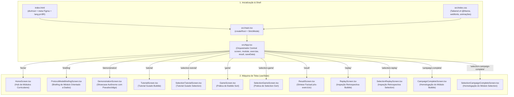

# 02 — Arquitetura de Software da Plataforma Educacional

> **Documento canônico:** Especificação arquitetural do software, topologia de componentes, fluxo de dados entre camadas e governança modular do **Sorting Station**.  
> **Status:** Ativo / Base de Verdade da Plataforma  
> **Data de Atualização:** 15/09/2026 (Marco PLATFORM-R0)  
> **Dependências:** [`AGENTS.md`](../../AGENTS.md), [`ADR 0018`](../adr/0018-game-to-educational-platform-transition.md), [`modules/README.md`](./modules/README.md), [`comparison-lab.md`](./comparison-lab.md), [`07-backend-and-persistence.md`](./07-backend-and-persistence.md).

---

# PARTE I — ESTADO FACTUAL DA ARQUITETURA IMPLEMENTADA

Esta seção documenta **rigorosamente a realidade fática do código existente no repositório**, atestada por 303 testes unitários aprovados e compilação limpa em TypeScript.

---

## 1. Topologia Geral do Front-End e Roteamento de Telas

O Sorting Station opera como uma Single Page Application (SPA) client-side desenvolvida em React 19 e TypeScript, estilizada com Tailwind CSS v4 e executada sobre a toolchain do Vite 8.



---

## 2. O Catálogo de Telas e Gatilhos de Transição

O estado `screen` em [`src/App.tsx`](../../src/App.tsx) controla a tela ativa na viewport:

| Tela | Componente | Papel Arquitetural na Plataforma | Gatilhos de Entrada | Gatilhos de Saída |
| :--- | :--- | :--- | :--- | :--- |
| `home` | `HomeScreen.tsx` | Hub Educacional de Módulos ([`protocolCatalog.ts`](../../src/screens/protocolCatalog.ts)) | Inicialização da SPA ou botões `← VOLTAR` / `CONCLUIR` | Clicar em Treinamento (`briefing`), Como Jogar (`tutorial`) ou Demonstração (`demonstration`) |
| `briefing` | `ProtocolModeBriefingScreen.tsx` | Portal preparatório com objetivos, invariantes e escolha de modo | Seleção de módulo no card da Home | Iniciar prática, Ver Demonstração ou Voltar |
| `demonstration` | `DemonstrationScreen.tsx` | Execução canônica perfeita e autônoma ([`ADR 0017`](../adr/0017-canonical-demonstration-mode.md)) | `[ 👁 DEMONSTRAÇÃO ]` na Home ou no Briefing | Voltar para origem (`home` ou `briefing`) ou Iniciar Treinamento |
| `tutorial` | `TutorialScreen.tsx` | Tutorial guiado passo a passo para o Módulo Bubble Sort | `[ COMO JOGAR ]` na Home | Concluir tutorial (vai para `game`) ou Voltar |
| `selection-tutorial`| `SelectionTutorialScreen.tsx` | Tutorial interativo bimodal para o Módulo Selection Sort | Início do módulo Selection sem tutorial prévio | Concluir tutorial (vai para `selection-game`) ou Voltar |
| `game` | `GameScreen.tsx` | Ambiente interativo de prática do Módulo Bubble Sort | Iniciar prática do Bubble Sort | Conclusão da esteira (vai para `result`) |
| `selection-game` | `SelectionGameScreen.tsx` | Ambiente interativo de prática do Módulo Selection Sort | Iniciar prática do Selection Sort | Conclusão da esteira (vai para `result`) |
| `result` | `ResultScreen.tsx` | Relatório factual pós-exercício com score, métricas e pseudocódigo | Disparo de `onComplete` na esteira | `[ VER EXECUÇÃO ]` (vai para replay), `[ REPETIR ]` ou `[ PRÓXIMO ]` |
| `replay` | `ReplayScreen.tsx` | Inspeção retrospectiva quadro a quadro do Bubble Sort | `[ VER EXECUÇÃO ]` em `ResultScreen` | `← VOLTAR AO RESULTADO` (retorna para `result`) |
| `selection-replay`| `SelectionReplayScreen.tsx` | Inspeção retrospectiva quadro a quadro do Selection Sort | `[ VER EXECUÇÃO ]` em `ResultScreen` | `← VOLTAR AO RESULTADO` (retorna para `result`) |
| `campaign-complete`| `CampaignCompleteScreen.tsx` | Relatório consolidado de conclusão do conjunto de práticas Bubble | Conclusão do último exercício do Bubble | `[ RETORNAR AO HUB ]` ou `[ REINICIAR MÓDULO ]` |
| `selection-campaign-complete`| `SelectionCampaignCompleteScreen.tsx`| Relatório consolidado de conclusão do conjunto de práticas Selection | Conclusão do último exercício do Selection | `[ RETORNAR AO HUB ]` ou `[ REINICIAR MÓDULO ]` |

---

## 3. Arquitetura em Camadas Desacopladas

O código-fonte em `src/` adota rigorosa segregação de responsabilidades:

```text
src/
├── screens/                 # Camada de Apresentação e Telas de Alto Nível
│   ├── HomeScreen.tsx       # Hub de Módulos (consome protocolCatalog)
│   ├── ProtocolCard.tsx     # Card simétrico reutilizável para cada módulo
│   ├── protocolCatalog.ts   # Metadados e catálogo desacoplado de módulos
│   ├── DemonstrationScreen.tsx # Orquestrador do Modo Demonstração Canônico
│   ├── GameScreen.tsx / SelectionGameScreen.tsx # Telas interativas de prática
│   └── ...
├── components/              # Componentes Visuais Atômicos e Reutilizáveis
│   ├── NumberedBox.tsx      # Carga interativa com papéis semânticos BoxRole
│   ├── InstructionPanel.tsx # Faixa de feedback formativo com 4 níveis
│   ├── GameButton.tsx       # Botoeira com variantes temáticas
│   ├── PhaseHeader.tsx      # Cabeçalho fixo com badge de status e telemetria
│   └── StatsPanel.tsx       # Contadores numéricos
└── game/                    # Núcleo de Domínio e Lógica Pura (100% agnóstico de React)
    ├── sorting/             # Engines algorítmicas e FSMs estritas (Bubble, Selection)
    ├── demonstration/       # Geradores de execução canônica para demonstração
    ├── generation/          # Geração procedural determinística universal (Mulberry32)
    ├── persistence/         # Adaptador desacoplado de armazenamento (Schema v3)
    ├── replay/              # Derivação funcional de quadros e sincronização de pseudocódigo
    ├── session/             # Cálculo puro da Pontuação do Protocolo e métricas
    ├── campaign/            # Agregação de resultados do conjunto de exercícios
    ├── tutorial/            # Modelos conceituais e FSMs de tutoriais guiados
    └── briefing/            # Modelos de dados para briefings operacionais
```

---

# PARTE II — ARQUITETURA ALVO DA PLATAFORMA EDUCACIONAL

Com a redefinição de produto aprovada no [`ADR 0018`](../adr/0018-game-to-educational-platform-transition.md), a arquitetura evolui de um agregador de mini-jogos para um **Ecossistema Curricular Modular Integrado**.

---

## 4. O Hub de Módulos e Extensibilidade Curricular

O ponto de entrada da plataforma é o **Hub de Módulos** ([`src/screens/HomeScreen.tsx`](../../src/screens/HomeScreen.tsx)).  
Ele consome o catálogo desacoplado [`src/screens/protocolCatalog.ts`](../../src/screens/protocolCatalog.ts), permitindo a inclusão de novos algoritmos de ordenação por mero acréscimo de metadados:

```typescript
export interface ProtocolCatalogEntry {
  id: ModuleId;                    // 'bubble' | 'selection' | 'insertion' | 'merge' | 'quick' | 'heap'
  title: string;                   // Nome canônico do algoritmo
  status: 'available' | 'coming_soon';
  themeColor: 'cyan' | 'purple' | 'amber' | 'blue' | 'orange' | 'gold';
  complexityTime: string;          // Ex: "O(n²)" ou "O(n log n)"
  complexitySpace: string;         // Ex: "O(1)" ou "O(n)"
  tagline: string;                 // Metáfora na Central Logística
  practiceGoal: string;            // Objetivo pedagógico central
  briefingModeId: string;
}
```

---

## 5. Arquitetura do Laboratório Comparativo (Evolução P3)

O **Laboratório Comparativo** ([`comparison-lab.md`](./comparison-lab.md)) opera transversalmente sobre os módulos já homologados:
- **Entrada Única Compartilhada:** O laboratório instancia uma única semente via `generateSortingArray` e fornece cópias congeladas idênticas para 2 a 6 engines puras simultâneas.
- **Isolamento de Efeitos:** Cada algoritmo executa em sua própria instância de FSM sem interferência concorrente sobre os outros.
- **Painel Analítico:** Segrega comparações universais de movimentações específicas de memória (swaps, shifts, escritas auxiliares).

---

## 6. Evolução da Persistência: Schema v4

O Schema v3 atual atende perfeitamente aos módulos Bubble e Selection Sort em suas práticas básicas.  
Para acomodar os 6 módulos e os 8 tipos de exercícios da taxonomia transversal sem quebras de tipo, o sistema migrará no futuro para o **Schema v4 Conceitual** ([`07-backend-and-persistence.md`](./07-backend-and-persistence.md)), baseado em `moduleId` e `exerciseId` dinâmicos.
