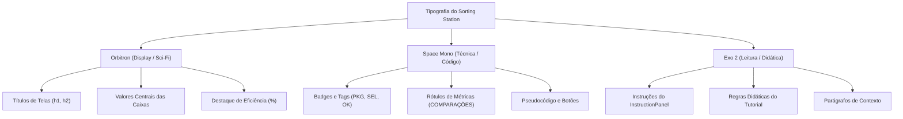

# 05 — Sistema de Design, UX e Identidade Visual

> **Documento canônico:** Especificação completa do Design System, identidade visual, linguagem de interação, catálogo de estilos e diretrizes de experiência do usuário (UX) do **Sorting Station**.  
> **Status:** Ativo / Base de Verdade da Wiki  
> **Data:** 08/09/2026  
> **Dependências:** [`AGENTS.md`](../../AGENTS.md), [`CLAUDE.md`](../../CLAUDE.md), [`00-repository-inventory.md`](./00-repository-inventory.md), [`01-product-vision.md`](./01-product-vision.md), [`03-frontend.md`](./03-frontend.md).

---

## 1. O Universo Visual do Sorting Station

O **Sorting Station** adota a estética **retrô-futurista de ficção científica industrial**, inspirada em centrais espaciais de transporte e terminais automatizados de logística pesada. Essa escolha visa transformar o aprendizado de algoritmos em uma experiência imersiva e lúdica, afastando o usuário tanto da aridez de testes acadêmicos em papel quanto da frieza de painéis analíticos corporativos.

### 1.1. A Metáfora Diegética: A "Central Logística v2.0"
- **O Jogador como Operador Técnico:** O usuário assume o papel de operador de triagem em uma instalação de alta tecnologia responsável pelo roteamento de dados e pacotes energéticos ([`src/screens/HomeScreen.tsx`](../../src/screens/HomeScreen.tsx)).
- **Cargas e Pacotes:** Os elementos do vetor matemático são representados como **caixas tecnológicas de carga** (`NumberedBox`), cada qual com seu número identificador em destaque e chaves secundárias de rastreamento.
- **A Esteira Transportadora:** O meio físico por onde os dados trafegam é uma **esteira de roletes com trilhos energizados** (`.conveyor-track`), reforçando o senso cinético de movimento contínuo, proximidade física e ordem sequencial.
- **A Linguagem de Terminal:** A comunicação do jogo adota o jargão de centros de controle industrial:
  - `PROTOCOLO`: O algoritmo de ordenação em execução (ex.: `PROTOCOLO: BUBBLE` em [`src/components/PhaseHeader.tsx`](../../src/components/PhaseHeader.tsx));
  - `FASE`: O lote de cargas a ser organizado (Fase 1 de 3, Fase 2 de 3, etc.);
  - `SISTEMA ATIVO`: A confirmação de telemetria operacional com badge pulsante verde ([`src/components/PhaseHeader.tsx`](../../src/components/PhaseHeader.tsx));
  - `INICIAR TURNO`: O comando para dar início à jornada de trabalho de triagem ([`src/screens/HomeScreen.tsx`](../../src/screens/HomeScreen.tsx)).

---

## 2. Paleta Cromática e Tokens do Tema

O sistema visual é estruturado sobre uma base escura profunda enriquecida por focos de iluminação neon em ciano, roxo, âmbar e esmeralda.

### 2.1. Tokens `@theme inline` ([`src/index.css`](../../src/index.css))

```css
@theme inline {
  --color-cyan-glow: #00f5ff;
  --color-purple-glow: #8b5cf6;
  --color-amber-glow: #f59e0b;
  --color-bg-deep: #060b1a;
  --color-bg-card: #0d1635;
  --color-bg-panel: #111e47;
  --font-orbitron: 'Orbitron', sans-serif;
  --font-mono-sci: 'Space Mono', monospace;
  --font-exo: 'Exo 2', sans-serif;
}
```

### 2.2. Guia de Aplicação de Cores

| Cor / Token | Valor Hex | Significado Semântico | Onde é Utilizado |
| :--- | :--- | :--- | :--- |
| **Ciano Neon** | `#00f5ff` | Acento primário, eletricidade, foco ativo | Títulos principais, caixas sob foco padrão, botões primários, destaque de código |
| **Roxo Neon** | `#8b5cf6` | Acento secundário, métricas secundárias | Contador de trocas efetuadas, botões secundários, caixas decorativas de fundo |
| **Âmbar Industrial** | `#f59e0b` | Atenção, aviso, seleção manual em aberto | Borda de caixa selecionada (`selected`), avisos de regras e caixas apontadas por dicas |
| **Esmeralda Estável** | `#10b981` | Conclusão, sucesso, elemento ordenado | Caixa definitivamente ordenada (`sorted`), badge "OK", badge "SISTEMA ATIVO" |
| **Vermelho Alerta** | `#ef4444` | Falha operacional, erro, ação destrutiva | Botões de perigo, ícones de erro no painel de instruções, cancelamento |
| **Deep Space** | `#060b1a` | Fundo infinito da viewport | Plano de fundo de todas as telas |
| **Card Blue** | `#0d1635` | Superfície base para painéis e caixas | Corpo de `NumberedBox`, cartões de tutoriais e painéis de resultado |

---

## 3. Tipografia do Sistema

O projeto consome três famílias tipográficas importadas via Google Fonts ([`src/index.css`](../../src/index.css)), cada uma com função semântica rigorosa:



1. **`Orbitron` (Display & Grandezas Numéricas):**
   - Transmite a alta tecnologia e a presença de máquinas futuristas.
   - Usado nos títulos das telas (ex.: `text-3xl font-bold tracking-widest`), nos números internos de cada caixa e nas grandezas numéricas dos contadores.
2. **`Space Mono` (Dados Técnicos & Controles):**
   - Fonte monoespaçada que simula leitores de telemetria e terminais CRT.
   - Usada no texto de todos os botões (`GameButton`), nos badges `#1`, `#2` e no bloco de pseudocódigo em `ResultScreen.tsx`.
3. **`Exo 2` (Leitura Contínua & Compreensão Textual):**
   - Tipografia geométrica humanista com excelente legibilidade para blocos de texto.
   - Usada para explicar regras de algoritmos, mensagens informativas do jogo e parágrafos de ajuda.

---

## 4. Efeitos Atmosféricos, Texturas e Animações

O visual sci-fi repousa sobre uma camada de utilitários CSS implementados em [`src/index.css`](../../src/index.css):

### 4.1. `.scanlines` ([`src/index.css`](../../src/index.css))
Gera uma camada fixa semi-transparente que sobrepõe linhas horizontais alternadas de $2\text{px}$ sobre a tela (`linear-gradient(rgba(18,16,16,0) 50%, rgba(0,0,0,0.25) 50%)`), simulando monitores antigos de tubo de raios catódicos (CRT) de bases espaciais. Possui `pointer-events: none` para não bloquear cliques.

### 4.2. `.bg-grid` ([`src/index.css`](../../src/index.css))
Desenha uma malha sutil quadriculada de $40\times 40\text{px}$ com cor `rgba(0, 245, 255, 0.04)`, conferindo a sensação de piso técnico ou planta de engenharia.

### 4.3. `.panel-border` ([`src/index.css`](../../src/index.css))
Aplica borda translúcida ciano com cantos chanfrados e sombra difusa (`border border-cyan-500/20 shadow-[0_0_15px_rgba(0,245,255,0.05)]`), servindo de moldura para painéis de instrução e telemetria.

### 4.4. A Esteira Mecânica (`.conveyor-track`) ([`src/index.css`](../../src/index.css))
A esteira usa uma imagem SVG embutida em base64 (`repeating-linear-gradient` com chevrons de roletes mecânicos) que desliza em loop contínuo através da animação `@keyframes conveyor`:
```css
@keyframes conveyor {
  from { background-position-x: 0px; }
  to { background-position-x: -32px; }
}
```

### 4.5. Animações de Permuta (`animate-swap-left` e `animate-swap-right`) ([`src/index.css`](../../src/index.css))
Simulam o levantamento mecânico da caixa com translação horizontal e elevação vertical em arco:
- **`swap-left`:** Move a caixa para a esquerda ($-100\%$) com ápice de $-12\text{px}$ em $50\%$ do tempo;
- **`swap-right`:** Move a caixa para a direita ($+100\%$) com ápice de $-12\text{px}$ em $50\%$ do tempo.

### 4.6. Pulsação de Foco (`animate-pulse-border`) ([`src/index.css`](../../src/index.css))
Oscila suavemente a opacidade da borda entre $0.4$ e $1.0$ e expande o brilho difuso para guiar o olhar do jogador até a caixa sob foco.

---

## 5. Catálogo de Componentes e Estados Visuais

### 5.1. `NumberedBox` ([`src/components/NumberedBox.tsx`](../../src/components/NumberedBox.tsx))

A caixa possui estados visuais e papéis semânticos multi-algoritmo claramente distintos (`role?: BoxRole`, P2.1-C / ADR 0012):

```text
[ PADRÃO ]                [ SELECIONADA ]            [ DEFINITIVA (OK) ]
┌────────────────┐        ┌────────────────┐        ┌────────────────┐
│#1          PKG │        │#1          PAR │        │#1           OK │
│                │        │                │        │                │
│       5        │        │       5        │        │       1        │
│                │        │                │        │                │
└────────────────┘        └────────────────┘        └────────────────┘
Borda ciano/40            Borda ciano pulsante      Borda esmeralda
Fundo card blue           Fundo ciano escuro        Fundo esmeralda translúcido

[ ALVO (i) ]              [ MÍNIMO (minIndex) ]     [ SCANNER (j) ]
┌────────────────┐        ┌────────────────┐        ┌────────────────┐
│#1         ALVO │        │#2          MÍN │        │#3         SCAN │
│                │        │                │        │                │
│       4        │        │       1        │        │       3        │
│                │        │                │        │                │
└────────────────┘        └────────────────┘        └────────────────┘
Borda âmbar               Borda púrpura             Borda ciano com pulso
Fundo âmbar translúcido   Fundo púrpura translúcido Fundo ciano translúcido
```

1. **Estado Padrão (`role="default"`):** Borda azul escuro (`border-[#2a4a9e]/80`), fundo `#0f1e4a`, badge superior direito `PKG`.
2. **Par Ativo (`role="pair"` ou `selected={true}`):** Borda ciano brilhante (`border-[#00f5ff]`), fundo `bg-cyan-950`, badge `PAR`, animação `animate-pulse-border`.
3. **Posição Alvo (`role="target"`):** Posição $i$ da rodada do Selection Sort. Borda âmbar (`border-amber-400`), fundo `bg-amber-950/40`, badge `ALVO`.
4. **Candidato a Mínimo (`role="min"`):** Menor elemento identificado até agora ($minIndex$). Borda púrpura (`border-purple-400`), fundo `bg-purple-950/40`, badge `MÍN`.
5. **Alvo Coincidente com Mínimo (`role="target-min"`):** Quando $minIndex = i$. Borda âmbar destacada com anel púrpura, badge `ALVO • MÍN`.
6. **Scanner em Inspeção (`role="scan"`):** Elemento sob escrutínio da varredura ($j$). Borda ciano com pulso (`border-cyan-400 animate-pulse`), badge `SCAN`.
7. **Scanner no Novo Mínimo (`role="scan-min"`):** Momento em que o scanner coincide com a atualização de candidato. Borda ciano/púrpura com pulso duplo, badge `MÍN • SCAN`.
8. **Estado Ordenado/Definitivo (`role="sorted"` ou `sorted={true}`):** Borda esmeralda (`border-emerald-500/30`), fundo `bg-emerald-950`, badge `OK` com texto verde luminoso.
9. **Estado Desabilitado (`disabled={true}`):** Redução de opacidade (`opacity-40`) e cursor `not-allowed`.
10. **Estado em Animação (`animating="left" | "right"`):** Aplicação de `animate-swap-left` ou `animate-swap-right` com elevação na camada (`z-20`). Executada no Bubble Sort durante a varredura e no Selection Sort estritamente na confirmação da transferência final.

### 5.2. `GameButton` ([`src/components/GameButton.tsx`](../../src/components/GameButton.tsx))

| Variante | Aparência Normal | Efeito Hover / Foco | Uso Recomendado |
| :--- | :--- | :--- | :--- |
| **`primary`** | Fundo ciano `#00f5ff`, texto `#060b1a` escuro, peso bold | Sombra difusa ciano intensa (`shadow-[0_0_20px_#00f5ff]`), leve brilho | Avançar de tela, confirmar ação positiva principal |
| **`secondary`** | Borda roxa `#8b5cf6`, fundo roxo translúcido, texto `#c4b5fd` | Borda roxa iluminada, fundo roxo mais opaco | Ações secundárias, regras, dicas da esteira |
| **`danger`** | Borda vermelha `#ef4444`, fundo vermelho translúcido | Borda vermelha vibrante, sombra avermelhada | Reiniciar fase, abortar turno |
| **`ghost`** | Fundo transparente, borda translúcida sutil | Borda ciano/branca nítida, fundo ciano/10 | Navegação para trás ("← VOLTAR") |

### 5.3. `InstructionPanel` ([`src/components/InstructionPanel.tsx`](../../src/components/InstructionPanel.tsx))

| Tipo | Ícone | Esquema Cromático | Cenário de Uso |
| :--- | :--- | :--- | :--- |
| **`info`** | `◈` | Borda ciano/40, fundo ciano/10, texto `#a5f3fc` | Instruções padrão de seleção (ex.: *"Clique em uma caixa vizinha"*) |
| **`warning`** | `⚠` | Borda âmbar/40, fundo âmbar/10, texto `#fde68a` | Ação incorreta sem penalidade (ex.: *"As caixas precisam ser vizinhas"*) |
| **`success`** | `✓` | Borda esmeralda/40, fundo esmeralda/10, texto `#a7f3d0` | Troca realizada com sucesso ou ordenação concluída |
| **`error`** | `✕` | Borda vermelha/40, fundo vermelho/10, texto `#fecaca` | Violação de protocolo ou falha crítica |

---

### 5.4. `ProtocolModeBriefingScreen` e Sistema de Briefings Orientados a Dados ([`src/screens/ProtocolModeBriefingScreen.tsx`](../../src/screens/ProtocolModeBriefingScreen.tsx))

A tela de briefing intermediária (P1.10 / ADR 0010) ancora a preparação mental do operador antes da esteira de ordenação. O componente foi desenhado para baixo esforço cognitivo e alta legibilidade:

1. **Pílula Superior de Status:** Crachá temático em fonte `Space Mono` com ponto luminoso pulsante (`animate-pulse`) indicando a unidade operacional e a variante em execução (`cyan`, `amber`, `emerald` ou `purple`);
2. **Hierarquia Tipográfica Imersiva:** Título em gradiente luminoso com sombra difusa (`Orbitron`), acompanhado do protocolo genérico e subtítulo explicativo (`Exo 2`);
3. **Cartão de Objetivo Operacional:** Painel translúcido (`bg-[#0d1635]/90 border border-[#2a4a9e]/60`) resumindo em 1 a 2 frases a meta algorítmica principal;
4. **Procedimento na Esteira (Grid 2x2):** Quatro cartões com cantos arredondados contendo ícone monoespacial estilizado, título de ação e descrição operacional concisa;
5. **Particularidades do Modo:** Painel destacado para regras teóricas fundamentais (ex.: término em passadas com zero trocas, neutralidade de score);
6. **Destaques de Telemetria:** Três cartões compactos de métricas com valores em destaque (`Orbitron`);
7. **Barra de Ação Inferior:** Botão de cancelamento/retorno seguro `[ ← VOLTAR ]` (sem efeitos colaterais na semente ou no storage) e botão principal de disparo `[ ▶ ${startLabel} ]` com foco visível acessível (`focus-visible:ring-2 focus-visible:ring-cyan-400`).

---

## 6. Princípios Futuros de UX e Design de Interação

Para orientar a evolução das próximas telas e novos algoritmos, as decisões de design devem obrigatoriamente respeitar os seguintes princípios:

### 1. Jogo Deve Parecer Jogo, Não Dashboard Corporativo
A imersão estética e a identidade sci-fi (sonoridade visual, esteiras dinâmicas, luzes neon e linguagem de operadores espaciais) são fundamentais para manter a motivação intrínseca do estudante. O jogo não deve regredir para formulários cinzentos ou dashboards corporativos estéreis.

### 2. Interação Principal Sempre Compreensível por Clique (*Zero Sintaxe*)
A mecânica fundamental deve ser imediata e táctil. O aluno deve interagir clicando nos elementos físicos da tela, sem precisar memorizar atalhos de teclado ou comandos de terminal.

### 3. O Par sob Escrutínio Deve Ser Visualmente Evidente
Na futura máquina de estados pedagógica, a interface deve iluminar como um "holofote" (*spotlight*) o par exato de caixas que o algoritmo exige que sejam comparadas, deixando evidente a fronteira de varredura.

### 4. A Partição já Ordenada Deve Ter Codificação Consistente
Conforme elementos atingem suas posições finais (como os maiores elementos fixados no final da esteira no Bubble Sort), eles devem receber um tratamento visual consistente de travamento (`LOCKED`), indicando ao estudante que aquela sublista não sofrerá novas permutas.

### 5. Feedback Deve Explicar o Motivo da Operação
A interface não deve emitir validações secas ("Correto" ou "Errado"). Toda mensagem deve conter o fundamento lógico: *"Elemento 5 > 2: troca necessária porque o maior deve flutuar à direita"*.

### 6. Pseudocódigo Sincronizado Visualmente
O bloco de pseudocódigo não deve ser uma imagem estática na tela final; ele deve residir ao lado ou abaixo da esteira, iluminando a linha exata que está sendo executada pela ação do jogador.

### 7. Estratégia Responsiva para Vetores Maiores
Para suportar fases futuras com vetores de 8 a 10 caixas sem quebrar o layout, o contêiner da esteira deve adotar escalonamento automático de tamanho (`size="sm"` para vetores longos) ou permitir rolagem horizontal suave com trilho retrátil.

### 8. Respeito Obrigatório a `prefers-reduced-motion`
Usuários com sensibilidade vestibular devem ter animações de esteira e translações bruscas desativadas automaticamente através de regras CSS condicionadas por `@media (prefers-reduced-motion: reduce)`.

### 9. Acessibilidade Cromática e Redundância Sensorial
Nenhum estado crítico do sistema pode depender exclusivamente de variações de cor. Todo estado (selecionado, ordenado, erro) deve ser corroborado por um **ícone específico**, uma **etiqueta textual explícita** e uma **textura ou borda diferenciada**.

### 10. Responsividade Desktop e Regra de Layout para Telas Longas
Telas com conteúdo vertical extenso (como briefings de protocolo, tutoriais guiados, relatórios de resultado e homologações de campanha) devem ser projetadas prioritariamente para caber ou rolar naturalmente em resoluções de desktop (1366x768, 1600x900 e 1920x1080):
- **Alinhamento ao Topo (`justify-start`):** O contêiner com rolagem deve alinhar seus itens ao topo (`justify-start`), nunca ao centro (`justify-center`) ou com margens automáticas verticais (`my-auto`). A centralização em contêineres de scroll que transbordam empurra a porção superior para coordenadas negativas ($y < 0$), tornando títulos e crachás permanentemente inalcançáveis pelo usuário;
- **Buffer de Acessibilidade no Rodapé (`pb-16` / `pb-24`):** A área de ações com botões `VOLTAR` e CTA principal deve dispor de padding inferior estrutural amplo, assegurando que as ações fundamentais nunca fiquem coladas na margem do navegador ou cortadas pela base da janela;
- **Densidade Visual Equilibrada:** Gaps verticais compactos (`gap-4 sm:gap-5`), tipografia proporcional e paddings internos comedidos preservam a estética e solenidade de terminal sci-fi sem esticar o layout além do necessário.

---

## 7. Vocabulário Padronizado da Interface

Para garantir uniformidade e consistência narrativa em todas as mensagens, botões e telas, os desenvolvedores devem utilizar a tabela canônica de redação UX abaixo:

| Conceito do Jogo | Termo Obrigatório Recomendado | Termos Proibidos / Evitar | Justificativa Pedagógica e Diegética |
| :--- | :--- | :--- | :--- |
| **O Algoritmo** | `Protocolo` (ex.: *Protocolo Bubble*, *Protocolo Selection*) | Método, Rotina, Função | Reforça a narrativa de procedimento operacional homologado |
| **O Vetor / Dados** | `Cargas`, `Pacotes` ou `Caixas` | Array, Vetor, Itens | Conecta a abstração matemática a objetos físicos manipuláveis |
| **A Rodada de Jogo** | `Fase` ou `Turno` | Nível, Level, Missão | Mantém consistência com o vocabulário da estação |
| **A Ação de Início** | `Iniciar Turno` / `Iniciar Selection Sort` | Jogar, Play, Start | Linguagem imersiva da estação de triagem |
| **O Passo de Troca (Bubble)** | `Trocar` / `Permutar` | Inverter, Mover, Swapar | Termo em português vernáculo claro e preciso |
| **O Passo de Manter (Bubble)** | `Manter Ordem` | Ignorar, Pular, Passar | Enfatiza que não trocar é uma decisão deliberada do algoritmo |
| **A Varredura (Selection)** | `Scanner` / `Varredura` | Passeio, Busca, Loop | Enfatiza inspeção sem movimentação física das caixas |
| **O Menor Provisório (Selection)** | `Candidato a Mínimo` | Menorzinho, Atual, Temp | Deixa explícito que o valor pode ser superado adiante |
| **Atualização de Mínimo (Selection)** | `Novo Mínimo` | Trocar, Atualizar, Salvar | Diferencia a decisão lógica da movimentação física |
| **Preservação de Mínimo (Selection)** | `Manter Candidato` | Ignorar, Pular, Descartar | Reafirma que a decisão de não alterar é consciente |
| **Troca de Fechamento (Selection)** | `Transferir Menor Carga` | Trocar logo, Mover, Jogar | Deixa evidente que a transferência ocorre no fim da varredura |
| **Fechamento sem Troca (Selection)** | `Consolidar Posição` | Nada a fazer, Pular, Ok | Formaliza que o elemento já estava na posição correta |
| **O Elemento Fixado** | `Consolidado` com selo `OK` | Bloqueado, Travado, Seguro | Indica matematicamente que a posição canônica foi atingida |
| **A Verificação Local** | `Comparar Vizinhos` | Testar, Checar, Olhar | Reforça a restrição da adjacência física do Bubble Sort |
| **As Métricas** | `Comparações` e `Trocas` | Clicks, Pontos, Movimentos | Alinha o vocabulário diretamente com a análise de complexidade |

---

## 8. Padrão Unificado de Telas (P2.1-G-A — ADR 0016)

O Sorting Station adota um padrão arquitetural estrito para cada uma de suas 8 tipologias de telas:

### 1. Home Screen (Hub de Protocolos)
- **Topo:** Cápsula de status da estação (`CENTRAL LOGÍSTICA V2.0`), logotipo com tipografia `Orbitron` e efeitos de neon, subtítulo temático;
- **Centro (Hub de Protocolos):** Grid/Lista simétrica de cartões para cada algoritmo suportado (`Bubble Sort`, `Selection Sort`, e `Insertion Sort [Em Breve]`). Cada cartão exibe:
  - Nome formal do protocolo;
  - Metáfora central (ex.: "Pares Vizinhos", "Scanner de Mínimo");
  - Indicador de status de progresso (ex.: "3/3 Fases" ou "Novo");
  - Recorde consolidado (melhor pontuação e menor número de erros);
  - Ações diretas: "Jogar Campanha", "Modo Desafio" (se elegível), "Tutorial" e "Demonstração".
- **Rodapé:** Versão do sistema, links institucionais e indicador de conectividade local.

### 2. Briefing Screen (Pre-Training Interface)
- Implementada via componente orientada a dados [`ProtocolModeBriefingScreen.tsx`](../../src/screens/ProtocolModeBriefingScreen.tsx);
- **Topo:** Cápsula de status com variante de cor do protocolo, nome do algoritmo e título do modo;
- **Centro:**
  - Parágrafo de objetivo de aprendizagem formal;
  - Grid 2x2 com as 4 regras operacionais fundamentais daquele algoritmo;
  - Linha de 3 métricas teóricas destacadas (Método, Comparações $C(n)$, Trocas $M(n)$);
  - Card de particularidades teóricas e analíticas;
- **Ações:** Botão `[ ◀ VOLTAR ]` e CTA primário `[ INICIAR PROTOCOLO ]`.

### 3. Modo Demonstração (Automated Showcase)
- Instanciação de reprodução autônoma (reaproveitando a arquitetura do Replay);
- **Topo:** Barra superior com botão `[ ◀ SAIR DA DEMONSTRAÇÃO ]` e badge `MODO DEMONSTRAÇÃO • AUTOPLAY`;
- **Centro Superior:** Esteira com caixas animadas e rótulos semânticos (`BoxRole`);
- **Centro Inferior:** Bloco de pseudocódigo em português com iluminação dinâmica da linha em execução em tempo real;
- **Rodapé:** Barra de controles temporais (Pausar/Play, Velocidade 1x/2x, Próximo passo, Reiniciar).

### 4. Tutorial Interativo (Guided Hands-on)
- Baseado em vetor curto curado e determinístico ($n=3$);
- **Topo:** Barra superior unificada com `[ ◀ VOLTAR ]`, badge central `TUTORIAL INTERATIVO` e `[ ↺ REINICIAR ]`;
- **Subcabeçalho:** Badge de protocolo e título do micro-passo atual (`stepInfo.title`);
- **Barra de Telemetria FSM:** Indicadores de fase operacional, ponteiros e contador de erros da sessão;
- **Esteira:** `NumberedBox` utilizando `BoxRole` semântico, acompanhado da legenda de cores;
- **Feedback & Dicas:** Card de feedback explicativo com sistema de dicas ativas sob demanda (`[ 💡 DICA ]`);
- **Controles:** Botoeira contextual com botões travados durante animações.

### 5. Gameplay da Campanha (Interactive Challenge)
- **Topo:** [`PhaseHeader.tsx`](../../src/components/PhaseHeader.tsx) com nome do protocolo, fase atual ($1/3, 2/3, 3/3$) e status do sistema;
- **Subcabeçalho:** Badge de modo, título da fase e contadores operacionais factuais;
- **Banner Relacional Textual:** Linha em destaque explicitando a comparação matemática em execução (ex.: $A[j] < A[\text{minIndex}]$);
- **Esteira:** Trilhos energizados com suporte a rolagem horizontal (`overflow-x-auto min-w-max`), caixas semânticas `NumberedBox` e legenda de papéis (`BoxRole`);
- **Barra de Progresso:** Barra contínua de 0% a 100% refletindo o avanço exato de micro-passos algorítmicos;
- **Painel de Feedback:** [`InstructionPanel.tsx`](../../src/components/InstructionPanel.tsx) posicionado acima da botoeira contextual;
- **Botoeira Contextual:** Botões de ação derivados estritamente da FSM do algoritmo, com bloqueio mútuo e guarda síncrona;
- **Rodapé:** Atalho discreto para Dica Pedagógica e Reinício de Turno.

### 6. Result Screen (Resultado Factual e Formativo)
- **Topo:** Badge com ícone de sucesso e animação sutil de pulso, título da fase concluída;
- **Centro:** Vetor resultante final consolidado com todos os elementos selados com badge `OK`;
- **Grade Analítica (2 Colunas):**
  - *Coluna Esquerda:* Cartão de Pontuação do Protocolo ($100 - 10 \times \text{erros} - 5 \times \text{dicas}$) e lista de métricas factuais da operação (comparações, trocas, erros, dicas, tempo decorrido formatado sem punição);
  - *Coluna Direita:* Bloco canônico de pseudocódigo com complexidade assintótica teórica;
- **Ações:** `[ ▶ VER EXECUÇÃO ]` (Replay), `[ ↺ REPETIR FASE ]` e `[ PRÓXIMA FASE → ]` ou `[ CONCLUIR PROTOCOLO ]`.

### 7. Replay Screen (Inspeção Retrospectiva)
- Modo somente-leitura derivado deterministicamente a partir de `initialArray` e `history` em memória RAM;
- **Topo:** Barra superior com `[ ◀ VOLTAR AOS RESULTADOS ]`, badge do protocolo e número do quadro ($k / N$);
- **Centro:** Esteira reconstituindo o estado exato das cargas naquele micro-passo;
- **Painel de Pseudocódigo:** Destaque em ciano da instrução em execução com isolamento e exibição dos valores concretos das variáveis;
- **Rodapé:** Barra de controle temporal completo: Quadro Inicial `[ |< ]`, Anterior `[ < ]`, Autoplay `[ ▶ / ⏸ ]`, Próximo `[ > ]`, Último `[ >| ]` e slider interativo.

### 8. Campaign Complete Screen (Homologação da Estação)
- Componente unificado consumindo os metadados do protocolo;
- **Topo:** Badge de conclusão geral da central e título em gradiente de celebração;
- **Centro:** 5 cartões com as métricas globais consolidadas da campanha:
  1. Fases Concluídas ($3/3$);
  2. Comparações Totais Acumuladas;
  3. Trocas / Transferências Totais Acumuladas;
  4. Decisões Incorretas (Erros Totais);
  5. Tempo Total Acumulado;
- **Ações:** `[ ↺ REPETIR PROTOCOLO ]` e `[ ◀ VOLTAR À CENTRAL ]`.

---

## 9. Hierarquia Visual e Semântica de Caixas (`BoxRole`)

Para eliminar qualquer dependência exclusiva de cores (em conformidade com WCAG 2.1 AA), todo `NumberedBox` deve utilizar papéis semânticos explícitos:

| Papel (`BoxRole`) | Borda e Efeito Visual | Badge Textual | Significado Pedagógico |
| :--- | :--- | :--- | :--- |
| `default` | Borda azul escuro, repouso | `PKG` | Carga não processada na partição desordenada |
| `pair` | Borda ciano neon pulsante | `PAR` | Elemento sob inspeção ativa em algoritmos de adjacência (Bubble Sort) |
| `target` | Borda âmbar industrial | `ALVO` | Posição que aguarda consolidação (Selection Sort) |
| `min` | Borda roxo neon glow | `MÍN` | Menor carga identificada até o momento (Selection Sort) |
| `target-min` | Borda âmbar com sombra | `ALVO • MÍN` | Carga que é simultaneamente o alvo da passada e o candidato mínimo |
| `scan` | Borda ciano com pulso | `SCAN` | Carga sendo avaliada pelo scanner na varredura (Selection Sort) |
| `scan-min` | Borda ciano/roxo composta | `MÍN • SCAN` | Carga examinada pelo scanner que acabou de se tornar o novo candidato mínimo |
| `sorted` | Borda esmeralda com glow sutil | `OK` | Carga definitivamente consolidada em sua posição ordenada final (invariante fixa) |
| `ordered` | Borda esmeralda tracejada/suave | `ORD` | Carga pertencente a partição ordenada provisória, ainda sujeita a deslocamentos (preparação Insertion Sort) |

