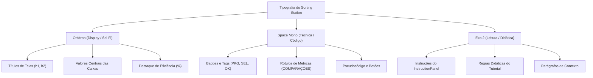

# 05 — Sistema de Design, UX e Identidade Visual

> **Documento canônico:** Especificação completa do Design System, identidade visual, linguagem de interação, catálogo de estilos e diretrizes de experiência do usuário (UX) do **Sorting Station**.  
> **Status:** Ativo / Base de Verdade da Wiki  
> **Data:** 08/09/2026  
> **Dependências:** [`AGENTS.md`](../../AGENTS.md), [`CLAUDE.md`](../../CLAUDE.md), [`00-repository-inventory.md`](./00-repository-inventory.md), [`01-product-vision.md`](./01-product-vision.md), [`03-frontend.md`](./03-frontend.md).

---

## 1. O Universo Visual do Sorting Station

O **Sorting Station** adota a estética **retrô-futurista de ficção científica industrial**, inspirada em centrais espaciais de transporte e terminais automatizados de logística pesada. Essa escolha visa transformar o aprendizado de algoritmos em uma experiência imersiva e lúdica, afastando o usuário tanto da aridez de testes acadêmicos em papel quanto da frieza de painéis analíticos corporativos.

### 1.1. A Metáfora Diegética: A "Central Logística v2.0"
- **O Jogador como Operador Técnico:** O usuário assume o papel de operador de triagem em uma instalação de alta tecnologia responsável pelo roteamento de dados e pacotes energéticos ([`src/screens/HomeScreen.tsx`](../../src/screens/HomeScreen.tsx)).
- **Cargas e Pacotes:** Os elementos do vetor matemático são representados como **caixas tecnológicas de carga** (`NumberedBox`), cada qual com seu número identificador em destaque e chaves secundárias de rastreamento.
- **A Esteira Transportadora:** O meio físico por onde os dados trafegam é uma **esteira de roletes com trilhos energizados** (`.conveyor-track`), reforçando o senso cinético de movimento contínuo, proximidade física e ordem sequencial.
- **A Linguagem de Terminal:** A comunicação do jogo adota o jargão de centros de controle industrial:
  - `PROTOCOLO`: O algoritmo de ordenação em execução (ex.: `PROTOCOLO: BUBBLE` em [`src/components/PhaseHeader.tsx`](../../src/components/PhaseHeader.tsx));
  - `FASE`: O lote de cargas a ser organizado (Fase 1 de 3, Fase 2 de 3, etc.);
  - `SISTEMA ATIVO`: A confirmação de telemetria operacional com badge pulsante verde ([`src/components/PhaseHeader.tsx`](../../src/components/PhaseHeader.tsx));
  - `INICIAR TURNO`: O comando para dar início à jornada de trabalho de triagem ([`src/screens/HomeScreen.tsx`](../../src/screens/HomeScreen.tsx)).

---

## 2. Paleta Cromática e Tokens do Tema

O sistema visual é estruturado sobre uma base escura profunda enriquecida por focos de iluminação neon em ciano, roxo, âmbar e esmeralda.

### 2.1. Tokens `@theme inline` ([`src/index.css`](../../src/index.css))

```css
@theme inline {
  --color-cyan-glow: #00f5ff;
  --color-purple-glow: #8b5cf6;
  --color-amber-glow: #f59e0b;
  --color-bg-deep: #060b1a;
  --color-bg-card: #0d1635;
  --color-bg-panel: #111e47;
  --font-orbitron: 'Orbitron', sans-serif;
  --font-mono-sci: 'Space Mono', monospace;
  --font-exo: 'Exo 2', sans-serif;
}
```

### 2.2. Guia de Aplicação de Cores

| Cor / Token | Valor Hex | Significado Semântico | Onde é Utilizado |
| :--- | :--- | :--- | :--- |
| **Ciano Neon** | `#00f5ff` | Acento primário, eletricidade, foco ativo | Títulos principais, caixas sob foco padrão, botões primários, destaque de código |
| **Roxo Neon** | `#8b5cf6` | Acento secundário, métricas secundárias | Contador de trocas efetuadas, botões secundários, caixas decorativas de fundo |
| **Âmbar Industrial** | `#f59e0b` | Atenção, aviso, seleção manual em aberto | Borda de caixa selecionada (`selected`), avisos de regras e caixas apontadas por dicas |
| **Esmeralda Estável** | `#10b981` | Conclusão, sucesso, elemento ordenado | Caixa definitivamente ordenada (`sorted`), badge "OK", badge "SISTEMA ATIVO" |
| **Vermelho Alerta** | `#ef4444` | Falha operacional, erro, ação destrutiva | Botões de perigo, ícones de erro no painel de instruções, cancelamento |
| **Deep Space** | `#060b1a` | Fundo infinito da viewport | Plano de fundo de todas as telas |
| **Card Blue** | `#0d1635` | Superfície base para painéis e caixas | Corpo de `NumberedBox`, cartões de tutoriais e painéis de resultado |

---

## 3. Tipografia do Sistema

O projeto consome três famílias tipográficas importadas via Google Fonts ([`src/index.css`](../../src/index.css)), cada uma com função semântica rigorosa:



1. **`Orbitron` (Display & Grandezas Numéricas):**
   - Transmite a alta tecnologia e a presença de máquinas futuristas.
   - Usado nos títulos das telas (ex.: `text-3xl font-bold tracking-widest`), nos números internos de cada caixa e nas grandezas numéricas dos contadores.
2. **`Space Mono` (Dados Técnicos & Controles):**
   - Fonte monoespaçada que simula leitores de telemetria e terminais CRT.
   - Usada no texto de todos os botões (`GameButton`), nos badges `#1`, `#2` e no bloco de pseudocódigo em `ResultScreen.tsx`.
3. **`Exo 2` (Leitura Contínua & Compreensão Textual):**
   - Tipografia geométrica humanista com excelente legibilidade para blocos de texto.
   - Usada para explicar regras de algoritmos, mensagens informativas do jogo e parágrafos de ajuda.

---

## 4. Efeitos Atmosféricos, Texturas e Animações

O visual sci-fi repousa sobre uma camada de utilitários CSS implementados em [`src/index.css`](../../src/index.css):

### 4.1. `.scanlines` ([`src/index.css`](../../src/index.css))
Gera uma camada fixa semi-transparente que sobrepõe linhas horizontais alternadas de $2\text{px}$ sobre a tela (`linear-gradient(rgba(18,16,16,0) 50%, rgba(0,0,0,0.25) 50%)`), simulando monitores antigos de tubo de raios catódicos (CRT) de bases espaciais. Possui `pointer-events: none` para não bloquear cliques.

### 4.2. `.bg-grid` ([`src/index.css`](../../src/index.css))
Desenha uma malha sutil quadriculada de $40\times 40\text{px}$ com cor `rgba(0, 245, 255, 0.04)`, conferindo a sensação de piso técnico ou planta de engenharia.

### 4.3. `.panel-border` ([`src/index.css`](../../src/index.css))
Aplica borda translúcida ciano com cantos chanfrados e sombra difusa (`border border-cyan-500/20 shadow-[0_0_15px_rgba(0,245,255,0.05)]`), servindo de moldura para painéis de instrução e telemetria.

### 4.4. A Esteira Mecânica (`.conveyor-track`) ([`src/index.css`](../../src/index.css))
A esteira usa uma imagem SVG embutida em base64 (`repeating-linear-gradient` com chevrons de roletes mecânicos) que desliza em loop contínuo através da animação `@keyframes conveyor`:
```css
@keyframes conveyor {
  from { background-position-x: 0px; }
  to { background-position-x: -32px; }
}
```

### 4.5. Animações de Permuta (`animate-swap-left` e `animate-swap-right`) ([`src/index.css`](../../src/index.css))
Simulam o levantamento mecânico da caixa com translação horizontal e elevação vertical em arco:
- **`swap-left`:** Move a caixa para a esquerda ($-100\%$) com ápice de $-12\text{px}$ em $50\%$ do tempo;
- **`swap-right`:** Move a caixa para a direita ($+100\%$) com ápice de $-12\text{px}$ em $50\%$ do tempo.

### 4.6. Pulsação de Foco (`animate-pulse-border`) ([`src/index.css`](../../src/index.css))
Oscila suavemente a opacidade da borda entre $0.4$ e $1.0$ e expande o brilho difuso para guiar o olhar do jogador até a caixa sob foco.

---

## 5. Catálogo de Componentes e Estados Visuais

### 5.1. `NumberedBox` ([`src/components/NumberedBox.tsx`](../../src/components/NumberedBox.tsx))

A caixa possui estados visuais e papéis semânticos multi-algoritmo claramente distintos (`role?: BoxRole`, P2.1-C / ADR 0012):

```text
[ PADRÃO ]                [ SELECIONADA ]            [ DEFINITIVA (OK) ]
┌────────────────┐        ┌────────────────┐        ┌────────────────┐
│#1          PKG │        │#1          PAR │        │#1           OK │
│                │        │                │        │                │
│       5        │        │       5        │        │       1        │
│                │        │                │        │                │
└────────────────┘        └────────────────┘        └────────────────┘
Borda ciano/40            Borda ciano pulsante      Borda esmeralda
Fundo card blue           Fundo ciano escuro        Fundo esmeralda translúcido

[ ALVO (i) ]              [ MÍNIMO (minIndex) ]     [ SCANNER (j) ]
┌────────────────┐        ┌────────────────┐        ┌────────────────┐
│#1         ALVO │        │#2          MÍN │        │#3         SCAN │
│                │        │                │        │                │
│       4        │        │       1        │        │       3        │
│                │        │                │        │                │
└────────────────┘        └────────────────┘        └────────────────┘
Borda âmbar               Borda púrpura             Borda ciano com pulso
Fundo âmbar translúcido   Fundo púrpura translúcido Fundo ciano translúcido
```

1. **Estado Padrão (`role="default"`):** Borda azul escuro (`border-[#2a4a9e]/80`), fundo `#0f1e4a`, badge superior direito `PKG`.
2. **Par Ativo (`role="pair"` ou `selected={true}`):** Borda ciano brilhante (`border-[#00f5ff]`), fundo `bg-cyan-950`, badge `PAR`, animação `animate-pulse-border`.
3. **Posição Alvo (`role="target"`):** Posição $i$ da rodada do Selection Sort. Borda âmbar (`border-amber-400`), fundo `bg-amber-950/40`, badge `ALVO`.
4. **Candidato a Mínimo (`role="min"`):** Menor elemento identificado até agora ($minIndex$). Borda púrpura (`border-purple-400`), fundo `bg-purple-950/40`, badge `MÍN`.
5. **Alvo Coincidente com Mínimo (`role="target-min"`):** Quando $minIndex = i$. Borda âmbar destacada com anel púrpura, badge `ALVO • MÍN`.
6. **Scanner em Inspeção (`role="scan"`):** Elemento sob escrutínio da varredura ($j$). Borda ciano com pulso (`border-cyan-400 animate-pulse`), badge `SCAN`.
7. **Scanner no Novo Mínimo (`role="scan-min"`):** Momento em que o scanner coincide com a atualização de candidato. Borda ciano/púrpura com pulso duplo, badge `MÍN • SCAN`.
8. **Scanner sobre Região Ordenada (`role="ordered-scan"`):** No Insertion Sort, quando o scanner $j$ examina uma carga já pertencente ao prefixo ordenado. Borda ciano vibrante pulsante com fundo verde translúcido, badge textual composto `ORD • SCAN`.
9. **Chave no Trilho Aéreo (`role="key"`):** Carga suspensa fora da esteira. Borda âmbar brilhante, halo de sustentação magnética e badge `CHAVE`.
10. **Estado Ordenado/Definitivo (`role="sorted"` ou `sorted={true}`):** Borda esmeralda (`border-emerald-500/30`), fundo `bg-emerald-950`, badge `OK` ou `ORD`.
11. **Estado Desabilitado (`disabled={true}`):** Redução de opacidade (`opacity-40`) e cursor `not-allowed`.
12. **Estado em Animação (`animating="left" | "right"`):** Aplicação de `animate-swap-left` ou `animate-swap-right` com elevação na camada (`z-20`). Executada no Bubble Sort durante a varredura e no Selection Sort estritamente na confirmação da transferência final.

### 5.2. `GameButton` ([`src/components/GameButton.tsx`](../../src/components/GameButton.tsx))

O componente central de interação e CTAs da plataforma foi padronizado para eliminar distorções de inchaço visual ("botões gordos/pesados"), garantir alturas mínimas consistentes, erradicar o uso de entidades HTML literais (`&nbsp;`) e banir emojis de sistema (como 💡) em favor de símbolos tipográficos (`?`, `✦`) ou ícones SVG da stack:

#### Padrão Estrutural e Ergonômico:
- **Layout:** `inline-flex items-center justify-center gap-2 select-none cursor-pointer text-center uppercase rounded-lg border transition-all duration-200`;
- **Ícones e Textos:** Ícones desacoplados via prop `icon` ou spans filhos independentes com espaçamento nativo flex (`gap-2`), proibindo terminantemente entidades HTML literais em strings JSX;
- **Estado Disabled:** `disabled:opacity-40 disabled:cursor-not-allowed disabled:transform-none disabled:shadow-none`, preservando a métrica tipográfica sem deformações;
- **Acessibilidade:** Suporte a `aria-label`, anel de foco visível `focus-visible:ring-2 focus-visible:ring-cyan-400`.

#### Tabela de Tamanhos Padronizados:

| Tamanho (`size`) | Altura Mínima (`min-h`) | Padding Interno | Tipografia (`Space Mono`) | Uso Recomendado |
| :--- | :--- | :--- | :--- | :--- |
| **`sm`** | $36\text{px}$ (`min-h-[36px]`) | `px-3.5 py-1.5` | `text-xs font-bold tracking-wider leading-tight` | Ações auxiliares compactas (Dica, Reiniciar, Seletores de velocidade) |
| **`md`** | $44\text{px}$ (`min-h-[44px]`) | `px-5 py-2.5` | `text-xs sm:text-sm font-bold tracking-wider leading-tight` | **Padrão da plataforma**: Ações de fase (`TROCAR`, `MANTER`, `NOVO MÍNIMO`, `TRANSFERIR MENOR CARGA`, `VER DEMONSTRAÇÃO`, `INICIAR PROTOCOLO`) |
| **`lg`** | $46\text{px}$ (`min-h-[46px]`) | `px-6 py-2.5` | `text-xs sm:text-sm font-bold tracking-wider leading-tight` | CTAs épicos de conclusão ou heróis com grande ênfase visual sem inchaço |

#### Tabela de Variantes:

| Variante | Aparência Normal | Efeito Hover / Foco | Uso Recomendado |
| :--- | :--- | :--- | :--- |
| **`primary`** | `.btn-primary`: Gradiente ciano/azul/púrpura, texto branco, borda `border-cyan-400/30` | Iluminação difusa (`shadow-[0_0_20px_rgba(0,245,255,0.3)]`), elevação sutil | Avançar de fase, confirmar decisão principal, iniciar protocolo |
| **`secondary`** | `.btn-secondary`: Borda `border-cyan-500/30`, texto ciano `#00f5ff` luminoso | Fundo ciano/08, borda ciano/60, brilho ciano suave | Ações secundárias equilibradas (`MANTER`, `VOLTAR`, `REPETIR FASE`) |
| **`danger`** | Fundo avermelhado translúcido, borda `border-red-500/40`, texto `#f87171` | Borda vermelha/70, fundo vermelho/15, texto vermelho vívido | Reiniciar fase, pausar execução |
| **`ghost`** | Fundo transparente, borda translúcida suave `border-white/10`, texto `#e2e8f0` | Borda ciano/branca nítida, fundo branco/5 | Demonstração observacional (`VER DEMONSTRAÇÃO`), repetições secundárias |

### 5.3. `InstructionPanel` ([`src/components/InstructionPanel.tsx`](../../src/components/InstructionPanel.tsx))

| Tipo | Ícone | Esquema Cromático | Cenário de Uso |
| :--- | :--- | :--- | :--- |
| **`info`** | `◈` | Borda ciano/40, fundo ciano/10, texto `#a5f3fc` | Instruções padrão de seleção (ex.: *"Clique em uma caixa vizinha"*) |
| **`warning`** | `⚠` | Borda âmbar/40, fundo âmbar/10, texto `#fde68a` | Ação incorreta sem penalidade (ex.: *"As caixas precisam ser vizinhas"*) |
| **`success`** | `✓` | Borda esmeralda/40, fundo esmeralda/10, texto `#a7f3d0` | Troca realizada com sucesso ou ordenação concluída |
| **`error`** | `✕` | Borda vermelha/40, fundo vermelho/10, texto `#fecaca` | Violação de protocolo ou falha crítica |

---

### 5.4. `ProtocolModeBriefingScreen` e Sistema de Briefings Orientados a Dados ([`src/screens/ProtocolModeBriefingScreen.tsx`](../../src/screens/ProtocolModeBriefingScreen.tsx))

A tela de briefing intermediária (P1.10 / ADR 0010) ancora a preparação mental do operador antes da esteira de ordenação. O componente foi desenhado para baixo esforço cognitivo e alta legibilidade:

1. **Pílula Superior de Status:** Crachá temático em fonte `Space Mono` com ponto luminoso pulsante (`animate-pulse`) indicando a unidade operacional e a variante em execução (`cyan`, `amber`, `emerald` ou `purple`);
2. **Hierarquia Tipográfica Imersiva:** Título em gradiente luminoso com sombra difusa (`Orbitron`), acompanhado do protocolo genérico e subtítulo explicativo (`Exo 2`);
3. **Cartão de Objetivo Operacional:** Painel translúcido (`bg-[#0d1635]/90 border border-[#2a4a9e]/60`) resumindo em 1 a 2 frases a meta algorítmica principal;
4. **Procedimento na Esteira (Grid 2x2):** Quatro cartões com cantos arredondados contendo ícone monoespacial estilizado, título de ação e descrição operacional concisa;
5. **Particularidades do Modo:** Painel destacado para regras teóricas fundamentais (ex.: término em passadas com zero trocas, neutralidade de score);
6. **Destaques de Telemetria:** Três cartões compactos de métricas com valores em destaque (`Orbitron`);
7. **Barra de Ação Inferior:** Botão de cancelamento/retorno seguro `[ ← VOLTAR ]` (sem efeitos colaterais na semente ou no storage) e botão principal de disparo `[ ▶ ${startLabel} ]` com foco visível acessível (`focus-visible:ring-2 focus-visible:ring-cyan-400`).

---

## 6. Princípios Futuros de UX e Design de Interação

Para orientar a evolução das próximas telas e novos algoritmos, as decisões de design devem obrigatoriamente respeitar os seguintes princípios:

### 1. Jogo Deve Parecer Jogo, Não Dashboard Corporativo
A imersão estética e a identidade sci-fi (sonoridade visual, esteiras dinâmicas, luzes neon e linguagem de operadores espaciais) são fundamentais para manter a motivação intrínseca do estudante. O jogo não deve regredir para formulários cinzentos ou dashboards corporativos estéreis.

### 2. Interação Principal Sempre Compreensível por Clique (*Zero Sintaxe*)
A mecânica fundamental deve ser imediata e táctil. O aluno deve interagir clicando nos elementos físicos da tela, sem precisar memorizar atalhos de teclado ou comandos de terminal.

### 3. O Par sob Escrutínio Deve Ser Visualmente Evidente
Na futura máquina de estados pedagógica, a interface deve iluminar como um "holofote" (*spotlight*) o par exato de caixas que o algoritmo exige que sejam comparadas, deixando evidente a fronteira de varredura.

### 4. A Partição já Ordenada Deve Ter Codificação Consistente
Conforme elementos atingem suas posições finais (como os maiores elementos fixados no final da esteira no Bubble Sort), eles devem receber um tratamento visual consistente de travamento (`LOCKED`), indicando ao estudante que aquela sublista não sofrerá novas permutas.

### 5. Feedback Deve Explicar o Motivo da Operação
A interface não deve emitir validações secas ("Correto" ou "Errado"). Toda mensagem deve conter o fundamento lógico: *"Elemento 5 > 2: troca necessária porque o maior deve flutuar à direita"*.

### 6. Pseudocódigo Sincronizado Visualmente
O bloco de pseudocódigo não deve ser uma imagem estática na tela final; ele deve residir ao lado ou abaixo da esteira, iluminando a linha exata que está sendo executada pela ação do jogador.

### 7. Estratégia Responsiva para Vetores Maiores
Para suportar fases futuras com vetores de 8 a 10 caixas sem quebrar o layout, o contêiner da esteira deve adotar escalonamento automático de tamanho (`size="sm"` para vetores longos) ou permitir rolagem horizontal suave com trilho retrátil.

### 8. Respeito Obrigatório a `prefers-reduced-motion`
Usuários com sensibilidade vestibular devem ter animações de esteira e translações bruscas desativadas automaticamente através de regras CSS condicionadas por `@media (prefers-reduced-motion: reduce)`.

### 9. Acessibilidade Cromática e Redundância Sensorial
Nenhum estado crítico do sistema pode depender exclusivamente de variações de cor. Todo estado (selecionado, ordenado, erro) deve ser corroborado por um **ícone específico**, uma **etiqueta textual explícita** e uma **textura ou borda diferenciada**.

### 10. Responsividade Desktop e Regra de Layout para Telas Longas
Telas com conteúdo vertical extenso (como briefings de protocolo, tutoriais guiados, relatórios de resultado e homologações de campanha) devem ser projetadas prioritariamente para caber ou rolar naturalmente em resoluções de desktop (1366x768, 1600x900 e 1920x1080):
- **Alinhamento ao Topo (`justify-start`):** O contêiner com rolagem deve alinhar seus itens ao topo (`justify-start`), nunca ao centro (`justify-center`) ou com margens automáticas verticais (`my-auto`). A centralização em contêineres de scroll que transbordam empurra a porção superior para coordenadas negativas ($y < 0$), tornando títulos e crachás permanentemente inalcançáveis pelo usuário;
- **Buffer de Acessibilidade no Rodapé (`pb-16` / `pb-24`):** A área de ações com botões `VOLTAR` e CTA principal deve dispor de padding inferior estrutural amplo, assegurando que as ações fundamentais nunca fiquem coladas na margem do navegador ou cortadas pela base da janela;
- **Densidade Visual Equilibrada:** Gaps verticais compactos (`gap-4 sm:gap-5`), tipografia proporcional e paddings internos comedidos preservam a estética e solenidade de terminal sci-fi sem esticar o layout além do necessário.

---

## 7. Vocabulário Padronizado da Interface

Para garantir uniformidade e consistência narrativa em todas as mensagens, botões e telas, os desenvolvedores devem utilizar a tabela canônica de redação UX abaixo:

| Conceito do Jogo | Termo Obrigatório Recomendado | Termos Proibidos / Evitar | Justificativa Pedagógica e Diegética |
| :--- | :--- | :--- | :--- |
| **O Algoritmo** | `Protocolo` (ex.: *Protocolo Bubble*, *Protocolo Selection*) | Método, Rotina, Função | Reforça a narrativa de procedimento operacional homologado |
| **O Vetor / Dados** | `Cargas`, `Pacotes` ou `Caixas` | Array, Vetor, Itens | Conecta a abstração matemática a objetos físicos manipuláveis |
| **A Rodada de Jogo** | `Fase` ou `Turno` | Nível, Level, Missão | Mantém consistência com o vocabulário da estação |
| **A Ação de Início** | `Iniciar Turno` / `Iniciar Selection Sort` | Jogar, Play, Start | Linguagem imersiva da estação de triagem |
| **O Passo de Troca (Bubble)** | `Trocar` / `Permutar` | Inverter, Mover, Swapar | Termo em português vernáculo claro e preciso |
| **O Passo de Manter (Bubble)** | `Manter Ordem` | Ignorar, Pular, Passar | Enfatiza que não trocar é uma decisão deliberada do algoritmo |
| **A Varredura (Selection)** | `Scanner` / `Varredura` | Passeio, Busca, Loop | Enfatiza inspeção sem movimentação física das caixas |
| **O Menor Provisório (Selection)** | `Candidato a Mínimo` | Menorzinho, Atual, Temp | Deixa explícito que o valor pode ser superado adiante |
| **Atualização de Mínimo (Selection)** | `Novo Mínimo` | Trocar, Atualizar, Salvar | Diferencia a decisão lógica da movimentação física |
| **Preservação de Mínimo (Selection)** | `Manter Candidato` | Ignorar, Pular, Descartar | Reafirma que a decisão de não alterar é consciente |
| **Troca de Fechamento (Selection)** | `Transferir Menor Carga` | Trocar logo, Mover, Jogar | Deixa evidente que a transferência ocorre no fim da varredura |
| **Fechamento sem Troca (Selection)** | `Consolidar Posição` | Nada a fazer, Pular, Ok | Formaliza que o elemento já estava na posição correta |
| **O Elemento Fixado** | `Consolidado` com selo `OK` | Bloqueado, Travado, Seguro | Indica matematicamente que a posição canônica foi atingida |
| **A Verificação Local** | `Comparar Vizinhos` | Testar, Checar, Olhar | Reforça a restrição da adjacência física do Bubble Sort |
| **As Métricas** | `Comparações` e `Trocas` | Clicks, Pontos, Movimentos | Alinha o vocabulário diretamente com a análise de complexidade |

---

## 8. Padrão Unificado de Telas (P2.1-G-A — ADR 0016)

O Sorting Station adota um padrão arquitetural estrito para cada uma de suas 8 tipologias de telas:

### 1. Home Screen (Hub de Protocolos)
- **Topo:** Cápsula de status da estação (`CENTRAL LOGÍSTICA V2.0`), logotipo com tipografia `Orbitron` e efeitos de neon, subtítulo temático;
- **Centro (Hub de Protocolos):** Grid/Lista simétrica de cartões para cada algoritmo suportado (`Bubble Sort`, `Selection Sort`, e `Insertion Sort [Em Breve]`). Cada cartão exibe:
  - Nome formal do protocolo;
  - Metáfora central (ex.: "Pares Vizinhos", "Scanner de Mínimo");
  - Indicador de status de progresso (ex.: "3/3 Fases" ou "Novo");
  - Recorde consolidado (melhor pontuação e menor número de erros);
  - Ações diretas: "Jogar Campanha", "Modo Desafio" (se elegível), "Tutorial" e "Demonstração".
- **Rodapé:** Versão do sistema, links institucionais e indicador de conectividade local.

### 2. Briefing Screen (Pre-Training Interface)
- Implementada via componente orientada a dados [`ProtocolModeBriefingScreen.tsx`](../../src/screens/ProtocolModeBriefingScreen.tsx);
- **Topo:** Cápsula de status com variante de cor do protocolo, nome do algoritmo e título do modo;
- **Centro:**
  - Parágrafo de objetivo de aprendizagem formal;
  - Grid 2x2 com as 4 regras operacionais fundamentais daquele algoritmo;
  - Linha de 3 métricas teóricas destacadas (Método, Comparações $C(n)$, Trocas $M(n)$);
  - Card de particularidades teóricas e analíticas;
- **Ações:** Botão `[ ◀ VOLTAR ]` e CTA primário `[ INICIAR PROTOCOLO ]`.

### 3. Modo Demonstração (Automated Showcase — P2.1-G-D / ADR 0017)
- Instanciação de reprodução autônoma gerada deterministicamente pelas engines reais (`BubbleSortEngine` e `SelectionSortEngine`) sobre vetores curados fixos (`[5, 2, 4, 1]` e `[4, 1, 3]`);
- **Topo:** Barra superior com botão contextual `[ ◀ VOLTAR ]` (com retorno fiel à tela de origem: Home ou Briefing) e badge `MODO DEMONSTRAÇÃO // EXECUÇÃO CANÔNICA`;
- **Centro Superior:** Esteira com caixas animadas e rótulos semânticos (`BoxRole`), acompanhada de telemetria descritiva (passo atual, comparações, trocas/transferências e passada);
- **Centro Inferior:** Bloco de pseudocódigo formal em português com iluminação dinâmica e sincronizada da linha em execução e dos valores concretos em tempo real;
- **Rodapé:** Barra de controles temporais:
  - Seletor de velocidade dinâmica: `0.5x`, `1x` (padrão) e `2x`;
  - Botoeira de transporte: `[ ↺ REINICIAR ]`, `[ ← ANTERIOR ]`, `[ ▶ / ⏸ REPRODUZIR / PAUSAR ]`, `[ PRÓXIMO → ]`;
  - CTA opcional de transição pedagógica: `[ ▶ INICIAR TREINAMENTO ]`.

### 4. Tutorial Interativo (Guided Hands-on)
- Baseado em vetor curto curado e determinístico ($n=3$);
- **Topo:** Barra superior unificada com `[ ◀ VOLTAR ]`, badge central `TUTORIAL INTERATIVO` e `[ ↺ REINICIAR ]`;
- **Subcabeçalho:** Badge de protocolo e título do micro-passo atual (`stepInfo.title`);
- **Barra de Telemetria FSM:** Indicadores de fase operacional, ponteiros e contador de erros da sessão;
- **Esteira:** `NumberedBox` utilizando `BoxRole` semântico, acompanhado da legenda de cores;
- **Feedback & Dicas:** Card de feedback explicativo com sistema de dicas ativas sob demanda (`[ 💡 DICA ]`);
- **Controles:** Botoeira contextual com botões travados durante animações.

### 5. Gameplay da Campanha (Interactive Challenge)
- **Topo:** [`PhaseHeader.tsx`](../../src/components/PhaseHeader.tsx) com nome do protocolo, fase atual ($1/3, 2/3, 3/3$) e status do sistema;
- **Subcabeçalho:** Badge de modo, título da fase e contadores operacionais factuais;
- **Banner Relacional Textual:** Linha em destaque explicitando a comparação matemática em execução (ex.: $A[j] < A[\text{minIndex}]$);
- **Esteira:** Trilhos energizados com suporte a rolagem horizontal (`overflow-x-auto min-w-max`), caixas semânticas `NumberedBox` e legenda de papéis (`BoxRole`);
- **Barra de Progresso:** Barra contínua de 0% a 100% refletindo o avanço exato de micro-passos algorítmicos;
- **Painel de Feedback:** [`InstructionPanel.tsx`](../../src/components/InstructionPanel.tsx) posicionado acima da botoeira contextual;
- **Botoeira Contextual:** Botões de ação derivados estritamente da FSM do algoritmo, com bloqueio mútuo e guarda síncrona;
- **Rodapé:** Atalho discreto para Dica Pedagógica e Reinício de Turno.

### 6. Result Screen (Resultado Factual e Formativo)
- **Topo:** Badge com ícone de sucesso e animação sutil de pulso, título da fase concluída;
- **Centro:** Vetor resultante final consolidado com todos os elementos selados com badge `OK`;
- **Grade Analítica (2 Colunas):**
  - *Coluna Esquerda:* Cartão de Pontuação do Protocolo ($100 - 10 \times \text{erros} - 5 \times \text{dicas}$) e lista de métricas factuais da operação (comparações, trocas, erros, dicas, tempo decorrido formatado sem punição);
  - *Coluna Direita:* Bloco canônico de pseudocódigo com complexidade assintótica teórica;
- **Ações:** `[ ▶ VER EXECUÇÃO ]` (Replay), `[ ↺ REPETIR FASE ]` e `[ PRÓXIMA FASE → ]` ou `[ CONCLUIR PROTOCOLO ]`.

### 7. Replay Screen (Inspeção Retrospectiva)
- Modo somente-leitura derivado deterministicamente a partir de `initialArray` e `history` em memória RAM;
- **Topo:** Barra superior com `[ ◀ VOLTAR AOS RESULTADOS ]`, badge do protocolo e número do quadro ($k / N$);
- **Centro:** Esteira reconstituindo o estado exato das cargas naquele micro-passo;
- **Painel de Pseudocódigo:** Destaque em ciano da instrução em execução com isolamento e exibição dos valores concretos das variáveis;
- **Rodapé:** Barra de controle temporal completo: Quadro Inicial `[ |< ]`, Anterior `[ < ]`, Autoplay `[ ▶ / ⏸ ]`, Próximo `[ > ]`, Último `[ >| ]` e slider interativo.

### 8. Campaign Complete Screen (Homologação da Estação)
- Componente unificado consumindo os metadados do protocolo;
- **Topo:** Badge de conclusão geral da central e título em gradiente de celebração;
- **Centro:** 5 cartões com as métricas globais consolidadas da campanha:
  1. Fases Concluídas ($3/3$);
  2. Comparações Totais Acumuladas;
  3. Trocas / Transferências Totais Acumuladas;
  4. Decisões Incorretas (Erros Totais);
  5. Tempo Total Acumulado;
- **Ações:** `[ ↺ REPETIR PROTOCOLO ]` e `[ ◀ VOLTAR À CENTRAL ]`.

---

## 9. Hierarquia Visual e Semântica de Caixas (`BoxRole`)

Para eliminar qualquer dependência exclusiva de cores (em conformidade com WCAG 2.1 AA), todo `NumberedBox` deve utilizar papéis semânticos explícitos:

| Papel (`BoxRole`) | Borda e Efeito Visual | Badge Textual | Significado Pedagógico |
| :--- | :--- | :--- | :--- |
| `default` | Borda azul escuro, repouso | `PKG` | Carga não processada na partição desordenada |
| `pair` | Borda ciano neon pulsante | `PAR` | Elemento sob inspeção ativa em algoritmos de adjacência (Bubble Sort) |
| `target` | Borda âmbar industrial | `ALVO` | Posição que aguarda consolidação (Selection Sort) |
| `min` | Borda roxo neon glow | `MÍN` | Menor carga identificada até o momento (Selection Sort) |
| `target-min` | Borda âmbar com sombra | `ALVO • MÍN` | Carga que é simultaneamente o alvo da passada e o candidato mínimo |
| `scan` | Borda ciano com pulso | `SCAN` | Carga sendo avaliada pelo scanner na varredura (Selection Sort) |
| `scan-min` | Borda ciano/roxo composta | `MÍN • SCAN` | Carga examinada pelo scanner que acabou de se tornar o novo candidato mínimo |
| `sorted` | Borda esmeralda com glow sutil | `OK` | Carga definitivamente consolidada em sua posição ordenada final (invariante fixa) |
| `ordered` | Borda esmeralda tracejada/suave | `ORD` | Carga pertencente a partição ordenada provisória, ainda sujeita a deslocamentos (preparação Insertion Sort) |

---

## 10. Regra Canônica de Telas Verticais e Rolagem (Scrollable Screen Rule)

Consolidada formalmente no marco **PLATFORM-UI-H1**, esta diretriz inegociável de UX e layout garante que qualquer tela cujo conteúdo cresça além da altura do viewport (especialmente em tutoriais, relatórios de resultado, replays e esteiras com trilhos verticais) permaneça perfeitamente navegável, sem cortes de conteúdo ou botões de ação (CTAs) inacessíveis.

### 10.1. Enunciado da Regra (Scrollable Screen Rule)

Toda tela com conteúdo potencialmente superior ao viewport **DEVE**:
1. **Utilizar Altura Mínima, Nunca Altura Fixa:**
   - O nó raiz deve declarar `min-h-screen w-full h-full`.
   - **Proibição Estrita:** É estritamente proibido utilizar `h-screen overflow-hidden` em containers ancestrais ou nós raízes de telas cujo conteúdo possa crescer verticalmente (ex.: `App.tsx` opera com `w-full h-full min-h-screen overflow-x-hidden`).
2. **Permitir Scroll Vertical e Conter Transbordamento Horizontal:**
   - O nó raiz ou o container principal com scroll deve declarar `overflow-y-auto overflow-x-hidden`.
3. **Alinhamento a Partir do Topo (`justify-start`):**
   - O container de fluxo vertical deve posicionar os elementos a partir do topo (`justify-start`).
   - É proibido depender de `justify-center` no container principal de telas roláveis, pois quando o conteúdo excede a altura da janela, o topo é empurrado para fora da viewport em coordenadas negativas inacessíveis.
4. **Padding Inferior de Segurança (Safe Bottom Padding):**
   - Toda tela rolável deve aplicar espaçamento inferior seguro: `pb-16 sm:pb-24`.
   - O último elemento interativo (CTA final, botão de conclusão de tutorial, avançar fase, etc.) deve ter espaço livre suficiente abaixo de si para visualização confortável e clique sem encavalar na borda da tela.
5. **Isolamento da Rolagem Horizontal da Esteira Mecânica:**
   - A esteira de roletes e caixas utiliza `overflow-x-auto` estritamente restrito ao seu container físico (`.conveyor-track`).
   - O transbordamento horizontal da esteira não deve interceptar ou bloquear o evento vertical de rolagem da página.
6. **Scrollbars Acessíveis e Temáticas:**
   - É proibido ocultar globalmente barras de rolagem funcionais com `display: none` ou `scrollbar-width: none`.
   - A plataforma adota uma estilização sci-fi acessível (`scrollbar-width: thin; scrollbar-color: rgba(0, 245, 255, 0.3) rgba(6, 11, 26, 0.7)` e seletores `::-webkit-scrollbar`), fornecendo affordance visual clara de navegação para usuários de mouse/desktop.
7. **Revelação Suave de Conclusão com Acessibilidade (Smooth Auto-Scroll e Reduced Motion):**
   - Ao concluir fluxos de etapas ou tutoriais interativos que geram cards adicionais na parte inferior da tela, o componente deve disparar `scrollIntoView({ behavior: prefersReducedMotion ? "auto" : "smooth", block: "nearest" })`.
   - É obrigatório consultar `window.matchMedia("(prefers-reduced-motion: reduce)")` para desativar movimentações automáticas em conformidade com as diretrizes de acessibilidade WCAG 2.1 (Critério 2.3.3 - Animation from Interactions).
8. **Dono Único do Scroll Vertical (Single Scroll Owner):**
   - Cada tela deve possuir um único ancestral responsável pela rolagem vertical (`overflow-y-auto overflow-x-hidden`), padronizado diretamente no nó raiz da tela.
   - É estritamente proibido criar múltiplos containers com `overflow-y-auto` concorrentes na mesma tela ou aninhar containers com `overflow-hidden` rígidos que compitam com o scroll da aplicação.

---

## 11. Diretriz de Linguagem Pedagógica e Hierarquia Visual

Consolidada na **Revisão Transversal de Legibilidade Visual e Linguagem Pedagógica** antes do módulo Quick Sort, esta diretriz estabelece os padrões inegociáveis para garantir que o estudante aprenda os algoritmos sem decifrar metáforas industriais opacas ou enfrentar atritos de contraste e hierarquia visual.

### 11.1. Inventário e Desindustrialização de Termos

A plataforma preserva a atmosfera diegética da estação espacial, mas adota **linguagem pedagógica direta e objetiva** nos comandos, orientações e feedbacks:

| Termo Industrial Anterior | Termo Pedagógico Canônico | Contexto / Justificativa |
| :--- | :--- | :--- |
| `despachar` | **escolher** ou **copiar** | "Escolher" na decisão entre opções ativas; "Copiar" ao transferir elemento para o vetor auxiliar/buffer. |
| `drenar` / `drenagem` | **copiar os números restantes** | Deixa explícito ao estudante que o grupo remanescente já está ordenado e não exige novas comparações. |
| `ramal` | **grupo** (`Grupo da Esquerda` / `Grupo da Direita`) | Substitui a metáfora de ramais ferroviários por conjuntos conceituais de divisão e conquista. |
| `carga` / `cargas` | **número(s)** ou **elemento(s)** | Termo técnico real do domínio de estruturas de dados e vetores. |
| `confluência` | **intercalação** / **juntar os grupos em ordem** | Preserva a terminologia científica com explicação imediata do objetivo. |
| `sensor` / `scanner` | **destaque**, **posição em análise** ou **leitura** | Remove terminologia de maquinário fabril mantendo a clareza da frente de leitura dos ponteiros. |
| `commit` | **confirmar a posição** / **trocar para a posição inicial** | Linguagem direta de ação algorítmica. |
| `telemetria` | **métricas** ou **resultados** | Facilita a interpretação dos dados da tentativa (comparações, trocas, escritas e tempo). |

**Termos Técnicos Preservados:** Vetor, pivô, intercalação, comparação, estabilidade e vetor auxiliar são termos canônicos fundamentais da computação que devem ser mantidos, acompanhados de explicações simples no primeiro contato e nos feedbacks guiados.

### 11.2. Diretrizes de Tipografia, Escala e Contraste (WCAG 2.1 AA)
1. **Fonte de Leitura Contínua (`Exo 2`):**
   - É obrigatório utilizar `'Exo 2', sans-serif` para todas as explicações, regras, instruções em painéis e feedbacks de erro/sucesso.
   - É estritamente proibido utilizar fontes decorativas (`Orbitron`) ou monoespaçadas (`Space Mono`) para blocos de texto contínuos superiores a 2 linhas.
   - A escala tipográfica para instruções e textos explicativos em desktop deve adotar a referência de aproximadamente **16px** (`text-sm sm:text-base` ou `text-xs sm:text-sm` em notas densas), com entrelinha confortável (`leading-relaxed`).
2. **Eliminação de Contrastes Fracos:**
   - Proibido o uso de `text-white/40` ou `text-white/50` para rótulos legíveis e informações secundárias essenciais.
   - Utilizar no mínimo `text-slate-300` (contraste $> 7:1$ sobre `#060b1a` e `#080f28`), garantindo conformidade com WCAG 2.1 AA e AAA para textos normais.
3. **Mitigação de Ofuscamento sobre Números:**
   - Redução dos halos e sombras de texto (`text-shadow`) em classes `.glow-cyan` e `.glow-purple` para um raio máximo de 4px com opacidade atenuada, eliminando a perda de definição das arestas numéricas em telas escuras.
   - Distinção nítida e independente entre valor numérico (`Orbitron font-bold`), identificador de duplicata (badge nítido `bg-[#060b1a]/80 text-cyan-200 border border-cyan-400/40`), índice (`#index+1` em `text-slate-300 font-bold`) e estado do elemento (papel semântico `BoxRole`).

### 11.3. Organização Estrutural do Hub e Arquitetura de 4 Regiões nos Cartões
- **Arquitetura de 4 Regiões no `ProtocolCard.tsx`:**
  Para eliminar desalinhamentos verticais causados por particularidades de módulos (como o bloco exclusivo de Modo Desafio do Bubble Sort), o cartão de protocolo é formalmente dividido em 4 regiões estruturais sequenciais:
  1. **Região 1 (Conteúdo do Protocolo):** Contém a barra de status/chip de práticas, título do algoritmo em degradê, metáfora diegética e descrição pedagógica direta. Possui altura mínima padronizada (`min-h-[148px]`), garantindo que variações de tamanho de texto entre os algoritmos não desloquem os blocos seguintes.
  2. **Região 2 (Progresso e Metadados):** Painel de status de aprendizado estruturado em 3 linhas empilhadas com espaçamento vertical:
     - Linha 1: `Práticas: X de Y concluídas`
     - Linha 2: `Tutorial guiado: CONCLUÍDO / PENDENTE`
     - Linha 3: `Melhor pontuação: X / 100` (ou `—`)
  3. **Região 3 (Ações Comuns Padronizadas):** Bloco delimitado por borda superior divisória (`pt-4 mt-3 border-t border-white/10`), contendo rigorosamente os três botões comuns a todos os módulos:
     - `INICIAR TREINAMENTO` (botão primário roxo/gradiente);
     - `TUTORIAL` (botão secundário);
     - `DEMONSTRAÇÃO` (botão secundário).
     Esses três botões compartilham a exata mesma posição e linha de base horizontal em todos os 4 cards da interface.
  4. **Região 4 (Atividade Extra / Desafio Exclusivo):** Posicionada **estritamente abaixo** da Região 3. É renderizada condicionalmente apenas quando o módulo possui atividade curricular extra (atualmente exclusivo do Bubble Sort, com o Modo Desafio Early Exit bloqueado/desbloqueado). Por estar isolada abaixo das ações comuns, sua presença jamais distorce ou empurra para cima os botões `INICIAR TREINAMENTO`, `TUTORIAL` e `DEMONSTRAÇÃO`.
- **Grid Responsivo Nivelado no `HomeScreen.tsx`:**
  A grade principal de cartões utiliza `grid-cols-1 md:grid-cols-2 2xl:grid-cols-4 gap-6 w-full items-start`, alinhando os topos dos cartões e assegurando paridade horizontal pixel-perfect tanto em 2 colunas quanto em 4 colunas.

### 11.4. Briefing Progressivo do Merge Sort (3 Etapas + Detalhes Secundários)
- Substituição da grade de sete cards sobrecarregados por uma estrutura pedagógica sequencial e clara:
  1. **Três Etapas Numeradas:**
     - `1. Divida o vetor`: divisão conceitual até subproblemas de 1 elemento.
     - `2. Junte os grupos em ordem`: intercalação com comparação dos primeiros elementos livres e cópia para vetor auxiliar.
     - `3. Repita até ordenar tudo`: reinserção no vetor principal e repetição para grupos maiores até conclusão total.
  2. **Exemplo Visual Estrutural em HTML:** Demonstração didática sem imagens raster usando o vetor `[4, 1, 3, 2]`, diferenciando a fase de divisão da fase de intercalação.
  3. **Duas Regras Curtas em Destaque:**
     - Empate estável: "Números iguais? Escolha o da esquerda para manter a ordem original."
     - Cópia dos restantes: "Um grupo terminou? Copie os números restantes do outro grupo diretamente."
  4. **Conceito de Vetor Auxiliar:** Apresentado como espaço temporário de trabalho antes da devolução ao vetor principal.
  5. **Seção Recolhível de Detalhes:** Uso de `<details>` com "Entenda os detalhes" para métricas secundárias, contagem de escritas físicas e formalismo `ORD` vs `OK`.

### 11.5. Prática Merge Sort: Área Única de Decisão
A prática de ordenação do Merge Sort foi consolidada em um fluxo direto, sem duplicações de valores:
1. **Instrução Direta e Regra de Desempate:** Banner superior com indicação da ação imediata do aluno (`"Compare os números destacados. Escolha o menor para a próxima posição do vetor auxiliar."`) e apoio de desempate por estabilidade.
2. **Eliminação de Caixas Redundantes de Confronto:** Removido o container superior que repetia os números já visíveis nos grupos.
3. **Dois Grupos com Destaque Nítido:** Grupo da Esquerda e Grupo da Direita apresentados lado a lado, com anel de foco nos ponteiros `p1` e `p2` (`ring-2 ring-cyan-400 bg-cyan-950/60`), sem halos difusos que ofusquem o valor numérico.
4. **Vetor Auxiliar Temporário B:** Exibição clara dos slots vazios e do slot ativo identificado como `"Próxima posição (k)"`.
5. **Botões de Decisão Alinhados:** Ações imediatas posicionadas diretamente junto à área de trabalho:
   - `1: ESCOLHER DA ESQUERDA`
   - `2: ESCOLHER DA DIREITA`
   - `3: COPIAR OS RESTANTES`
6. **Vetor Principal e Pseudocódigo:** Vetor A com identificação limpa e rastreamento de subvetores em ordenação.

### 11.6. Homologação Visual e Viewports de Validação
- As viewports canônicas de teste são: **1366×768** (laptop comum), **1920×1080** (desktop full HD) e **1280×650** (janela de navegador reduzida com barra de ferramentas).
- Em ambientes de execução automatizada em terminal (sem motor de renderização de navegador com display gráfico aberto), qualquer validação visual deve ser formalmente registrada como **pendente de homologação e conferência visual com o usuário**, sendo expressamente proibido declarar problemas visuais como resolvidos apenas pela inspeção de regras CSS.
- Quando ferramentas de renderização headless (Chrome/Edge headless) estiverem disponíveis, capturas de tela devem ser geradas em arquivos PNG e inspecionadas diretamente antes de submeter o relatório.

### 11.7. Padronização Canônica das Explicações Ilustradas para Todos os Módulos
O modelo pedagógico visual aprovado para o Merge Sort foi formalizado como **padrão canônico obrigatório** para as telas de briefing de todos os módulos presentes e futuros da plataforma (`ProtocolModeBriefingScreen.tsx`). O padrão é estruturado em **5 camadas sequenciais**:

1. **Etapas Numeradas do Algoritmo:**
   - Lista vertical de cards com numeração destacada (`1, 2, 3...`), título em caixa-alta mono e explicação concisa de cada passo operacional.
2. **Exemplo Visual Pequeno em HTML/CSS Puro com Vetores Reais:**
   - Proibição estrita de imagens raster (PNG, JPG) geradas por IA para diagramas algorítmicos. O diagrama deve ser construído inteiramente com elementos DOM acessíveis, legíveis e independentes de cor.
   - Apresenta uma passada representativa real, com crachás de decisão e vetor resultante:
     - **Bubble Sort:** Primeira passada com o vetor `[5, 2, 4, 1]`:
       - Passo 1: Compara vizinhos `5` e `2` ($5 > 2$) → Troca para `[2, 5, 4, 1]` (crachá `5 > 2 • TROCAR`);
       - Passo 2: Próximo par `5` e `4` ($5 > 4$) → Troca para `[2, 4, 5, 1]` (crachá `5 > 4 • TROCAR`);
       - Passo 3: Fim da 1ª passada com `5` e `1` ($5 > 1$) → Troca para `[2, 4, 1, 5 OK]` (crachá `5 OK DEFINITIVO`);
       - Caixa de avanço sem troca: Demonstra que se o par fosse `[2, 4]`, como $2 \le 4$, não há troca — apenas avanço do leitor (crachá `AVANÇO SEM TROCA`).
     - **Selection Sort:** Primeira passada com o vetor `[4, 1, 3, 2]`:
       - Posição alvo destacada no índice `#0` (valor inicial 4);
       - Fase 1 (Varredura sem trocas): Leitura dos números não ordenados (lê 1 → novo menor = 1; lê 3 → mantém 1; lê 2 → mantém 1) com crachá `SEM TROCAS NO VETOR`;
       - Fase 2 (Troca única no fim da passada): Troca o menor (1) com o alvo (4), resultando em `[1 OK, 4, 3, 2]` com crachá `CONSOLIDAÇÃO`;
       - Caso especial: Se o menor já estiver na posição alvo, crachá `ZERO TROCAS` e concessão direta do selo OK.
     - **Insertion Sort:** Inserção representativa com o vetor `[2, 5, 3, 1]`:
       - Passo 1 (Chave e deslocamento): Chave `3` suspensa abrindo vaga no vetor `[2, 5, __, 1]`. Compara $5 > 3$ → `5` desliza para a direita (crachá `5 > 3 • DESLOCAR`);
       - Passo 2 (Encaixe na vaga): Compara $2 \le 3$ → parada do deslocamento. Chave `3` é inserida na vaga, expandindo a partição para `[2, 3, 5]` com crachá `2 ≤ 3 • INSERIR`;
       - Distinção essencial `ORD` local vs `OK` definitivo: Crachá `ORD LOCAL` esclarecendo que os elementos estão ordenados entre si, mas ainda deslizarão quando o número `1` for inserido na passada subsequente.
     - **Merge Sort:** Divisão e intercalação estrutural com o vetor `[4, 1, 3, 2]` separando a fase de divisão da fase de intercalação com vetor auxiliar.
3. **Duas Regras Curtas em Cards Lado a Lado:**
   - Cards com ícones expressivos e contrastes específicos para decisões binárias:
     - Bubble: *"Quando trocar?"* ($A[i] > A[i+1]$) vs *"Quando manter?"* ($A[i] \le A[i+1]$);
     - Selection: *"Nenhuma troca na busca"* vs *"Troca única por passada"*;
     - Insertion: *"Deslocamento ≠ Troca"* vs *"ORD local vs Selo OK"*;
     - Merge: *"Números iguais? (Estabilidade)"* vs *"Um grupo terminou? (Cópia direta)"*.
4. **Destaque do Conceito Central:**
   - Card único com ícone de lâmpada e síntese da invariante:
     - Bubble: *"Flutuação e Selo OK"*;
     - Selection: *"Posição Alvo e Selo OK"*;
     - Insertion: *"Número-Chave e Vaga Aberta"*;
     - Merge: *"Vetor Auxiliar Temporário"*.
5. **Seção Secundária Recolhível (`<details> "Entenda os detalhes técnicos"`):**
   - Invariantes matemáticas formais, otimizações específicas (ex.: Early Exit no Modo Desafio do Bubble), contagem formal de comparações vs movimentações físicas e régua de destaques analíticos (`highlights`).


