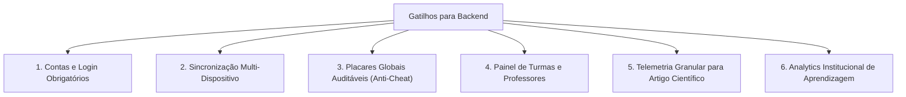
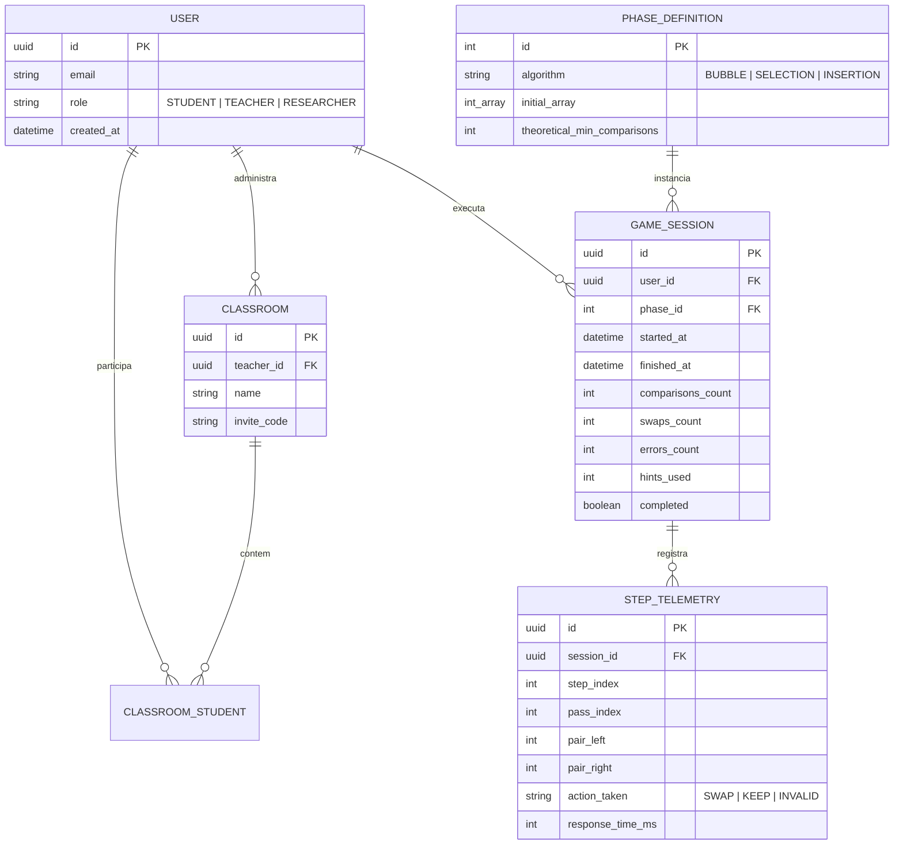

# 07 — Backend e Persistência: Realidade Atual, Armazenamento Local e Arquitetura Futura

> **Documento canônico:** Diagnóstico de persistência, modelo de armazenamento local implementado (P1.6), matriz de gatilhos operacionais e diretrizes para arquitetura futura de backend do **Sorting Station**.  
> **Status:** Ativo / Base de Verdade da Wiki  
> **Data:** 11/09/2026 (Atualizado em P1.6)  
> **Dependências:** [`AGENTS.md`](../../AGENTS.md), [`CLAUDE.md`](../../CLAUDE.md), [`00-repository-inventory.md`](./00-repository-inventory.md), [`01-product-vision.md`](./01-product-vision.md), [`02-system-architecture.md`](./02-system-architecture.md), [`ADR 0006`](../../docs/adr/0006-decoupled-local-storage-persistence.md).

---

O **Sorting Station opera como uma Single Page Application client-side com persistência local desacoplada** via `localStorage` (módulo `src/game/persistence/`), mantendo zero custos de servidor, zero necessidade de backend centralizado e resiliência total contra recargas de página (F5).

---

# PARTE 1 — ESTADO ATUAL

Esta seção documenta a realidade técnica fática do repositório em relação a dados, rede, armazenamento local e estado em tempo de execução.

```mermaid
flowchart LR
    BrowserTab["Aba do Navegador (F5 / Reload)"]
    AppState["Estado em Memória React (App.tsx)\nscreen, phase, result, phaseResults"]
    Storage[("Armazenamento Local (localStorage)\nsorting_station_v1_save\n[IMPLEMENTADO - P1.6]")]
    BackendServer[("Servidor Backend / API Remota\n[INEXISTENTE]")]

    BrowserTab <--> AppState
    AppState <-->|StorageAdapter (Safe Fallback)| Storage
    AppState -.->|INEXISTENTE| BackendServer
```

### 1.1. Ausência de Backend e APIs Remotas
- **Zero Endpoints:** O repositório não contém nenhum arquivo de rota de API, função serverless ou servidor backend (`Express`, `Fastify`, `NestJS`, `Django`, `Go`, etc.).
- **Zero Chamadas de Rede para Dados:** Não há chamadas `fetch`, `axios` ou instâncias de `WebSocket` para comunicação com APIs externas. O único tráfego de rede existente ocorre no carregamento inicial dos arquivos estáticos (`HTML`, `JS`, `CSS`) e no download das webfonts do Google Fonts.

### 1.2. Banco de Dados Remoto Inexistente
- Não há banco de dados remoto relacional (ex.: PostgreSQL, MySQL), não relacional (ex.: MongoDB, Redis) ou serviços BaaS (Firebase, Supabase).
- Todo armazenamento persistente é **estritamente local no navegador do operador**.

### 1.3. Ausência de Autenticação e Perfis Remotos
- O sistema não possui contas de usuário em servidor, tela de login, sessões ativas com token ou cookies de rastreamento. Todos os usuários operam com dados locais e privados em seu próprio dispositivo.

### 1.4. Como o Estado é Gerenciado e Separado (P1.6)
A arquitetura separa estritamente duas categorias de estado:

1. **Estado Volátil da Sessão (Em Memória RAM):**
   - Em [`src/App.tsx`](../../src/App.tsx): `screen`, `result` da fase corrente, `phaseResults` acumulados na campanha em andamento;
   - Em [`src/screens/GameScreen.tsx`](../../src/screens/GameScreen.tsx): FSM de ordenação, par sob análise, animações, histórico da fase atual;
   - Em [`src/screens/ReplayScreen.tsx`](../../src/screens/ReplayScreen.tsx): frame de inspeção retrospectiva corrente;
   - **Comportamento em Reset:** Clicar em "VOLTAR AO INÍCIO" (`handleReturnHome`) ou "REJOGAR PROTOCOLO" (`handleRestartProtocol`) reinicializa os arrays voláteis de sessão, mas **NÃO apaga o progresso gravado em disco**.

2. **Progresso Persistente de Longo Prazo (Armazenamento Local Desacoplado):**
   - Gerenciado exclusivamente através de `src/game/persistence/`;
   - Restaurado na inicialização da aplicação (inclusive após recarregar a página com F5);
   - Preservado entre sessões e reinicializações de protocolo.

---

# PARTE 2 — PERSISTÊNCIA LOCAL MULTI-PROTOCOLO IMPLEMENTADA `[IMPLEMENTADO - P2.1-F]` (ADR 0006, ADR 0007, ADR 0015)

Conforme deliberado nos [ADR 0006](../../docs/adr/0006-decoupled-local-storage-persistence.md), [ADR 0007](../../docs/adr/0007-protocol-score-and-descriptive-elapsed-time.md) e [ADR 0015](../../docs/adr/0015-multi-protocol-persistence-schema-v3.md), a persistência local opera com isolamento total dos componentes React, garantindo resiliência defensiva, suporte multi-protocolo e conformidade pedagógica.

---

## 2.1. O que É Persistido vs. O que NÃO É Persistido

| Categoria | Dado | Persistido? | Justificativa Arquitetural |
| :--- | :--- | :---: | :--- |
| **Protocolo (Bubble/Selection)** | `unlockedPhases` | **SIM** | Registra o nível de fases desbloqueadas pelo operador no protocolo em questão (1 a 3). Não altera a fase inicial da sessão (novo turno sempre inicia na Fase 1). |
| **Protocolo (Bubble/Selection)** | `highestPhaseReached` | **SIM** | Registra a maior fase alcançada pelo operador na campanha histórica daquele protocolo. Não determina a fase ativa da sessão. |
| **Protocolo (Bubble/Selection)** | `hasCompletedTutorial` | **SIM** | Evita forçar a leitura do tutorial toda vez que o operador clica em "INICIAR TURNO". O tutorial permanece acessível a qualquer momento via "COMO JOGAR". Resiste a F5. |
| **Recordes por Fase** | `records[phase].completed` | **SIM** | Registro factual booleano de conclusão da fase dentro do protocolo correspondente. |
| **Recordes por Fase** | `records[phase].completedAt` | **SIM** | Timestamp ISO 8601 da conclusão mais recente. |
| **Recordes por Fase** | `records[phase].bestScore` | **SIM** | Melhor pontuação obtida na fase (0 a 100), conforme fórmula do P1.7. |
| **Recordes por Fase** | `records[phase].bestScoreErrors` | **SIM** | Decisões incorretas cometidas na execução da melhor pontuação. |
| **Recordes por Fase** | `records[phase].bestScoreHintsUsed` | **SIM** | Dicas utilizadas na execução da melhor pontuação. |
| **Recordes por Fase** | `records[phase].bestScoreElapsedTimeMs` | **SIM** | Duração factual da execução da melhor pontuação (não utilizado em desempate). |
| **Preferências Globais** | `soundEnabled`, `reducedMotion`, `highContrast` | **SIM** | Configurações globais de acessibilidade e áudio do operador, compartilhadas entre protocolos. |
| **Metadados** | `schemaVersion`, `lastUpdated` | **SIM** | Versionamento canônico (`schemaVersion: 3` em P2.1-F) e data ISO da última mutação de estado. |
| **Sessão** | `phaseResults` (resumo global) | **NÃO** | As métricas da campanha corrente pertencem ao ciclo de jogo ativo e são resetadas ao reiniciar o protocolo. |
| **Sessão** | `result` (fase corrente) | **NÃO** | Dados voláteis da última fase jogada na rodada em andamento. |
| **Sessão / Replay** | `history: StepRecord[]`, `SelectionStepRecord[]` | **NÃO** | Histórico detalhado de micro-passos e frames consumido apenas durante a tela de replay da sessão atual (100% volátil em RAM). |
| **Pedagogia** | Estrelas, rankings, notas globais | **NÃO** | **Proibido inventar métricas arbitrárias.** O sistema adota a `Pontuação do Protocolo` por fase baseada em decisões incorretas e dicas, com tempo puramente descritivo (ADR 0007). |

---

## 2.2. Schema Versionado Canônico Multi-Protocolo (v3 — P2.1-F)

- **Chave de Armazenamento:** `sorting_station_v1_save` (preservada estritamente para manter compatibilidade)
- **Versão Atual:** `3` (pipeline explícito e transparente a partir de `schemaVersion: 1` e `schemaVersion: 2`)

```typescript
// src/game/persistence/types.ts
export type SupportedProtocol = "bubble" | "selection";

export interface PhaseRecord {
  readonly completed: boolean;
  readonly completedAt: string;
  readonly bestScore?: number;
  readonly bestScoreErrors?: number;
  readonly bestScoreHintsUsed?: number;
  readonly bestScoreElapsedTimeMs?: number;
}

export interface ProtocolProgress {
  readonly unlockedPhases: number;      // 1 a 3 (clamped)
  readonly highestPhaseReached: number;  // 1 a 3 (clamped)
  readonly hasCompletedTutorial: boolean;
  readonly records: Record<number, PhaseRecord>;
}

export interface GameSaveSchema {
  readonly schemaVersion: number; // 3
  readonly lastUpdated: string;   // ISO 8601
  readonly protocols: {
    readonly bubble: ProtocolProgress;
    readonly selection: ProtocolProgress;
  };
  readonly preferences: {
    readonly soundEnabled: boolean;
    readonly reducedMotion: boolean;
    readonly highContrast: boolean;
  };

  // Aliases de conveniência retrocompatíveis (apontam para protocols.bubble)
  readonly campaign: ProtocolProgress;
  readonly records: Record<number, PhaseRecord>;
}
```

### Isolamento Estrito de Namespaces
- Fases 1, 2 e 3 do Bubble Sort residem em `protocols.bubble.records[1..3]`;
- Fases 1, 2 e 3 do Selection Sort residem em `protocols.selection.records[1..3]`;
- **Proibição de Números Mágicos:** Nenhum identificador artificial ou sintético (como `101`, `201`) é utilizado no sistema. Cada protocolo possui suas próprias fases numéricas naturais de 1 a 3 isoladas pelo namespace do protocolo;
- Concluir fases no Selection Sort não afeta o progresso ou recordes do Bubble Sort, e vice-versa.

---

## 2.3. Arquitetura Defensiva e Pipeline de Migração (ADR 0015)

A camada de persistência reside em `src/game/persistence/` e implementa o padrão **Storage Adapter**:

1. **Abstração `StorageAdapter`:** Define os métodos contratuais `getItem`, `setItem` e `removeItem`.
2. **`MemoryStorageAdapter`:** Implementação 100% volátil em memória para testes unitários isolados e fallback automático.
3. **`createSafeStorage()`:** Envolve qualquer storage real com tratamento estrito de exceções:
   - **`SecurityError`:** Lançado por navegadores em contextos de sandbox restritos ou modo anônimo severo;
   - **`QuotaExceededError`:** Lançado quando a cota do domínio é ultrapassada;
   - **Comportamento:** Ao capturar qualquer exceção, a operação é redirecionada de forma transparente para um `MemoryStorageAdapter` em memória, emitindo aviso em `console.warn` e **impedindo a quebra da aplicação**.
4. **Pipeline Explícito de Migração (`validateAndMigrateSaveData`):**
   - Não utiliza conversão cega (`as`) em dados externos;
   - Sanitiza tipos inválidos, descarta chaves espúrias e clampa valores numéricos;
   - **Migração v1 $\rightarrow$ v2:** Saves de `schemaVersion: 1` têm campanha, conclusões, preferências e timestamps migrados;
   - **Migração v2 $\rightarrow$ v3:** O progresso e os recordes do Bubble existentes no save v2 são preservados e encapsulados em `protocols.bubble`, enquanto `protocols.selection` é inicializado com o padrão limpo;
   - **Pipeline v1 $\rightarrow$ v2 $\rightarrow$ v3:** Saves legados v1 transitam deterministicamente por ambos os passos sem perda de dados;
   - Caso o payload JSON esteja corrompido ou o `schemaVersion` seja superior/desconhecido, descarta com segurança e restaura o estado padrão (`createDefaultSaveData`).

---

## 2.4. Regras de Atualização de Recordes de Fase (ADR 0007 / ADR 0015)

Ao concluir uma fase com novos dados de pontuação (`PhaseScoreData`), a função pura `recordPhaseCompletion` avalia a substituição do recorde existente de forma isolada no protocolo alvo:

1. **Substituição por Pontuação Superior:**
   Se `newScore > bestScore`, os dados de pontuação (`bestScore`, `bestScoreErrors`, `bestScoreHintsUsed`, `bestScoreElapsedTimeMs`) são integralmente atualizados com a nova rodada;
2. **Substituição por Desempate de Precisão (Menos Erros):**
   Se `newScore === bestScore` E `newErrors < bestScoreErrors`, o recorde é atualizado para refletir a execução mais precisa;
3. **Imutabilidade em Pontuação Inferior ou Mais Erros:**
   Se `newScore < bestScore`, ou se em empate `newErrors >= bestScoreErrors`, o recorde atual é **estritamente preservado**;
4. **Veto ao Desempate por Tempo:**
   O tempo decorrido (`elapsedTimeMs`) **NUNCA** é usado como critério de desempate. Caso score e erros sejam idênticos, o recorde pré-existente permanece inalterado. O jogo não estimula pressa, mas foco reflexivo e conceitual;
5. **Preservação de Conclusão:**
   `completed: true` e `completedAt` mantêm o registro factual da execução mais recente, independentemente da substituição do recorde de pontuação.

---

## 2.5. Diagnóstico do Schema v3 e Especificação Conceitual do Schema v4 (ADR 0018)

### 2.5.1. Diagnóstico das Limitações do Schema v3 Atual
Embora o Schema v3 atual atenda perfeitamente à operação independente de Bubble e Selection Sort em suas campanhas de 3 fases, a transição do produto para **Plataforma Educacional** expõe limitações estruturais:
1. **Chaves Estáticas de Protocolo:** A interface `SaveData` fixa os protocolos como propriedades rígidas (`protocols: { bubble: ProtocolProgress; selection: ProtocolProgress }`). A inclusão dos outros 4 módulos (Insertion, Merge, Quick e Heap) exigiria quebrar a tipagem estática raiz;
2. **Indexação Numérica Rígida por Fases:** Os recordes são indexados por inteiros (`Record<number, PhaseRecord>`), refletindo a mentalidade legada de "fases de jogo lineares" (1, 2, 3);
3. **Falta de Suporte à Taxonomia de Exercícios:** O Schema v3 não suporta nativamente a classificação transversal de 8 tipos de exercícios (Introdução, Demonstração, Tutorial Guiado, Prática Básica, Prática Progressiva, Casos, Desafio e Prática Livre).
4. **Risco de Proliferação com Seeds Procedurais:** Persistir cada seed procedural como exercício distinto poluiria o storage. O progresso deve ser agregado por conjunto de exercícios (`moduleId + exerciseSetId`).

### 2.5.2. Especificação Conceitual do Schema v4 (Projetado)

> [!NOTE]
> **Diretriz Mandatória de Não-Alteração de Código em PLATFORM-R0:**  
> A especificação abaixo constitui um **desenho arquitetural puramente conceitual**. O código em `src/game/persistence/` e os saves existentes de usuários reais no navegador permanecem **100% inalterados no Schema v3** durante esta tarefa documental.

No futuro, a migração para o Schema v4 adotará um modelo dinâmico e extensível:

```typescript
// Especificação Conceitual do Schema v4 (Projeção para Futura Migração)
export interface SaveDataV4 {
  readonly schemaVersion: 4;
  readonly lastUpdated: string;
  readonly preferences: GlobalPreferences;
  readonly modules: Record<string, ModuleProgressV4>; // indexado por moduleId ('bubble', 'selection', etc.)
}

export interface ModuleProgressV4 {
  readonly moduleId: string;
  readonly completed: boolean;
  readonly completedTutorial: boolean;
  readonly unlockedExercises: readonly string[];
  readonly exercises: Record<string, ExerciseRecordV4>; // indexado por exerciseId ('basic', 'cases-nearly-sorted', etc.)
}

export interface ExerciseRecordV4 {
  readonly exerciseId: string;
  readonly exerciseType: ExerciseTypeId;
  readonly completed: boolean;
  readonly completedAt: string;
  readonly bestScore?: number;
  readonly bestScoreErrors?: number;
  readonly bestScoreHintsUsed?: number;
  readonly bestScoreElapsedTimeMs?: number;
}
```

**Pipeline de Migração Projetado (v3 $\rightarrow$ v4):**
- O migrador converterá as chaves `protocols.bubble.records[1]`, `[2]`, `[3]` em `modules.bubble.exercises["basic"]`, `["intermediate"]`, `["advanced"]`;
- As preferências globais (`soundEnabled`, `reducedMotion`, `highContrast`) serão preservadas sem qualquer perda.

---

# PARTE 3 — GATILHOS PARA CRIAÇÃO DE BACKEND

> [!IMPORTANT]
> **Diretriz de Engenharia:**  
> **Um backend NÃO deve ser desenvolvido por inércia ou presunção arquitetural.**  
> O modelo client-side estático atual atende plenamente aos objetivos do MVP pedagógico. A complexidade operacional e o custo de manutenção de um servidor só são justificados quando houver **requisitos formais que tornem o servidor estritamente indispensável**.

A introdução de uma API e banco de dados centralizado só será autorizada mediante a ocorrência de um ou mais dos seguintes **gatilhos mandatórios**:



1. **Contas de Usuário e Autenticação:** Necessidade de identificar formalmente estudantes por e-mail institucional ou Single Sign-On (Google/GitHub/SAML escolar).
2. **Sincronização Multi-Dispositivo:** Exigência de que o aluno inicie uma fase no laboratório da universidade e conclua a mesma campanha em seu computador pessoal ou tablet.
3. **Placares e Rankings Globais Auditáveis:** Criação de tabelas de liderança competitivas onde a integridade das pontuações precise ser validada pelo servidor para evitar adulterações via console do navegador (*anti-cheat*).
4. **Painel de Turmas e Professores (*Classroom Management*):** Funcionalidade onde docentes possam cadastrar turmas, atribuir listas de fases customizadas e acompanhar relatórios consolidados de rendimento dos alunos.
5. **Telemetria de Baixo Nível para Pesquisa Acadêmica:** Coleta massiva e padronizada de eventos temporais (ex.: milissegundos transcorridos entre cada clique, quantidade exata de erros por passada) para fundamentar a avaliação estatística do artigo científico.
6. **Analytics de Aprendizagem (*Learning Analytics*):** Processamento centralizado para identificar conceitos onde os estudantes mais travam (ex.: detecção estatística de dificuldade na compreensão do caso médio do Bubble Sort).

---

# PARTE 4 — ARQUITETURA FUTURA POSSÍVEL (AGNOSTA DE TECNOLOGIA)

Esta seção traça o modelo conceitual de uma futura API, **sem escolher tecnologias ou frameworks de forma arbitrária e sem inventar endpoints ou bancos inexistentes**.

---

## 4.1. Domínios Conceituais da API Futura

Caso um dos gatilhos da Parte 3 seja disparado, a API deverá ser estruturada em torno dos seguintes subdomínios de negócio:

1. **Domínio de Identidade e Acesso (Identity & Access):**
   - Gerenciamento de credenciais, sessões seguras e perfis de usuário (`ESTUDANTE`, `PROFESSOR`, `PESQUISADOR`).
2. **Domínio de Turmas e Currículo (Academic Management):**
   - Agrupamento de alunos em turmas, vinculação a professores e definição de trilhas de fases personalizadas.
3. **Domínio de Sessões de Jogo e Telemetria (Game Tracking):**
   - Registro de execuções de fase (*runs*), registro de ações atômicas (comparações, trocas, erros) e cálculo auditado de eficiência.
4. **Domínio de Pesquisa e Analytics (Research Analytics):**
   - Extração de datasets anonimizados para ferramentas de análise estatística (R, Python, SPSS).

---

## 4.2. Entidades Conceituais de Dados



---

## 4.3. Requisitos Mandatórios de Privacidade e Conformidade (LGPD / GDPR)

A introdução de qualquer mecanismo remoto de armazenamento deve cumprir integralmente a legislação de proteção de dados:

- **Minimização de Dados:** Coletar apenas as informações estritamente necessárias para o funcionamento pedagógico e acadêmico.
- **Anonimização em Pesquisa Acadêmica:** Todos os dados de telemetria utilizados para a confecção de artigos científicos devem ser anonimizados ou pseudonimizados, desvinculando identificadores pessoais (nomes, e-mails) de métricas de desempenho.
- **Consentimento Informado:** Termo de Consentimento Livre e Esclarecido (TCLE) digital integrado para estudantes que participarem de coletas de dados empíricas.
- **Direito ao Esquecimento:** Mecanismo acessível para que o usuário solicite a exclusão definitiva de sua conta e de seu histórico de sessões.

---

## 4.4. Obrigatoriedade de um Registro de Decisão Arquitetural (ADR)

> [!CAUTION]
> **Proibição de Escolha Arbitrária de Frameworks:**  
> A escolha da linguagem de backend (ex.: TypeScript/Node vs. Python vs. Go), do framework (ex.: Fastify vs. NestJS vs. FastAPI), do banco de dados (ex.: PostgreSQL relacional vs. MongoDB) e do provedor de nuvem (ex.: AWS, GCP, Fly.io) **não deve ser decidida precipitadamente**.  
> Antes de qualquer linha de código de backend ser escrita, a equipe deverá obrigatoriamente formalizar um **ADR (Architecture Decision Record)** documentando o contexto, requisitos de latência, custos estimados de operação, conformidade e alternativas avaliadas.
