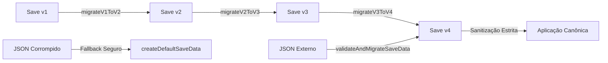
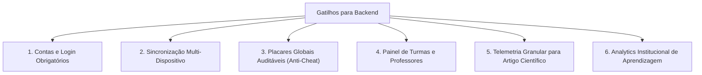

# 07 — Backend e Persistência: Realidade Atual, Armazenamento Local e Arquitetura Futura

> **Documento canônico:** Diagnóstico de persistência, modelo de armazenamento local implementado (Schema v4 - P2.2-F), matriz de gatilhos operacionais e diretrizes para arquitetura futura de backend do **Sorting Station**.  
> **Status:** Ativo / Base de Verdade da Wiki  
> **Data:** 17/09/2026 (Atualizado no Marco P2.2-F)  
> **Dependências:** [`AGENTS.md`](../../AGENTS.md), [`00-repository-inventory.md`](./00-repository-inventory.md), [`01-product-vision.md`](./01-product-vision.md), [`02-system-architecture.md`](./02-system-architecture.md), [`ADR 0006`](../../docs/adr/0006-decoupled-local-storage-persistence.md), [`ADR 0015`](../../docs/adr/0015-multi-protocol-persistence-schema-v3.md), [`ADR 0018`](../../docs/adr/0018-game-to-educational-platform-transition.md), [`ADR 0021`](../../docs/adr/0021-module-exercise-persistence-schema-v4.md).

---

O **Sorting Station opera como uma Single Page Application client-side com persistência local desacoplada** via `localStorage` (módulo `src/game/persistence/`), mantendo zero custos de servidor, zero necessidade de backend centralizado e resiliência total contra recargas de página (F5).

---

# PARTE 1 — ESTADO ATUAL

Esta seção documenta a realidade técnica fática do repositório em relação a dados, rede, armazenamento local e estado em tempo de execução.

```mermaid
flowchart LR
    BrowserTab["Aba do Navegador (F5 / Reload)"]
    AppState["Estado em Memória React (App.tsx)\nscreen, currentModule, currentExerciseSetId, volatileResult"]
    Storage[("Armazenamento Local (localStorage)\nsorting_station_save\n[IMPLEMENTADO - Schema v4 (P2.2-F)]")]
    LegacyKey[("Chave Legada (Fallback)\nsorting_station_v1_save")]
    BackendServer[("Servidor Backend / API Remota\n[INEXISTENTE]")]

    BrowserTab <--> AppState
    AppState <-->|StorageAdapter (Safe Fallback)| Storage
    Storage -.->|Fallback de leitura transparente| LegacyKey
    AppState -.->|INEXISTENTE| BackendServer
```

### 1.1. Ausência de Backend e APIs Remotas
- **Zero Endpoints:** O repositório não contém nenhum arquivo de rota de API, função serverless ou servidor backend (`Express`, `Fastify`, `NestJS`, `Django`, `Go`, etc.).
- **Zero Chamadas de Rede para Dados:** Não há chamadas `fetch`, `axios` ou instâncias de `WebSocket` para comunicação com APIs externas. O único tráfego de rede existente ocorre no carregamento inicial dos arquivos estáticos (`HTML`, `JS`, `CSS`) e no download das webfonts do Google Fonts.

### 1.2. Banco de Dados Remoto Inexistente
- Não há banco de dados remoto relacional (ex.: PostgreSQL, MySQL), não relacional (ex.: MongoDB, Redis) ou serviços BaaS (Firebase, Supabase).
- Todo armazenamento persistente é **estritamente local no navegador do operador**.

### 1.3. Ausência de Autenticação e Perfis Remotos
- O sistema não possui contas de usuário em servidor, tela de login, sessões ativas com token ou cookies de rastreamento. Todos os usuários operam com dados locais e privados em seu próprio dispositivo.

### 1.4. Como o Estado é Gerenciado e Separado (P2.2-F)
A arquitetura separa estritamente duas categorias de estado:

1. **Estado Volátil da Sessão (Em Memória RAM):**
   - Em [`src/App.tsx`](../../src/App.tsx): `screen`, rota ativa, `result` da atividade corrente, `insertionSessionScores` acumulados no conjunto de práticas;
   - Em [`src/screens/GameScreen.tsx`](../../src/screens/GameScreen.tsx), [`src/screens/SelectionGameScreen.tsx`](../../src/screens/SelectionGameScreen.tsx) e [`src/screens/InsertionGameScreen.tsx`](../../src/screens/InsertionGameScreen.tsx): FSMs de ordenação, pares/elementos sob análise, animações, histórico da execução atual;
   - Em [`src/screens/ReplayScreen.tsx`](../../src/screens/ReplayScreen.tsx), [`src/screens/SelectionReplayScreen.tsx`](../../src/screens/SelectionReplayScreen.tsx) e [`src/screens/InsertionReplayScreen.tsx`](../../src/screens/InsertionReplayScreen.tsx): frame de inspeção retrospectiva corrente;
   - **Comportamento em Reset:** Clicar em "VOLTAR AO INÍCIO" (`handleReturnHome`) ou "REINICIAR PRÁTICA" (`handleRestartExercise`) reinicializa o estado volátil de sessão, mas **NÃO regride o progresso persistido**.

2. **Progresso Persistente de Longo Prazo (Armazenamento Local Desacoplado):**
   - Gerenciado exclusivamente através de `src/game/persistence/`;
   - Restaurado na inicialização da aplicação (inclusive após recarregar a página com F5);
   - Preservado entre sessões e navegações de rota.

---

# PARTE 2 — PERSISTÊNCIA SCHEMA V4 ORIENTADA A MÓDULOS E EXERCÍCIOS `[IMPLEMENTADO - P2.2-F]` (ADR 0021)

Conforme deliberado no [ADR 0021](../../docs/adr/0021-module-exercise-persistence-schema-v4.md), a persistência local opera com isolamento total dos componentes React, garantindo resiliência defensiva, suporte multi-módulo extensível e conformidade pedagógica.

---

## 2.1. O que É Persistido vs. O que NÃO É Persistido

| Categoria | Dado | Persistido? | Justificativa Arquitetural |
| :--- | :--- | :---: | :--- |
| **Módulos Curriculares** | `modules[moduleId].completedTutorial` | **SIM** | Evita forçar a repetição do tutorial guiado toda vez que o estudante entra na atividade. O tutorial permanece acessível a qualquer momento via Hub ou botão dedicado. Resiste a F5. |
| **Conjuntos de Exercícios** | `exerciseSets[exerciseSetId].completed` | **SIM** | Registro factual booleano de conclusão do exercício dentro do módulo correspondente. |
| **Conjuntos de Exercícios** | `exerciseSets[exerciseSetId].completedAt` | **SIM** | Timestamp ISO 8601 da conclusão mais recente daquele exercício. |
| **Recordes de Exercício** | `bestRecord.bestScore` | **SIM** | Melhor pontuação obtida no exercício (0 a 100), conforme fórmula da Carta Pedagógica ($100 - 10\times\text{erros} - 5\times\text{dicas}$). |
| **Recordes de Exercício** | `bestRecord.bestScoreErrors` | **SIM** | Quantidade de decisões incorretas cometidas na execução da melhor pontuação. |
| **Recordes de Exercício** | `bestRecord.bestScoreHintsUsed` | **SIM** | Quantidade de dicas utilizadas na execução da melhor pontuação. |
| **Recordes de Exercício** | `bestRecord.bestScoreElapsedTimeMs` | **SIM** | Duração factual da execução da melhor pontuação (estritamente descritiva; **nunca** desempata recordes). |
| **Preferências Globais** | `soundEnabled`, `reducedMotion`, `highContrast` | **SIM** | Configurações globais de acessibilidade e áudio do estudante, compartilhadas entre todos os módulos. |
| **Metadados** | `schemaVersion`, `lastUpdated` | **SIM** | Versionamento canônico (`schemaVersion: 4` em P2.2-F) e data ISO da última mutação de estado. |
| **Desbloqueios Derivados** | `unlockedPhases`, `isUnlocked`, `challengeUnlocked` | **NÃO** | **Proibido salvar flags redundantes no storage.** Desbloqueios são calculados puramente a partir de `completed` de exercícios anteriores. |
| **Sessão / Replay** | `history: StepRecord[]`, `frames`, `seeds` | **NÃO** | Quadros de replay e histórico de micro-passos residem exclusivamente na memória RAM da sessão atual. Seeds procedurais nunca são salvos. |
| **Demonstração Canônica** | Telas de demonstração | **NÃO** | A demonstração executa vetores fixos curados em tempo de execução e não salva histórico. |

---

## 2.2. Schema Versionado Canônico v4 (`src/game/persistence/types.ts`)

- **Chave Canônica Estável:** `STORAGE_KEY = "sorting_station_save"`
- **Chave Legada para Fallback:** `LEGACY_STORAGE_KEY = "sorting_station_v1_save"`
- **Versão Atual:** `4`

```typescript
export type ModuleId =
  | "bubble"
  | "selection"
  | "insertion"
  | "merge"
  | "quick"
  | "heap";

export interface ExerciseRecordV4 {
  readonly bestScore: number;
  readonly bestScoreErrors: number;
  readonly bestScoreHintsUsed: number;
  readonly bestScoreElapsedTimeMs: number;
}

export interface ExerciseSetProgressV4 {
  readonly completed: boolean;
  readonly completedAt?: string;
  readonly bestRecord?: ExerciseRecordV4;
}

export interface ModuleProgressV4 {
  readonly completedTutorial: boolean;
  readonly exerciseSets: Record<string, ExerciseSetProgressV4>;
}

export interface GlobalPreferences {
  readonly soundEnabled: boolean;
  readonly reducedMotion: boolean;
  readonly highContrast: boolean;
}

export interface GameSaveSchemaV4 {
  readonly schemaVersion: 4;
  readonly lastUpdated: string;
  readonly preferences: GlobalPreferences;
  readonly modules: Partial<Record<ModuleId, ModuleProgressV4>>;
}
```

### Identificadores Canônicos de Exercícios (`src/game/persistence/constants.ts`)
```typescript
export const BUBBLE_EXERCISE_SETS = {
  BASIC: "bubble.practice.basic",
  INTERMEDIATE: "bubble.practice.intermediate",
  ADVANCED: "bubble.practice.advanced",
  CHALLENGE_EARLY_EXIT: "bubble.challenge.early-exit",
} as const;

export const SELECTION_EXERCISE_SETS = {
  BASIC: "selection.practice.basic",
  INTERMEDIATE: "selection.practice.intermediate",
  ADVANCED: "selection.practice.advanced",
} as const;

export const INSERTION_EXERCISE_SETS = {
  BASIC: "insertion.practice.basic",
  INTERMEDIATE: "insertion.practice.intermediate",
  ADVANCED: "insertion.practice.advanced",
} as const;
```

---

## 2.3. Pipeline de Migração Sequencial e Validação Defensiva



1. **`migrateV1ToV2`:** Converte conclusões simples de fase para v2;
2. **`migrateV2ToV3`:** Mapeia recordes de Bubble para `protocols.bubble` e inicializa Selection limpo;
3. **`migrateV3ToV4`:** Transforma o progresso factual das fases 1/2/3 de Bubble e Selection nos respectivos `exerciseSetIds` (`basic`, `intermediate`, `advanced`) com pontuações, erros, tempos, dicas e tutoriais integralmente preservados;
4. **Sanitização Nativa v4:** Remove chaves espúrias, clampa métricas corrompidas e garante imutabilidade via `Object.freeze`;
5. **Fallback Seguro:** Caso o payload não seja JSON válido ou declare versão futura desconhecida (> 4), gera estado padrão limpo sem interrupção do app.

---

## 2.4. Regras Canônicas de Recorde (ADR 0007 / ADR 0021)

A substituição de recordes é governada pela função pura `shouldUpdateRecord(current, candidate)`:

1. **Maior Pontuação:** Se `candidate.score > current.bestScore`, atualiza;
2. **Desempate por Menor Erro:** Se `candidate.score === current.bestScore` E `candidate.errors < current.bestScoreErrors`, atualiza (recompensa maior precisão conceitual);
3. **Veto ao Desempate por Tempo:** Se score e erros forem idênticos, o tempo de execução **NÃO** desempata nem incentiva pressa mecânica;
4. **Tentativas Incompletas:** Novas tentativas não concluídas ou reinicializadas antes do fim nunca sobrescrevem recordes.

---

## 2.5. Adaptadores de Compatibilidade

Para preservar o funcionamento imediato das telas legadas de Bubble e Selection sem introduzir refatores precipitados fora de escopo:
- `getProtocolProgress(saveData, protocolId)`: Função pura que deriva sob demanda a projeção legada `ProtocolProgress` (`unlockedPhases`, `highestPhaseReached`, `hasCompletedTutorial`, `records`);
- `recordPhaseCompletion`: Converte chamadas de fase (1, 2, 3) para os respectivos exercícios do Schema v4;
- `isChallengeModeUnlocked(saveData)`: Deriva o desbloqueio do Modo Desafio (Early Exit) a partir da conclusão factual de `bubble.practice.advanced`.

---

# PARTE 3 — GATILHOS PARA CRIAÇÃO DE BACKEND

> [!IMPORTANT]
> **Diretriz de Engenharia:**  
> **Um backend NÃO deve ser desenvolvido por inércia ou presunção arquitetural.**  
> O modelo client-side estático atual atende plenamente aos objetivos do MVP pedagógico. A complexidade operacional e o custo de manutenção de um servidor só são justificados quando houver **requisitos formais que tornem o servidor estritamente indispensável**.

A introdução de uma API e banco de dados centralizado só será autorizada mediante a ocorrência de um ou mais dos seguintes **gatilhos mandatórios**:



1. **Contas de Usuário e Autenticação:** Necessidade de identificar formalmente estudantes por e-mail institucional ou Single Sign-On (Google/GitHub/SAML escolar).
2. **Sincronização Multi-Dispositivo:** Exigência de que o aluno inicie uma fase no laboratório da universidade e conclua a mesma campanha em seu computador pessoal ou tablet.
3. **Placares e Rankings Globais Auditáveis:** Criação de tabelas de liderança competitivas onde a integridade das pontuações precise ser validada pelo servidor para evitar adulterações via console do navegador (*anti-cheat*).
4. **Painel de Turmas e Professores (*Classroom Management*):** Funcionalidade onde docentes possam cadastrar turmas, atribuir listas de fases customizadas e acompanhar relatórios consolidados de rendimento dos alunos.
5. **Telemetria de Baixo Nível para Pesquisa Acadêmica:** Coleta massiva e padronizada de eventos temporais (ex.: milissegundos transcorridos entre cada clique, quantidade exata de erros por passada) para fundamentar a avaliação estatística do artigo científico.
6. **Analytics de Aprendizagem (*Learning Analytics*):** Processamento centralizado para identificar conceitos onde os estudantes mais travam (ex.: detecção estatística de dificuldade na compreensão do caso médio do Bubble Sort).
