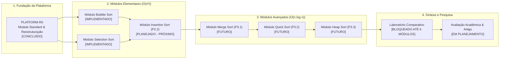

# 10 — Roadmap Estratégico da Plataforma Educacional

> **Documento canônico:** Planejamento estratégico, governança de módulos, roadmap oficial da plataforma, histórico de implementação (marcos legados) e matriz de riscos do **Sorting Station**.  
> **Status:** Ativo / Base de Verdade da Plataforma  
> **Data de Atualização:** 15/09/2026 (Marco PLATFORM-R0)  
> **Dependências:** [`AGENTS.md`](../../AGENTS.md), [`ADR 0018`](../adr/0018-game-to-educational-platform-transition.md), [`modules/README.md`](./modules/README.md), [`comparison-lab.md`](./comparison-lab.md).

---

## 1. Visão Geral e Reposicionamento do Roadmap

A partir do marco **PLATFORM-R0** ([`ADR 0018`](../adr/0018-game-to-educational-platform-transition.md)), o roadmap do Sorting Station foi oficialmente desvinculado do modelo de "fases de jogo linear" e reestruturado em torno de **Módulos Curriculares de Algoritmos** e da **Plataforma Educacional Integrada**.

---

## 2. Status Factual dos Módulos Curriculares

| Módulo | Arquivo de Especificação | Complexidade | Status Factual | Próximo Passo |
| :--- | :--- | :---: | :---: | :--- |
| **01. Bubble Sort** | [`modules/bubble-sort.md`](./modules/bubble-sort.md) | $\Theta(n^2)$ | `IMPLEMENTADO` | Adaptação conceitual de fases para exercícios |
| **02. Selection Sort** | [`modules/selection-sort.md`](./modules/selection-sort.md) | $\Theta(n^2)$ | `IMPLEMENTADO` | Adaptação conceitual de fases para exercícios |
| **03. Insertion Sort** | [`modules/insertion-sort.md`](./modules/insertion-sort.md) | $\Theta(n^2)$ | `PLANEJADO` (P2.2) | Implementação da engine pura e elevação de chave |
| **04. Merge Sort** | [`modules/merge-sort.md`](./modules/merge-sort.md) | $\Theta(n \log n)$ | `FUTURO` (P3.1) | Arquitetura de sub-esteiras e intercalação |
| **05. Quick Sort** | [`modules/quick-sort.md`](./modules/quick-sort.md) | $\Theta(n \log n)$ | `FUTURO` (P3.2) | Particionamento bilateral e seleção de pivô |
| **06. Heap Sort** | [`modules/heap-sort.md`](./modules/heap-sort.md) | $\Theta(n \log n)$ | `FUTURO` (P3.3) | Estrutura de max-heap e afundamento (*sift-down*) |
| **Laboratório Comparativo**| [`comparison-lab.md`](./comparison-lab.md) | Multi-algoritmo | `BLOQUEADO` | Aguarda conclusão dos 6 módulos |

---

## 3. Roadmap da Plataforma Educacional

### Marco 0: PLATFORM FOUNDATION (PLATFORM-R0) — `CONCLUÍDO`
- Redefinição oficial do produto como **Plataforma Educacional Interativa e Gamificada** ([`ADR 0018`](../adr/0018-game-to-educational-platform-transition.md)).
- Estabelecimento do **Module Standard transversal** com as 20 seções obrigatórias para todos os módulos ([`modules/README.md`](./modules/README.md)).
- Congelamento dos **6 módulos curriculares oficiais** em `docs/wiki/modules/`.
- Taxonomia Transversal de Exercícios (A até H) com matriz de obrigatoriedade.
- Especificação formal do **Laboratório Comparativo** com bloqueio explícito até a entrega dos 6 módulos ([`comparison-lab.md`](./comparison-lab.md)).
- Diagnóstico do Schema v3 e especificação conceitual do Schema v4 orientado a exercícios ([`07-backend-and-persistence.md`](./07-backend-and-persistence.md)).
- Auditoria e sincronização documental completa da Wiki.

---

### Marco 1: MÓDULO INSERTION SORT (P2.2) — `EM PROGRESSO` (DESIGN APROVADO EM P2.2-A)
- **Objetivo:** Implementar o 3º módulo curricular da plataforma: *"Desvio e Encaixe de Cargas"*.
- **Sub-Marcos de Engenharia:**
  1. **P2.2-A:** Design Pedagógico, Mecânico e Curricular do Módulo (`CONCLUÍDO` em [`modules/insertion-sort.md`](./modules/insertion-sort.md));
  2. **P2.2-B:** Engine pura de Insertion Sort por deslocamentos em `src/game/sorting/insertion/` + suíte completa de testes unitários com Vitest (`CONCLUÍDO`, ADR 0018);
  3. **P2.2-C:** Restrições procedurais (`insertionConstraints.ts`), briefing oficial, tutorial interativo (`[4, 2, 3]`) e driver puro de demonstração canônica (`[6, 3, 5, 2]`) (`CONCLUÍDO`, ADR 0019);
  4. **P2.2-D:** Interface de prática interativa (`InsertionGameScreen.tsx`) com trilho suspenso para chave elevada, esteira com vaga única (`InsertionHoleSlot`), role `"ordered-scan"`, catálogo de práticas sem fases (`basic`, `intermediate`, `advanced`), resultado de exercício e tela de conclusão do conjunto (`PracticeSetCompleteScreen.tsx`) (`CONCLUÍDO`, 368 testes verdes);
  5. **P2.2-E:** Replay retrospectivo com derivação pura de quadros e pseudocódigo sincronizado de 11 instruções (`InsertionSortPseudocodePanel.tsx`) + conexão visual da demonstração (`PRÓXIMO MARCO`);
  6. **P2.2-F:** Persistência Schema v4 multi-protocolo orientada a exercícios/módulos e homologação final do Insertion Sort no catálogo.
- **Critério de Aceite:** 100% dos testes unitários verdes e zero regressão nos testes existentes.

---

### Marco 2: MÓDULO MERGE SORT (P3.1) — `FUTURO`
- **Objetivo:** Primeiro módulo log-linear da plataforma, demonstrando Divisão e Conquista.
- **Entregáveis:**
  1. Visualização de sub-esteiras paralelas bifurcadas;
  2. Botoeira com dois ponteiros para intercalação guiada;
  3. Métrica especializada de escritas em memória auxiliar;
  4. Demonstração autônoma sobre `[7, 2, 5, 3]`;
  5. Modo de intercalação balanceada e assimétrica.

---

### Marco 3: MÓDULO QUICK SORT (P3.2) — `FUTURO`
- **Objetivo:** Segundo módulo log-linear, demonstrando particionamento in-place em torno de pivô.
- **Entregáveis:**
  1. Destaque luminoso do pivô na esteira com farol indicador;
  2. Particionamento bilateral Lomuto com esteiras para menores e maiores;
  3. Fixação definitiva do pivô na fronteira entre as metades;
  4. Casos especiais curados demonstrando degeneração para $O(n^2)$ e caso balanceado $O(n \log n)$.

---

### Marco 4: MÓDULO HEAP SORT (P3.3) — `FUTURO`
- **Objetivo:** Terceiro módulo avançado, unindo complexidade garantida $O(n \log n)$ com espaço auxiliar $O(1)$.
- **Entregáveis:**
  1. Comutador de visão dupla (esteira horizontal e holograma em árvore binária quase completa);
  2. Fase 1 de montagem do heap (*heapify*) e Fase 2 de extração sucessiva da raiz;
  3. Mecânica interativa de afundamento (*sift-down*) promovendo o maior filho.

---

### Marco 5: LABORATÓRIO COMPARATIVO (P3.4) — `BLOQUEADO`
- **Condição Mandatória:** Bloqueado até a conclusão formal dos Marcos 1 a 4 (todos os 6 módulos homologados).
- **Entregáveis:**
  1. Modo Comparação Visual: de 2 a 6 esteiras paralelas alimentadas pela mesma semente (PRNG Mulberry32);
  2. Modo Benchmark Analítico: execução em lote sem animação sobre $n = 10, 50, 100, 500$, gerando gráficos analíticos;
  3. Matriz de métricas segregada: Comparações universais vs. Movimentações específicas (swaps, shifts, writes);
  4. Exportação de dados para pesquisa científica (JSON/CSV).

---

### Marco 6: AVALIAÇÃO ACADÊMICA E METODOLOGIA (P3.5) — `EM PLANEJAMENTO`
- **Objetivo:** Aplicação pedagógica do Sorting Station em turmas de graduação de Ciência da Computação.
- **Diretriz Ética Inegociável:** Coleta de dados controlada sem alegações prematuras de eficácia na documentação antes da conclusão formal dos experimentos empíricos.

---

## 4. Histórico de Implementação / Legacy (Marcos P0 a P2.1-G)

Esta seção preserva o registro histórico indelével de engenharia dos marcos concluídos durante a fase inicial de desenvolvimento do projeto:

### Marco P0 — MVP Pedagógico e Correção de Fundações (Concluído)
- **P0.1 a P0.4:** FSM da engine pura de Bubble Sort, bloqueio de ações fora de sequência, decisões explícitas `TROCAR` vs `MANTER`.
- **P0.5:** Fixação determinística de elementos consolidados (`sortedBoundary`).
- **P0.6 e P0.7:** Cálculo real de progresso e correção física do bug de animação de permuta.
- **P0.8:** Suíte inicial de testes unitários com Vitest (28 testes).
- **P0.9:** Tela final de encerramento da campanha (`CampaignCompleteScreen.tsx`) e eliminação do loop infinito da Fase 3 ([`ADR 0002`](../adr/0002-campaign-completion-memory-state.md)).

### Marco P1 — Refinamento Pedagógico e Infraestrutura Transversal (Concluído)
- **P1.1 a P1.4:** Replay retrospectivo com derivação pura de quadros a partir do histórico ([`ADR 0004`](../adr/0004-execution-replay-state-derivation.md)) e pseudocódigo sincronizado de 9 instruções ([`ADR 0005`](../adr/0005-replay-synchronized-pseudocode.md)).
- **P1.5 e P1.6:** Persistência local desacoplada via `StorageAdapter` com Schema v1 e v2 ([`ADR 0006`](../adr/0006-decoupled-local-storage-persistence.md)).
- **P1.7:** Pontuação do Protocolo transparente e tempo decorrido puramente descritivo ([`ADR 0007`](../adr/0007-protocol-score-and-descriptive-elapsed-time.md)).
- **P1.8:** Tutorial interativo guiado com FSM dedicada sobre `[3, 1, 2]` ([`ADR 0008`](../adr/0008-interactive-tutorial-fsm.md)).
- **P1.9:** Geração procedural determinística universal (PRNG Mulberry32) com constraints puras ([`ADR 0009`](../adr/0009-deterministic-procedural-generation.md)).
- **P1.10:** Briefing operacional com seleção bimodal canônico vs Early Exit ([`ADR 0010`](../adr/0010-data-driven-protocol-mode-briefing.md)).

### Marco P2.1 — Implementação do Selection Sort (Concluído)
- **P2.1-A:** Especificação conceitual e formal do Selection Sort ([`ADR 0011`](../adr/0011-selection-sort-engine-fsm.md)).
- **P2.1-B:** Engine pura bimodal `INSPECT`/`COMMIT` e constraints procedurais (`selectionSortEngine.ts`, `selectionConstraints.ts`).
- **P2.1-C:** Tutorial interativo com engine real sobre `[4, 1, 3]` (`SelectionTutorialScreen.tsx`).
- **P2.1-D:** Interface de gameplay do Selection Sort com scanner visual, animações de longo alcance e tela final (`SelectionGameScreen.tsx`, `SelectionCampaignCompleteScreen.tsx`, [`ADR 0013`](../adr/0013-selection-sort-gameplay-and-screen-flow.md)).
- **P2.1-E:** Replay retrospectivo do Selection Sort com pseudocódigo sincronizado de 13 instruções ([`ADR 0014`](../adr/0014-selection-sort-replay-and-synchronized-pseudocode.md)).
- **P2.1-F:** Persistência multi-protocolo Schema v3 isolando namespaces de progresso sem cross-contamination ([`ADR 0015`](../adr/0015-multi-protocol-persistence-schema-v3.md)).

### Marco P2.1-G — Harmonização Transversal e Modo Demonstração (Concluído)
- **P2.1-G-A:** Charter Educacional e congelamento da metáfora logística ([`ADR 0016`](../adr/0016-educational-charter-and-cross-protocol-standardization.md)).
- **P2.1-G-B:** Harmonização visual de layout, cabeçalhos, telemetria contínua e notas pedagógicas de resultado.
- **P2.1-G-C:** Hub Simétrico de Protocolos na Home (`HomeScreen.tsx`, `ProtocolCard.tsx`, `protocolCatalog.ts`).
- **P2.1-G-D:** Modo Demonstração Educacional Canônico consumindo engines reais sobre vetores curados (`DemonstrationScreen.tsx`, `bubbleDemonstration.ts`, `selectionDemonstration.ts`, [`ADR 0017`](../adr/0017-canonical-demonstration-mode.md)).
- **Consolidação de Testes:** Total de **303 testes unitários automatizados 100% verdes** distribuídos em 19 arquivos de teste.

---

## 5. Próxima Ação Imediata de Desenvolvimento

Com a conclusão do marco **P2.2-D** (práticas interativas, interface de exercício e conclusão do conjunto), a próxima prioridade de implementação de código no Sorting Station é:

$$\mathbf{M\acute{O}DULO\ INSERTION\ SORT\ -\ REPLAY,\ PSEUDOC\acute{O}DIGO\ E\ DEMONSTRA\C{C}\tilde{A}O\ VISUAL\ (Marco\ P2.2-E)}$$

Seguindo estritamente o ciclo de governança:
1. Derivação pura de quadros de replay (`insertionReplayModel.ts`) a partir de `InsertionStepRecord[]`;
2. Painel de pseudocódigo sincronizado de 11 linhas (`InsertionSortPseudocodePanel.tsx`);
3. Tela de Replay interativo (`InsertionReplayScreen.tsx`);
4. Conexão visual do Modo Demonstração para Insertion Sort em `DemonstrationScreen.tsx` consumindo `insertionDemonstration.ts`.
