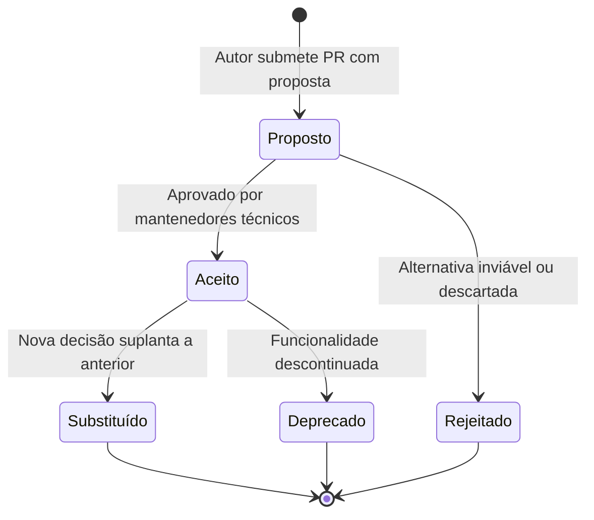

# 11 — Registro de Decisões Arquiteturais (ADRs)

> **Documento canônico:** Governança técnica, processo formal de deliberação arquitetural, template padronizado e catálogo de decisões candidatas do **Sorting Station**.  
> **Status:** Ativo / Base de Verdade da Wiki  
> **Data:** 08/09/2026  
> **Dependências:** [`AGENTS.md`](../../AGENTS.md), [`CLAUDE.md`](../../CLAUDE.md), [`00-repository-inventory.md`](./00-repository-inventory.md) a [`10-roadmap.md`](./10-roadmap.md), [`docs/adr/TEMPLATE.md`](../adr/TEMPLATE.md).

---

## 1. Governança e Princípio da Honestidade Histórica

Para que a documentação técnica sirva de fundação sólida para a engenharia de software e para a futura pesquisa acadêmica, o **Sorting Station** adota o modelo de **Architecture Decision Records (ADRs)** para registrar mudanças fundamentais no sistema.

> [!IMPORTANT]
> **Diretriz de Honestidade Histórica:**  
> **Não reescrever a história técnica do projeto.**  
> Decisões arquiteturais tomadas durante a fase inicial de prototipagem (como a escolha implícita de manter estado com `useState` imperativo em `GameScreen.tsx` ou a ausência de roteador) **não devem ser retroativamente inventadas como se fossem ADRs formalmente aprovados no passado**.  
> Os ADRs passam a vigorar a partir deste marco canônico para guiar deliberações presentes e futuras. Propostas de evolução técnica são tratadas honestamente como **Candidatas a ADR**, e só recebem o status de `Aceito` após consenso técnico e validação nos fóruns de projeto.

---

## 2. O Ciclo de Vida de um ADR

Todos os registros formais de decisão serão armazenados no diretório [`docs/adr/`](../../docs/adr) seguindo o padrão de nomenclatura sequencial `docs/adr/ADR-XXX-[slug].md` (ex.: `ADR-001-separacao-engine-ui.md`).



- **`Proposto`:** Submetido para revisão da equipe; descreve o problema, alternativas e impactos. O código ainda não deve refletir a decisão como definitiva.
- **`Aceito`:** Formalmente aprovado; autoriza a implementação de código e passa a constituir a verdade arquitetural canônica.
- **`Rejeitado`:** Avaliado e descartado; preservado no repositório para evitar que a equipe rediscuta ideias já refutadas sem novos fatos.
- **`Substituído`:** Uma decisão previamente aceita foi suplantada por uma solução mais madura (aponta explicitamente para o novo `ADR-YYY`).
- **`Deprecado`:** A decisão perdeu relevância devido à remoção da funcionalidade correspondente.

---

## 3. Template Canônico de ADR

O modelo oficial de deliberação está versionado em [`docs/adr/TEMPLATE.md`](../adr/TEMPLATE.md) e deve conter obrigatoriamente os seguintes campos:

```markdown
# ADR [NÚMERO]: [TÍTULO DA DECISÃO ARQUITETURAL]

- **Status:** Proposto | Aceito | Rejeitado | Deprecado | Substituído por [ADR-XXX]
- **Data:** AAAA-MM-DD
- **Autores:** [Nomes dos responsáveis ou papéis técnicos]
- **Decisores:** [Equipe técnica / Mantenedores]

---

## 1. Contexto e Declaração do Problema
[Descreve o cenário operacional, a restrição de ambiente e a necessidade real de mudança]

---

## 2. Decisão Arquitetural
[Declaração direta, inequívoca e assertiva da solução adotada]

---

## 3. Alternativas Consideradas
- **Alternativa A:** [Descrição e motivo do descarte]
- **Alternativa B:** [Descrição e motivo do descarte]

---

## 4. Consequências e Trade-offs
### 4.1. Consequências Positivas (Ganhos)
### 4.2. Consequências Negativas ou Custos (Trade-offs)

---

## 5. Riscos e Mitigações
[Matriz de riscos com severidade e ações preventivas/corretivas]

---

## 6. Links e Referências
- **Código-fonte Afetado:** [links de arquivo]
- **Documentos da Wiki Relacionados:** [links de documentação]
```

---

## 4. Registro de ADRs Aceitos

### [ADR 0001: Integração da FSM Pura da Bubble Sort Engine com GameScreen e Modelo Decisório TROCAR/MANTER](../../docs/adr/0001-bubble-sort-fsm-ui-integration.md)
- **Status:** `Aceito` (2026-09-10)
- **Contexto:** Resolve formalmente os Candidatos 1 e 2. Elimina a lógica heurística imperativa de `GameScreen.tsx`, adota a Bubble Sort Engine pura (`src/game/sorting/`) como fonte única de verdade e implementa o modelo de decisão didático `[⇄ TROCAR]` vs `[= MANTER]`.
- **Impacto:** Conclusão de P0.1, P0.2 e P0.3 com 31 testes automatizados passando.

### [ADR 0002: Encerramento da Campanha Bubble Sort e Agregação de Resultados em Memória](../../docs/adr/0002-campaign-completion-memory-state.md)
- **Status:** `Aceito` (2026-09-10)
- **Contexto:** Resolve o bug de loop infinito na conclusão da Fase 3 em `src/App.tsx`, introduz a máquina de telas explícita com `CampaignCompleteScreen` e a camada pura de agregação em memória das métricas factuais das fases concluídas (`src/game/campaign/campaignSummary.ts`).
- **Impacto:** Conclusão de P0.8 e finalização formal do Milestone P0 com 34 testes automatizados passando.

### [ADR 0003: Separação entre Domínio Algorítmico Puro e Telemetria de Sessão (Dicas e Interação)](../../docs/adr/0003-session-metrics-engine-decoupling.md)
- **Status:** `Aceito` (2026-09-10)
- **Contexto:** Resolve a telemetria factual de P1.2. Mantém a Bubble Sort Engine (`src/game/sorting/`) puramente algorítmica (fonte canônica de `errors`), enquanto introduz a camada pura `src/game/session/sessionMetrics.ts` para rastreamento isolado de scaffolding/dicas (`hintsUsed`). Elimina a heurística de "Eficiência (%)" em `ResultScreen.tsx`.
- **Impacto:** Conclusão de P1.2 com 45 testes automatizados passando.

### [ADR 0004: Derivação Pura de Quadros de Replay da Execução a partir de StepRecord](../../docs/adr/0004-execution-replay-state-derivation.md)
- **Status:** `Aceito` (2026-09-10)
- **Contexto:** Resolve a reprodução retrospectiva passo a passo de P1.3. Introduz a camada pura `src/game/replay/replayModel.ts` que transforma deterministicamente o `initialValues` e o `history: readonly StepRecord[]` em quadros imutáveis (`ReplayFrame`), sem reexecução redundante do algoritmo. Introduz o quadro 0 (estado inicial), controles somente-leitura na `ReplayScreen` e botão `[ VER EXECUÇÃO ]` em `ResultScreen`.
- **Impacto:** Conclusão de P1.3 com 54 testes automatizados passando e integridade absoluta das métricas da sessão.

### [ADR 0005: Sincronização Pura de Pseudocódigo no Modo Replay da Execução](../../docs/adr/0005-replay-synchronized-pseudocode.md)
- **Status:** `Aceito` (2026-09-10)
- **Contexto:** Resolve a representação textual sincronizada de P1.4. Define a representação canônica imutável `BUBBLE_SORT_PSEUDOCODE` (9 instruções), a função de mapeamento puro `getPseudocodeHighlight(frame)` em `src/game/replay/replayPseudocode.ts` e o componente reutilizável `BubbleSortPseudocodePanel`. Separa rigorosamente a instrução abstrata genérica ($A[j] > A[j+1]$) da contextualização com valores concretos ($5 > 2 \rightarrow \text{VERDADEIRO}$).
- **Impacto:** Conclusão de P1.4 com 63 testes automatizados passando, ausência de reexecução e sincronização perfeita em todos os controles de replay.

### [ADR 0006: Camada Desacoplada de Persistência Local via localStorage](../../docs/adr/0006-decoupled-local-storage-persistence.md)
- **Status:** `Aceito` (2026-09-11)
- **Contexto:** Resolve formalmente o Candidato 3 e o marco P1.6. Introduz o módulo puro e desacoplado `src/game/persistence/` com abstração `StorageAdapter`, schema canônico versionado (`schemaVersion: 1`, chave `sorting_station_v1_save`), validador defensivo sem dependências e fallback gracioso em memória. Garante a restauração transparente do progresso e do tutorial após recarregar com F5, sem acoplar componentes visuais e sem inventar métricas arbitrárias de score.
- **Impacto:** Conclusão de P1.6 com 86 testes automatizados passando 100% verde (23 testes dedicados à persistência e resiliência).

### [ADR 0007: Pontuação do Protocolo e Tempo Descritivo de Operação](../../docs/adr/0007-protocol-score-and-descriptive-elapsed-time.md)
- **Status:** `Aceito` (2026-09-11)
- **Contexto:** Resolve formalmente o marco P1.7. Corrige a premissa obsoleta do roadmap após comprovação factual em P1.7-A de que comparações e trocas são invariantes do algoritmo Bubble Sort. Implementa a função pura `calculateProtocolScore` com a fórmula canônica `score = max(0, 100 - errors * 10 - hintsUsed * 5)`, a medição de tempo monotônica descritiva com peso zero no score (`elapsedTimeMs`), o formatador neutro `formatElapsedTime`, e a evolução do storage para Schema v2 (`schemaVersion: 2`) com migração transparente retrocompatível de saves v1 e regra estrita de recordes (substituição por maior pontuação ou menor número de erros em caso de empate; tempo estritamente excluído do desempate para evitar ansiedade e pressa).
- **Impacto:** Conclusão de P1.7 com 106 testes automatizados passando 100% verde (11 testes dedicados de pontuação/tempo e 9 testes dedicados de migração v1->v2 e recordes).

### [ADR 0008: Variante Otimizada Bubble Sort Early Exit e Modo Desafio](../../docs/adr/0008-bubble-sort-early-exit-variant.md)
- **Status:** `Aceito` (2026-09-11)
- **Contexto:** Resolve formalmente o marco P1.8. Adiciona a variante opcional `EARLY_EXIT` unificada no mesmo motor da Sorting Engine (`src/game/sorting/bubbleSortEngine.ts`), preservando a variante didática `CANONICAL` intacta com todas as suas comparações teóricas. Estabelece a condição determinística de parada ao término de passada sem trocas (`swapsInCurrentPass === 0`), 3 cenários canônicos de teste, sincronização com pseudocódigo estendido de 14 instruções no replay (`BUBBLE_SORT_EARLY_EXIT_PSEUDOCODE`), desbloqueio puramente derivado da conclusão da campanha regular, persistência de resultados em memória sem mutação no Schema v2 e exibição de métricas comparativas na tela de resultado sem pontuação extra para comparações evitadas.
- **Impacto:** Conclusão de P1.8 com 122 testes automatizados passando 100% verde (16 testes dedicados à variante e cenários, metadados de replay e pseudocódigo).

### [ADR 0009: Infraestrutura Global de Geração Procedural de Vetores](../../docs/adr/0009-global-procedural-array-generation.md)
- **Status:** `Aceito` (2026-09-11)
- **Contexto:** Resolve formalmente o marco P1.9. Cria a camada transversal e universal `src/game/generation/` (`types.ts`, `prng.ts`, `constraints.ts`, `arrayGenerator.ts`, `index.ts`), 100% desacoplada e agnóstica a qualquer engine de ordenação (zero imports de `sorting/`). Implementa PRNG determinístico Mulberry32 de 32 bits com dispersão FNV-1a para sementes numéricas e textuais, amostragem Fisher-Yates sem colisões para arrays sem duplicados (suportando também `allowDuplicates: true`), preset desacoplado `BUBBLE_CAMPAIGN_CONSTRAINTS` (não-ordenado, não-reverso, com ao menos um SWAP e um KEEP), estratégia de fallback estruturado determinístico sem loops infinitos e falha explícita via `ArrayGenerationError` se impossível. Conecta os vetores procedurais à campanha regular (F1: 4, F2: 5, F3: 6 elementos), preservando arrays curados no tutorial (`[3,1,2]`) e no Modo Desafio, mantendo o mesmo vetor ao reiniciar a fase (`handleRepeat`), gerando nova entrada ao avançar ou reiniciar a campanha, consumindo estritamente `initialArray` e `history` no replay sem regeneração via seed, e mantendo o Schema v2 do `localStorage` intacto.
- **Impacto:** Conclusão de P1.9 com 157 testes automatizados passando 100% verde (31 testes dedicados de geração procedural, determinismo, imutabilidade, constraints e multi-algoritmo).

### [ADR 0010: Tela Intermediária de Briefing Orientada a Dados e Desacoplada](../../docs/adr/0010-reusable-data-driven-mode-briefing.md)
- **Status:** `Aceito` (2026-09-11)
- **Contexto:** Resolve formalmente o marco P1.10. Cria a camada transversal de briefings `src/game/briefing/` (`types.ts`, `briefingCatalog.ts`, `index.ts`) e o componente genérico de interface `src/screens/ProtocolModeBriefingScreen.tsx`. Elimina a entrada abrupta e automática no gameplay após seleção do modo, apresentando ao operador um painel com objetivos, procedimentos operacionais, particularidades do modo, destaques de telemetria e CTA explícito. Posterga a geração procedural de vetores (P1.9) para o clique no CTA de início, garantindo que o botão [VOLTAR] retorne à tela anterior sem consumir sementes, sem gerar vetores e sem alterar métricas do Schema v2. A arquitetura orientada a dados é 100% agnóstica e reutilizável para futuros protocolos (Selection, Insertion, etc.).
- **Impacto:** Conclusão de P1.10 com 169 testes automatizados passando 100% verde (12 testes dedicados ao briefing e integridade de fluxo).

### [ADR 0011: Selection Sort Pure Engine e Máquina de Estados Finita (FSM)](../../docs/adr/0011-selection-sort-engine-and-fsm.md)
- **Status:** `Aceito` (2026-09-11)
- **Contexto:** Resolve o domínio puro do Selection Sort (Marco P2.1-B). Cria o módulo desacoplado `src/game/sorting/selection/` (`types.ts`, `selectionSortEngine.ts`, `index.ts`, `selectionSortEngine.test.ts`), modelando uma FSM bimodal estrita com fases `INSPECT` (decisões `SELECT_NEW_MIN` / `KEEP_MIN`, critério $A[j] < A[minIndex]$, sem trocas na esteira) e `COMMIT` (ação procedimental `commitSelectionPass`, no máximo uma única troca pontual, consolidação de posição $i$). Estabelece rigor matemático ($n(n-1)/2$ comparações, no máximo $n-1$ trocas), histórico discriminado para replay sem ações erradas e imutabilidade total via `Object.freeze`.
- **Impacto:** Conclusão do domínio puro de P2.1-B com 187 testes automatizados passando 100% verde (18 testes dedicados ao Selection Sort).

### [ADR 0012: Camada Pedagógica, Constraints Procedurais, Briefing e Tutorial Interativo do Selection Sort](../../docs/adr/0012-selection-sort-pedagogical-layer-and-interactive-tutorial.md)
- **Status:** `Aceito` (2026-09-11)
- **Contexto:** Resolve a camada pedagógica preparatória do Selection Sort (Marco P2.1-C). Implementa constraints procedurais desacopladas (`selectionConstraints.ts`) com predicados matemáticos puros para fases 1 (tamanho 4), 2 (tamanho 5) e 3 (tamanho 6) no intervalo 1..99; briefing oficial `SELECTION_CANONICAL_BRIEFING` integrado ao catálogo global e à `ProtocolModeBriefingScreen` sem duplicação de JSX; extensão semântica de `NumberedBox` (`BoxRole`: `target`, `min`, `target-min`, `scan`, `scan-min`, `sorted`, `pair`, `default`) garantindo acessibilidade e não dependência de cor; tutorial interativo guiado (`SelectionTutorialScreen.tsx`) com a engine real sobre o vetor fixo `[4, 1, 3]`, botões derivados da fase (`INSPECT` vs `COMMIT`), feedback formativo explicativo ($A[j] < A[minIndex]$), animação de transferência exclusiva no commit pós-varredura e navegação segura a partir da HomeScreen sem rotas quebradas.
- **Impacto:** Conclusão de P2.1-C com 210 testes automatizados passando 100% verde (10 testes de constraints, 4 novos de briefing e 3 de tutorial e fluxo).

### [ADR 0013: Selection Sort Gameplay, Animação de Longa Distância e Campanha de 3 Fases](../../docs/adr/0013-selection-sort-gameplay-and-three-phase-campaign.md)
- **Status:** `Aceito` (2026-09-13)
- **Contexto:** Resolve a campanha jogável e gameplay do Selection Sort (Marco P2.1-D). Cria a tela autônoma `SelectionGameScreen.tsx` consumindo a engine imutável como fonte única de verdade; botoeira contextual estrita com bloqueio mútuo e trava síncrona; comparação textual explícita ($A[j] < A[minIndex]$); feedback formativo não punitivo em decisões incorretas; suporte a animação de transferência de longa distância com translação horizontal variável (`--swap-distance`) e elevação sobre a esteira; tela dedicada de encerramento do protocolo (`SelectionCampaignCompleteScreen.tsx`); união discriminada de resultados (`GameResult = BubbleGameResult | SelectionGameResult`); adaptação de `ResultScreen.tsx` com nota pedagógica de varredura completa antes da troca; e isolamento estrito de persistência em memória sem mutação do Schema v2 do Bubble Sort no `localStorage`.
- **Impacto:** Conclusão de P2.1-D com 229 testes automatizados passando 100% verde (19 testes dedicados de gameplay, FSM, geração procedural F1..F3, persistência em memória e transições da campanha). P2.1 permanece em andamento (pendente Replay, Pseudocódigo e Persistência multi-protocolo).

### [ADR 0014: Replay Somente Leitura e Pseudocódigo Sincronizado do Selection Sort](../../docs/adr/0014-selection-sort-replay-and-synchronized-pseudocode.md)
- **Status:** `Aceito` (2026-09-14)
- **Contexto:** Resolve o Replay dedicado e o pseudocódigo formal sincronizado do Selection Sort (Marco P2.1-E). Deriva quadros puros e imutáveis exclusivamente a partir de `initialArray` e `SelectionStepRecord[]` sem reexecução do algoritmo e sem frames fantasmas (`frames.length === history.length + 1`); tipifica quadros em `INITIAL`, `INSPECTION` (com $i$, $j$, $minIndex$, comparação textual e atualização do candidato) e `COMMIT` (com distinção entre swap real e consolidação direta sem troca); implementa a tabela canônica de pseudocódigo de 13 instruções estruturadas em português (`SELECTION_SORT_PSEUDOCODE`) com destaques semânticos para `INIT_MIN`, `IF_CONDITION`, `UPDATE_MIN`, `CHECK_SWAP` e `SWAP_STATEMENT`; cria o painel de UI `SelectionSortPseudocodePanel.tsx` com badges contextuais e isolamento de valores concretos; implementa `SelectionReplayScreen.tsx` com esteira semântica de `NumberedBox`, autoplay com auto-stop e responsividade desktop segura (`justify-start`, rolagem vertical natural, esteira com `overflow-x-auto min-w-max`); habilita `[ ▶ VER EXECUÇÃO ]` para Selection Sort em `ResultScreen.tsx` e preserva integralmente métricas e sessões (somente-leitura estrito).
- **Impacto:** Conclusão de P2.1-E com 246 testes automatizados passando 100% verde (+17 novos testes unitários puros).

### [ADR 0015: Persistência Multi-Protocolo (Schema v3) e Conclusão do Selection Sort](../../docs/adr/0015-multi-protocol-persistence-schema-v3.md)
- **Status:** `Aceito` (2026-09-14)
- **Contexto:** Resolve formalmente o marco P2.1-F e consolida integralmente a introdução do Selection Sort (P2.1). Evolui o modelo de persistência desacoplado de `localStorage` para o Schema v3 (`protocols: { bubble, selection }`), eliminando o acoplamento exclusivo ao Bubble Sort e proibindo o uso de números mágicos ou IDs artificiais para fases (cada algoritmo gerencia naturalmente suas Fases 1 a 3 em namespaces independentes). Implementa pipeline de migração explícito, testável e sem perda de dados ($v1 \rightarrow v2 \rightarrow v3$ e $v2 \rightarrow v3$) preservando a mesma `STORAGE_KEY`. Garante a persistência de longo prazo do Selection Sort (tutorial concluído resistente a F5, desbloqueio de fases 1..3, histórico de conclusões e recordes factuais atualizados pela regra canônica de score e precisão com tempo estritamente descritivo). Assegura a semântica de início de sessão (maior fase alcançada não inicia campanha; "INICIAR TURNO" sempre gera novos vetores procedurais na Fase 1), mantém o histórico de Replay exclusivamente na memória volátil da sessão sem inflar o storage e valida resiliência contra storage corrompido ou indisponível.
- **Impacto:** Conclusão de P2.1-F e fechamento definitivo do Milestone P2.1 (Selection Sort) com 268 testes automatizados passando 100% verde (+22 novos testes unitários de persistência e Replay QA).

### [ADR 0016: Charter Educacional, Padronização Transversal de Telas e Glossário Canônico do Sorting Station](../../docs/adr/0016-educational-charter-and-cross-protocol-standardization.md)
- **Status:** `Aceito` (2026-09-14)
- **Contexto:** Resolve formalmente o marco P2.1-G-A. Estabelece o Charter Educacional oficial do produto, congela a metáfora diegética exclusivamente em torno da Central Logística Espacial/Industrial, formaliza os 6 elementos pedagógicos obrigatórios por protocolo, unifica a política de métricas e pontuação (score transparente $100 - 10 \times \text{erros} - 5 \times \text{dicas}$ e métricas factuais assintóticas descritivas com peso zero no score), define o padrão conceitual unificado para as 8 telas, congela o Glossário Canônico de termos controlados e audita assimetrias existentes entre Bubble e Selection Sort.
- **Impacto:** Conclusão de P2.1-G-A.

### [ADR 0017: Modo Demonstração Educacional Canônico](../../docs/adr/0017-canonical-demonstration-mode.md)
- **Status:** `Aceito` (2026-09-14)
- **Contexto:** Institucionaliza o Modo Demonstração Educacional Canônico (Marco P2.1-G-D) como recurso transversal de observação autônoma anterior à prática. Reutiliza as engines puras de ordenação e os componentes de visualização (`NumberedBox`, painéis de pseudocódigo formal) sem duplicar código; introduz geradores de histórico canônico determinístico em `src/game/demonstration/` sobre vetores curados (`[5, 2, 4, 1]` para Bubble e `[4, 1, 3]` para Selection); implementa controles de reprodução autônoma (Play, Pause, Reset, Velocidades 0.5x, 1x, 2x) com desacoplamento estrito de persistência (armazenamento 100% somente-leitura); e disponibiliza pontos de entrada contextuais na HomeScreen e no Briefing de protocolo.
- **Impacto:** Conclusão de P2.1-G-D com 303 testes unitários aprovados.

### [ADR 0018: Transição de Jogo para Plataforma Educacional de Algoritmos](../../docs/adr/0018-game-to-educational-platform-transition.md)
- **Status:** `Aceito` (2026-09-15)
- **Contexto:** Formaliza a redefinição oficial do Sorting Station como "Plataforma educacional interativa e gamificada para aprendizagem, prática e visualização de algoritmos de ordenação" (Marco PLATFORM-R0). Congela os 6 módulos curriculares oficiais (Bubble, Selection, Insertion, Merge, Quick, Heap); estabelece o Module Standard transversal de 20 seções; define a taxonomia transversal de 8 tipos de exercícios (A a H); documenta a migração conceitual de fases para exercícios (Prática Básica, Intermediária e Avançada) sem alteração de código ou persistência; bloqueia o Laboratório Comparativo até a homologação dos 6 módulos; projeta a especificação conceitual do Schema v4 de persistência; e reposiciona a camada narrativa secundária para backlog opcional de gamificação.
- **Impacto:** Fundação institucional do Marco PLATFORM-R0 e remodelagem completa da arquitetura da Wiki.

### [ADR 0019: Camada Pedagógica e Tutorial Interativo do Insertion Sort](../../docs/adr/0019-insertion-sort-pedagogical-layer-and-interactive-tutorial.md)
- **Status:** `Aceito` (2026-09-16)
- **Contexto:** Formaliza a camada conceitual e o tutorial interativo do Insertion Sort (Marco P2.2-C). Adota a metáfora visual de elevação de chave com deslocamentos lineares regressivos (*shifts*), FSM bimodal `COMPARE_AND_SHIFT` / `INSERT_READY`, vetor curado `[4, 2, 3]` com 8 passos determinísticos e feedback formativo imediato sem punição mecânica.
- **Impacto:** Conclusão de P2.2-C com 322 testes unitários aprovados.

### [ADR 0020: Sistema de Prática Interativa e Progressão do Insertion Sort](../../docs/adr/0020-insertion-sort-interactive-practice-system.md)
- **Status:** `Aceito` (2026-09-17)
- **Contexto:** Formaliza o gameplay e a progressão prática do Insertion Sort (Marco P2.2-D). Implementa `insertionConstraints.ts`, trilha de exercícios `basic` (n=4), `intermediate` (n=5) e `advanced` (n=6), telemetria factual de *shifts* e *inserts* em `ResultScreen` e `PracticeSetCompleteScreen`, e consolidação do fluxo deliberado de exercícios.
- **Impacto:** Conclusão de P2.2-D com 344 testes unitários aprovados.

### [ADR 0021: Persistência Orientada a Módulos e Exercícios (Schema v4), Migração v3->v4 e Ativação Pública do Insertion Sort](../../docs/adr/0021-module-exercise-persistence-schema-v4.md)
- **Status:** `Aceito` (2026-09-17)
- **Contexto:** Concretiza a persistência da plataforma educacional (Marco P2.2-F). Rejeita a extensão direta de `protocols.insertion` no Schema v3 e adota o Schema v4 canônico estruturado em `modules` e `exerciseSets`. Implementa pipeline de migração determinístico $v1 \rightarrow v2 \rightarrow v3 \rightarrow v4$, estabiliza a chave `sorting_station_save` com fallback seguro para `sorting_station_v1_save`, estabelece a regra estrita de recordes (tempo nunca desempata) e ativa publicamente o Módulo Insertion Sort no Hub (`PROTOCOL_CATALOG`).
- **Impacto:** Conclusão de P2.2-F com 376 testes unitários aprovados.

### [ADR 0022: Padronização Visual e Estrutural de Bubble e Selection como Módulos de Exercícios](../../docs/adr/0022-canonical-exercise-module-standardization.md)
- **Status:** `Aceito` (2026-09-21)
- **Contexto:** Formaliza a convergência dos módulos Bubble Sort e Selection Sort ao modelo canônico da plataforma educacional (Marco PLATFORM-R1-B). Elimina termos legados de "fases" e "campanha" na interface ativa; adota o Catálogo Curricular compartilhado (`src/game/curriculum/practiceCatalog.ts`) com práticas progressivas (`basic`: 4 cargas, `intermediate`: 5 cargas, `advanced`: 6 cargas); introduz o Seletor de Práticas reutilizável (`PracticeSelector.tsx`); desacopla o Early Exit do Bubble Sort como Caso Especial Curricular desbloqueado pelo Schema v4; unifica a tela de conclusão via `PracticeSetCompleteScreen.tsx` preservando wrappers finos para retrocompatibilidade; e preserva rigorosamente as mecânicas singulares de cada algoritmo.
- **Impacto:** Conclusão de PLATFORM-R1-B com 408 testes unitários aprovados e zero erros TypeScript.

### [ADR 0023: Design Pedagógico e Mecânico do Módulo Merge Sort (P3.1-A)](../../docs/adr/0023-merge-sort-pedagogical-mechanical-design.md)
- **Status:** `PROPOSTO / AGUARDA REVISÃO` (2026-09-21)
- **Contexto:** Especifica a arquitetura pedagógica e cinestésica para o Módulo 04 (Merge Sort), marcando o início do Marco P3 (algoritmos log-lineares de Divisão e Conquista). Estabelece a variante canônica Top-Down pós-ordem com convenção fechada $[left, right]$ e ponto médio $\lfloor (left+right)/2 \rfloor$; define a mecânica ativa de intercalação com dois ponteiros ($p_1, p_2$) confrontando frentes de ramais convergentes sob sensores ópticos; introduz a Esteira Coletora Auxiliar ancorando visualmente o custo de memória $O(n)$; formaliza a regra estrita de desempate $\le$ no Ramal Esquerdo para salvaguardar a estabilidade algorítmica; detalha a distinção curricular entre partição localmente ordenada (`ORD`) e ordenação global imutável (`OK`); e mapeia as 20 seções do Module Standard sem iniciar a implementação de código.
- **Impacto:** Entrega de P3.1-A aguardando revisão humana antes da implementação da engine em P3.1-B.

---

## 5. Catálogo de Candidatos a ADR Futuro

As seguintes propostas de evolução estrutural permanecem documentadas como **candidatas formais**:

---

### Candidato 3 — Estratégia de Persistência Local Desacoplada
- **Status:** `ACEITO COMO ADR 0006 (2026-09-11)` — Implementado em `src/game/persistence/`.
- **Resolução:** Resolvido pela adoção de `StorageAdapter`, schema v1 com namespace e fallback defensivo em memória.

---

### Candidato 4 — Adoção de Backend Centralizado e Modelo de Hospedagem
- **Contexto:** Avaliar sob quais condições fáticas um backend deve ser desenvolvido.
- **Proposta sob Avaliação:** Condicionar a criação de uma API e banco de dados exclusivamente ao disparo de gatilhos operacionais comprovados (contas institucionais, sincronização multi-dispositivo, combate a fraude em placares ou telemetria para artigos acadêmicos).
- **Alternativas a Ponderar:** Backend Node/TypeScript (Fastify/Nest) vs. Python (FastAPI para análise de dados) vs. Backend-as-a-Service (Supabase/Firebase).
- **Impacto:** Crítico. Exige custos de nuvem e compliance rigoroso com a LGPD/GDPR.
- **Status:** `CANDIDATO CONDICIONADO (P3)`.

---

### Candidato 5 — Seleção de Framework de Testes Automatizados
- **Status:** `ACEITO E IMPLEMENTADO (2026-09-10)` — Adotado o **Vitest** nativo via `vitest.config.ts`.
- **Resolução:** Suíte integralmente operacional com **303 testes unitários automatizados em 19 arquivos de teste**, executando 100% verde com cobertura sobre engines puras, máquinas de estados, geração procedural PRNG, constraints, persistência e demonstração.

---

### Candidato 6 — Arquitetura de Roteamento Client-Side
- **Contexto:** A navegação atual é controlada por uma máquina de telas em [`src/App.tsx`](../../src/App.tsx) (`screen: "home" | "briefing" | "demonstration" | "tutorial" | ...`), sem URLs navegáveis pelo histórico do navegador (botão "Voltar").
- **Proposta sob Avaliação:** Avaliar se a máquina de telas em `App.tsx` continua sendo a abordagem mais limpa ou se deve ser introduzido um roteador hash (`react-router-dom` ou similar).
- **Alternativas a Ponderar:** Manter `screen` em `useState` vs. Hash Router (`#/module/bubble/exercise/1`) vs. Browser History API (risco de 404 em sandboxes do Figma Make).
- **Impacto:** Baixo/Médio. Deve garantir total compatibilidade com o iframe e CDN do Figma Make.
- **Status:** `CANDIDATO PROPOSTO (P2)`.

---

### Candidato 7 — Estratégia Arquitetural para Novos Algoritmos (Selection e Insertion)
- **Status:** `PARCIALMENTE ACEITO E IMPLEMENTADO (Selection via ADRs 0011 a 0015; Insertion planejado P2.2)`.
- **Resolução:** O padrão de engines puras isoladas em `src/game/sorting/` com FSMs específicas e telas dedicadas (`GameScreen`, `SelectionGameScreen`, e futura `InsertionGameScreen`) foi validado e padronizado pelo Module Standard ([`modules/README.md`](./modules/README.md)).

---

### Candidato 8 — Telemetria Acadêmica, Anonimização e Privacidade de Dados
- **Contexto:** O projeto visa embasar um artigo científico com dados empíricos de aprendizagem e usabilidade.
- **Proposta sob Avaliação:** Especificar formalmente a taxonomia de eventos de telemetria (tempo de resposta, erros cometidos, padrão de busca), com anonimização mandatória desde a coleta (sem vincular nomes civis ou endereços IP aos registros da plataforma).
- **Alternativas a Ponderar:** Coleta via beacon HTTP anônimo vs. exportação manual de arquivo JSON pelo próprio estudante ao final da aula.
- **Impacto:** Alto. Decisivo para a aprovação ética e legal da pesquisa perante comitês universitários.
- **Status:** `CANDIDATO PROPOSTO (P3)`.

---

## 5. Diretrizes de Integração com a Wiki

1. **Rastreabilidade Bidirecional:** Sempre que um ADR for aceito ou modificado, a página correspondente da Wiki (ex.: [`02-system-architecture.md`](./02-system-architecture.md) ou [`07-backend-and-persistence.md`](./07-backend-and-persistence.md)) deve ser atualizada para citar o número do ADR aprovado.
2. **Atualização do `SUMMARY.md`:** Qualquer novo ADR formalmente aceito deve ter sua entrada registrada no índice principal da Wiki.
3. **Respeito ao `AGENTS.md`:** Nenhum ADR poderá propor padrões que violem as restrições inegociáveis do ambiente (ex.: quebra de compatibilidade com Vite no Figma Make ou remoção indevida dos scripts em `.figma/make/*`).
