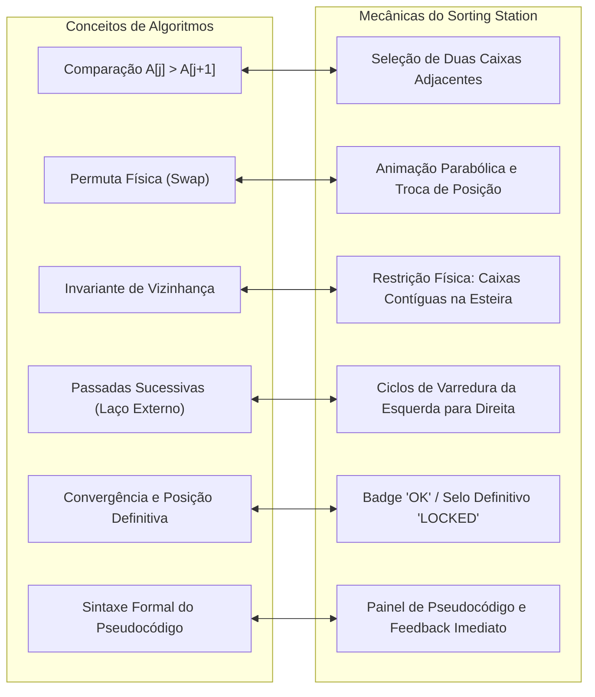

# 12 — Pedagogia, Rastreabilidade Acadêmica e Rigor Científico

> **Documento canônico:** Mapeamento epistemológico entre mecânicas de jogo e conceitos de ciência da computação, fundamentação pedagógica e diretrizes para a elaboração de artigo acadêmico do **Sorting Station**.  
> **Status:** Ativo / Base de Verdade da Wiki  
> **Data:** 08/09/2026  
> **Dependências:** [`AGENTS.md`](../../AGENTS.md), [`CLAUDE.md`](../../CLAUDE.md), [`00-repository-inventory.md`](./00-repository-inventory.md), [`01-product-vision.md`](./01-product-vision.md), [`04-sorting-engine.md`](./04-sorting-engine.md), [`10-roadmap.md`](./10-roadmap.md).

---

## 1. Fundamentação Epistemológica e Níveis de Afirmação

Para garantir total conformidade com a ética em pesquisa acadêmica e a integridade de publicações científicas, este documento estabelece uma distinção metodológica estrita entre cinco categorias conceituais:

1. **Intenção Pedagógica:** O conceito computacional exato que a mecânica de jogo foi concebida para transmitir (o *objetivo de aprendizagem*).
2. **Implementação Observável:** O comportamento real e verificável presente no código-fonte atual do repositório ([`00-repository-inventory.md`](./00-repository-inventory.md)).
3. **Hipótese / Proposta:** A conjectura pedagógica teórica formulada pelos autores sobre os potenciais efeitos cognitivos da intervenção (ex.: redução da carga cognitiva, retenção de invariantes de laço).
4. **Avaliação Futura:** O protocolo experimental empírico que deverá ser desenhado e executado para testar as hipóteses científicas (ex.: testes pré e pós-intervenção com estudantes).
5. **Resultado Comprovado:** Conclusões sustentadas por dados quantitativos ou qualitativos reais. **Atualmente, o projeto possui ZERO resultados comprovados**, uma vez que nenhuma avaliação empírica foi coletada ou registrada no repositório.

---

## 2. Rastreabilidade entre Conceitos Computacionais e Mecânicas de Jogo



---

### 2.1. Comparação de Elementos ($C(n)$)
- **Conceito Teórico:** A operação fundamental de tomada de decisão onde a ordem relativa entre dois valores $A[j]$ e $A[j+1]$ é avaliada. Determina a complexidade de tempo dos algoritmos de comparação ($\Omega(n \log n)$ no caso geral, $O(n^2)$ nos algoritmos elementares).
- **Intenção Pedagógica:** Fazer o aluno perceber que comparar elementos consome recursos computacionais finitos e que mesmo comparações que não resultam em troca possuem custo operacional.
- **Implementação Observável:** Em [`src/screens/GameScreen.tsx`](../../src/screens/GameScreen.tsx), toda seleção válida de um par vizinho incrementa o contador `comparisons`, exibido no [`StatsPanel`](../../src/components/StatsPanel.tsx).
- **Hipótese:** A visualização contínua do contador de comparações desmistifica a ilusão de que ordenar é apenas "arrastar para o lugar", evidenciando o esforço analítico da máquina.
- **Avaliação Futura:** Questionar os alunos após o jogo sobre qual operação é mais frequente no Bubble Sort (comparações vs. trocas).

---

### 2.2. Ação de Troca / Permuta ($M(n)$)
- **Conceito Teórico:** A modificação do estado da memória transferindo o conteúdo de duas posições do vetor: `temp = A[j]; A[j] = A[j+1]; A[j+1] = temp`.
- **Intenção Pedagógica:** Materializar o custo físico de movimentação de dados em memória e diferenciar elementos na ordem correta daqueles fora de ordem.
- **Implementação Observável:** Em [`GameScreen.tsx`](../../src/screens/GameScreen.tsx), a troca só ocorre quando $A[\text{left}] > A[\text{right}]$, disparando animação de translação horizontal por $500\text{ms}$ e incrementando `swaps`.
- **Hipótese:** A necessidade de aguardar a troca visual e ver o contador de trocas avançar associa a permutação a uma operação custosa de escrita em memória.
- **Avaliação Futura:** Medir o entendimento do estudante sobre o melhor caso ($0$ trocas) versus pior caso ($\frac{n(n-1)}{2}$ trocas).

---

### 2.3. Vizinhança e Adjacência no Bubble Sort
- **Conceito Teórico:** O Bubble Sort restringe todas as suas comparações e permutas a **elementos contíguos** ($j$ e $j+1$). Ele não tem "visão global" do vetor.
- **Intenção Pedagógica:** Ensinar o conceito de algoritmo puramente local, onde a ordem global emerge unicamente de decisões tomadas em nível microscópico (vizinho imediato).
- **Implementação Observável:** Em [`GameScreen.tsx`](../../src/screens/GameScreen.tsx), a regra `Math.abs(selected - index) !== 1` bloqueia seleções não adjacentes.
- **Dívida Pedagógica Atual:** O protótipo atual permite escolher *qualquer* par vizinho em qualquer ordem, descaracterizando a varredura linear do algoritmo ([`04-sorting-engine.md`](./04-sorting-engine.md)).
- **Proposta P0:** A introdução da FSM travará o foco no par mandatória da passada, garantindo aderência rigorosa ao laço interno `for j = 0 to n - 2 - i`.

---

### 2.4. Passadas Sucessivas e o Laço Externo ($i$)
- **Conceito Teórico:** Uma única varredura pelo vetor não garante a ordenação completa; são necessárias até $n-1$ passadas para que todas as inversões sejam resolvidas.
- **Intenção Pedagógica:** Ilustrar a necessidade de laços aninhados (*nested loops*) e demonstrar por que o algoritmo possui complexidade quadrática no caso médio.
- **Implementação Observável:** Ausente no protótipo atual (não há controle explícito de passadas, apenas verificação global de `isSorted(boxes)`).
- **Proposta P0:** Implementar o indicador `PASSADA X DE Y` que avança formalmente ao término da varredura de cada lote.

---

### 2.5. Elemento Fixado ao Final da Passada (*Invariante de Laço*)
- **Conceito Teórico:** Ao final da passada $i$, o elemento que for o maior da sublista não ordenada atinge sua posição definitiva no índice $n - 1 - i$ e **nunca mais precisará ser comparado**.
- **Intenção Pedagógica:** Fixar cinestesicamente a invariante de laço do Bubble Sort: a partição $[n-1-i \dots n-1]$ está estritamente ordenada e contém os maiores elementos do vetor.
- **Implementação Observável:** Heurística falha baseada em sufixo em [`GameScreen.tsx`](../../src/screens/GameScreen.tsx).
- **Proposta P0:** O selamento formal com a etiqueta `LOCKED` no `sortedBoundary`, eliminando a caixa das futuras comparações da fase.

---

### 2.6. A Conexão Tríade: Ação $\rightarrow$ Visualização $\rightarrow$ Pseudocódigo
- **Conceito Teórico:** A dissociação entre o código formal e a visualização mental é um dos principais obstáculos cognitivos no aprendizado de algoritmos.
- **Intenção Pedagógica:** O estudante deve conectar simultaneamente a ação motora (clique), o efeito físico concreto (caixa deslizando na esteira) e a linha abstrata de código que comanda aquela operação.
- **Implementação Observável:** Parcial. A tela de resultado ([`src/screens/ResultScreen.tsx`](../../src/screens/ResultScreen.tsx)) exibe o pseudocódigo estático, mas ele não está sincronizado dinamicamente durante a execução do jogo.
- **Proposta P1:** Painel de pseudocódigo lateral em `GameScreen.tsx` que ilumina em tempo real a linha em execução conforme o par é testado.

---

### 2.7. Feedback Imediato e Formativo
- **Conceito Teórico:** O feedback imediato reduz o acúmulo de equívocos mentais (*misconceptions*), permitindo que o aluno corrija o raciocínio no instante exato da falha.
- **Implementação Observável:** Em [`GameScreen.tsx`](../../src/screens/GameScreen.tsx) e [`L91`](../../src/screens/GameScreen.tsx), o painel [`InstructionPanel`](../../src/components/InstructionPanel.tsx) explica textualmente o motivo da rejeição ou aceitação da operação (ex.: `"As caixas precisam ser vizinhas"` ou `"X ≤ Y — já estão na ordem correta!"`).

---

### 2.8. Replay Retrospectivo e Linha do Tempo (Ideia Futura — P1)
- **Conceito Teórico:** A autorreflexão e a meta-cognição são fortalecidas quando o estudante pode rever retrospectivamente sua trajetória de decisões e erros.
- **Proposta P1:** Gravação do vetor imutável `history` permitindo ao aluno navegar em uma barra de tempo após o término da fase, assistindo novamente a como suas decisões estabilizaram o vetor.

---

### 2.9. Diferenças Pedagógicas Planejadas para Novos Algoritmos (P2)

Para garantir que o jogo não caia na armadilha de usar a mesma mecânica de permuta para algoritmos distintos:

| Algoritmo | Invariante Central a Ensinar | Mecânica Dedicada de Jogo | Diferencial Cognitivo para o Aluno |
| :--- | :--- | :--- | :--- |
| **Bubble Sort** | O maior elemento flutua a cada passada por comparações locais | Testar vizinhos contíguos na esteira | Compreender o custo cumulativo de permutas locais sucessivas |
| **Selection Sort** | O menor elemento da partição desordenada é localizado e posicionado | Scanner de busca do mínimo global e troca única de longa distância | Perceber a redução drástica de escritas ($M(n) \le n-1$), mantendo $O(n^2)$ comparações |
| **Insertion Sort** | Um elemento por vez é encaixado na posição correta da sublista ordenada | Elevação do pacote chave e deslocamento regressivo dos itens maiores | Compreender a construção incremental de listas ordenadas e o melhor caso linear $O(n)$ |

### 2.10. Mini-Treinamento Interativo do Protocolo Bubble (P1.1)
- **Mapeamento Epistemológico:**
  - **Comparação Guiada $\longleftrightarrow$ Comparação Adjacente ($A[j]$ vs $A[j+1]$):** O par mandatória da vez é destacado graficamente na esteira com o badge `PAR`, canalizando o foco atencional do operador sem desvios arbitrários.
  - **Ação `[⇄ TROCAR]` $\longleftrightarrow$ Operação Swap em Memória:** Exige a verificação da relação $A[j] > A[j+1]$. Ao confirmar a troca, a esteira executa uma animação simétrica de permuta física (500ms), materializando a mutação no estado do vetor.
  - **Ação `[= MANTER]` $\longleftrightarrow$ Reconhecimento da Invariante de Ordem Local:** Ensina que quando $A[j] \le A[j+1]$, o algoritmo não permuta posições, mas obrigatoriamente consome uma comparação formal para certificar a ordem relativa.
  - **Transição de Passada $\longleftrightarrow$ Iteração do Laço Externo ($i$):** Ao concluir uma varredura pelo trecho desordenado, a interface emite um callout pedagógico explicitando o conceito de "Passada" e consolidando formalmente a maior carga restante com o selo `OK`.
  - **Feedback Formativo após Decisão $\longleftrightarrow$ Reforço Formativo Imediato:** Se o operador escolher uma ação em desacordo com as regras do algoritmo, a FSM não avança, o vetor permanece intacto e o `InstructionPanel` exibe o motivo lógico da inconsistência, permitindo nova tentativa imediata.
- **Ressalva Epistemológica:** O mini-treinamento constitui uma estratégia didática de *scaffolding* interativo. Seus impactos cognitivos sobre retenção e velocidade de raciocínio são hipóteses teóricas a serem investigadas empiricamente em pesquisas acadêmicas controladas.

### 2.11. Telemetria Factual Descritiva vs. Avaliação Normativa Arbitrária (P1.2)
- **Princípio Epistemológico:** A telemetria local registrada durante a sessão de jogo é estritamente **descritiva**: visa responder com fidelidade *"O que ocorreu factualmente durante a sessão do operador?"* e **não** *"O quanto o aluno aprendeu?"*.
- **Veto a Fórmulas Arbitrárias de Eficiência:** Foi formalmente eliminada da aplicação qualquer fórmula heurística de pontuação (como a antiga fórmula `100 - swaps * 8` em `ResultScreen`), pois penalizar trocas que são decorrência matemática mandatória da permutação inicial do vetor é epistemologicamente incoerente e pedagogicamente punitivo.
- **Métricas Factuais Registradas:**
  1. *Comparações:* Custo analítico formal de pares inspecionados ($C(n)$);
  2. *Trocas:* Custo físico de movimentação de memória ($M(n)$);
  3. *Decisões Incorretas (`errors`):* Ações do operador (`SWAP`/`KEEP`) divergentes da invariante mandatória do micro-passo corrente, rastreadas canonicamente pela engine;
  4. *Dicas Utilizadas (`hintsUsed`):* Acionamentos intencionais do recurso de assistência pedagógica, rastreados de forma isolada pela camada de sessão (ADR 0003).
- **Rastreabilidade para Pesquisa Científica:** As quatro variáveis factuais constituem dados brutos sem vieses de fórmulas arbitrárias, prontos para análises de regressão, tempo de reação e curvas de persistência em futuras coletas de dados experimentais controladas.

### 2.12. Retrospecção Reflexiva Passo a Passo via Replay da Execução (P1.3)
- **Princípio Epistemológico da Metacognição:** A literatura em Ciência da Computação Educacional (Computing Education Research — CER) aponta que a aprendizagem efetiva de algoritmos requer não apenas a ação direta, mas momentos de reflexão retrospectiva (*post-mortem analysis*). Ao término de uma fase, o estudante tem a oportunidade de revisar passo a passo o processo que ordenou o vetor.
- **Isolamento de Pressão Operacional:** No modo Replay, o estudante não é avaliado nem pressionado por novas decisões. Ele pode retroceder (`ANTERIOR`), avançar (`PRÓXIMO`) ou assistir à reprodução contínua (`REPRODUZIR` com autoplay auto-stop no último passo).
- **Inspeção do Estado Inicial (Quadro 0):** O replay viabiliza o contraste imediato entre a desordem inicial e a ordenação progressiva resultante de cada passada.
- **Rigor Factual da Explicação:** Cada passo traz a fundamentação matemática explícita ($A[j] > A[j+1]$ ou $A[j] \le A[j+1]$), reforçando a invariante do laço interno do Bubble Sort.
- **Ressalva Acadêmica:** A efetividade do replay na redução de erros em fases subsequentes constitui hipótese de pesquisa empírica a ser validada em protocolos de teste pré/pós-intervenção.

### 2.13. Conexão Visual-Textual via Pseudocódigo Sincronizado no Replay (P1.4)
- **Fundamento Teórico da Dupla Codificação:** O alinhamento concorrente entre a representação visual-analógica (caixas inspecionadas e permutadas na esteira) e a representação formal-proposicional (instruções em pseudocódigo estruturado) visa explicitar a correspondência entre a ação cinestésica observada e a sintaxe algorítmica.
- **Preservação da Abstração Algorítmica:** O pseudocódigo canônico exibido é estritamente genérico (`se A[j] > A[j + 1] então`, `trocar A[j] e A[j + 1]`), evitando a substituição do texto do algoritmo por expressões literais (`if 5 > 4`). Os valores concretos observados no frame corrente ($A[j] = 5, A[j+1] = 2 \rightarrow 5 > 2$) são apresentados em um painel contextual separado, garantindo clareza sem distorcer o modelo computacional formal.
- **Correspondência Semântica Estrita dos Quadros:**
  - `Quadro INITIAL`: Destaque neutro no cabeçalho do algoritmo (`procedimento bubbleSort(A)`), sem avaliação de condição ou execução de operações;
  - `Quadro KEEP`: Destaque na linha condicional (`IF_CONDITION`) com indicação de resultado `FALSO`, demonstrando a supressão da instrução de permuta e a preservação das posições relativas;
  - `Quadro SWAP`: Destaque na linha condicional com resultado `VERDADEIRO` e foco primário na instrução de troca (`SWAP_STATEMENT`), evidenciando a correlação de causa e efeito da permuta física na esteira.
### 2.14. Distribuição da Carga Cognitiva e Decisão Pedagógica sobre Pseudocódigo no Gameplay (P1.5)
- **Fundamento na Teoria da Carga Cognitiva (Sweller et al.):** A memória de trabalho humana possui capacidade restrita de processamento simultâneo de novas informações. No aprendizado de algoritmos, deve-se minimizar a carga cognitiva extrínseca (ruído visual, divisão de atenção e redundância) para maximizar a capacidade disponível para o esquema conceitual intrínseco (a lógica de ordenação).
- **Tríade de Prioridade Visual no `GameScreen`:** Durante a fase ativa na esteira, a interface organiza o foco perceptivo-motor do operador em três níveis hierárquicos estritos:
  1. *Ação Atual:* O par sob foco (`selected={true}`) e os botões de decisão imediata `[⇄ TROCAR]` e `[= MANTER]`;
  2. *Consequência Imediata:* O deslocamento físico das caixas na animação simétrica (500ms) e o feedback formativo conciso via `InstructionPanel`;
  3. *Contexto Algorítmico:* Indicador de progresso analítico real, contadores factuais e status da passada.
- **Avaliação Formal da Exclusão de Pseudocódigo do `GameScreen`:** Inserir o painel de 9 linhas de pseudocódigo no `GameScreen` durante o gameplay geraria o *efeito de atenção dividida* (*split-attention effect*), compelindo o aluno a alternar continuamente o olhar entre caixas animadas, botões de ação e linhas de código, além de forçar rolagem vertical excessiva em telas menores. A homologação do P1.5 estabelece que a formalização sintática via pseudocódigo sincronizado deve permanecer situada no `ReplayScreen`, onde a análise retrospectiva ocorre de forma reflexiva, pausada e sem competição sensorial com a esteira ativa.
- **Compatibilidade com a Futura Narrative Layer:** A homologação do vocabulário técnico na esteira (`estação`, `operador`, `cargas`, `protocolo`, `treinamento`, `turno`) consolida uma base diegética sólida para a introdução futura de personagens e lore sem distorcer o rigor conceitual da ciência da computação.

### 2.15. Pontuação do Protocolo e Tempo Descritivo de Operação (P1.7 — ADR 0007)
- **Princípio Epistemológico da Pontuação:** A fórmula implementada para a rodada ($\text{score} = \max(0, 100 - \text{errors} \times 10 - \text{hintsUsed} \times 5)$) constitui uma **mecânica lúdica e formativa imediata da sessão**, projetada para sintetizar a conformidade da execução com o algoritmo ensinado.
- **Veto a Alegações de Mensuração de Aprendizagem:** A pontuação **NÃO** é uma medida psicométrica ou pedagógica validada de aprendizagem, retenção ou inteligência computacional. A interface adota estritamente o rótulo **`PONTUAÇÃO DO PROTOCOLO`** e veta expressamente designações pseudocientíficas como *"Nota de Aprendizado"*, *"Domínio"*, *"Desempenho Cognitivo"*, *"Precisão do Protocolo"* ou *"Eficiência"*.
- **Enquadramento Pedagógico da Busca de Ajuda (*Help-Seeking*):** O uso de dicas é um comportamento metacognitivo positivo e desejável no processo de aprendizagem inicial. A dedução de 5 pontos serve unicamente como incentivo lúdico ao esforço autônomo, sem tom punitivo. A interface comunica: *"Dicas auxiliam durante a operação e reduzem 5 pontos da pontuação da rodada"*, recusando mensagens culpabilizadoras.
- **Axioma do Tempo Não Punitivo:** A duração da fase (`elapsedTimeMs`) é mensurada monotonicamente de forma estritamente factual e descritiva. Seu peso no score é rigorosamente **ZERO** e ela é expressamente **desconsiderada em qualquer desempate de recordes**. Não há cronômetros regressivos (*countdowns*) ou avisos visuais de urgência, resguardando o tempo de reflexão indispensável para a assimilação de estruturas abstratas.

### 2.16. Compreensão Empírica da Complexidade Assintótica: Modo Desafio e Early Exit (P1.8 — ADR 0008)
- **Contraste Canônico vs. Heurística de Otimização:** O Bubble Sort canônico (modo didático regular) executa obrigatoriamente $n(n-1)/2$ comparações para consolidar a invariante de laço. A variante `EARLY_EXIT` introduz a flag de verificação de trocas por passada, materializando o conceito de melhor caso assintótico ($\Omega(n)$).
- **Desmistificação Pedagógica do Melhor Caso:** Na literatura de Computer Science Education (CSE), estudantes frequentemente assumem de forma ingênua que adicionar um *early exit* torna o Bubble Sort eficiente em todos os cenários. A seleção de 3 cenários canônicos contrapõe essa crença:
  1. *Cenário 1 (Já ordenado):* Demonstra o ganho ideal ($\Omega(n)$, 4 comparações vs 10 canônicas, 60% de economia);
  2. *Cenário 2 (Quase ordenado):* Demonstra estabilização intermediária (7 comparações vs 10 canônicas, 30% de economia);
  3. *Cenário 3 (Inversão na cauda / Elemento Tartaruga):* O menor elemento inicia na última posição (`[30, 45, 60, 75, 10]`) e avança apenas uma casa à esquerda por passada, forçando todas as 10 comparações canônicas e evidenciando empiricamente que a heurística de parada precoce não altera o comportamento no pior caso ($O(n^2)$).
- **Isolamento de Pontuação e Equidade Metodológica:** Comparações evitadas pela otimização são registradas factualmente na tela de resultado, mas possuem peso estritamente **ZERO** na pontuação do protocolo, mantendo a métrica de conformidade centrada em decisões analíticas corretas (`errors`) e busca informada de ajuda (`hintsUsed`).

---

### 2.17. Alinhamento Prévio e Redução de Sobrecarga Cognitiva através de Briefing (P1.10 — ADR 0010)
- **Fundamentação Pedagógica (*Pre-training Effect*):** Na Teoria da Aprendizagem Multimídia (Mayer), o princípio do pré-treinamento postula que as pessoas aprendem com maior profundidade quando conhecem os nomes e características dos conceitos centrais antes de entrarem na fase cinestésica ou em simulações dinâmicas complexas. A transição abrupta da seleção de modo diretamente para a esteira forçava o estudante a processar simultaneamente a mecânica do modo, a disposição dos dados e as decisões de comparação.
- **Preparação e Contraste Conceitual Pré-Gameplay:** A tela intermediária orientada a dados (`ProtocolModeBriefingScreen`) segmenta esse processamento cognitivo:
  1. *Treinamento Regular (Canônico):* Foca nas invariantes canônicas da triagem em pares adjacentes, no conceito de passada e na consolidação sequencial dos maiores elementos à direita, sem poluição de otimizações antecipadas;
  2. *Modo Desafio (Early Exit):* Esclarece antecipadamente que a mecânica de adjacência se mantém inalterada, mas introduz o critério de monitoramento de trocas na esteira, desmistifica o ganho assintótico (alertando que nem todo vetor propicia término precoce) e confirma a neutralidade de score das comparações evitadas.
- **Autonomia Atencional e Geração Tardia:** O botão de retorno seguro `[ ← VOLTAR ]` assegura que o operador só avance quando estiver cognitivamente preparado. A semente e o lote procedural da Fase 1 só são gerados no momento exato do clique no CTA de início, sincronizando perfeitamente a prontidão do usuário com a instanciação dos dados do problema.
- **Ressalva Epistemológica:** A hipótese de que o briefing prévio reduz erros na primeira passada ou atenua a ansiedade do estudante constitui proposição didática a ser avaliada em ensaios acadêmicos controlados no futuro.

---

### 2.18. Camada Pedagógica e Diferenciação Cinestésica do Selection Sort (P2.1-A, P2.1-B, P2.1-C — ADR 0011 e ADR 0012)
- **Princípio Epistemológico da Diferenciação Algorítmica:** A literatura em Computing Education Research (CER) identifica como equívoco frequente a confusão conceitual entre algoritmos $O(n^2)$, em especial a assimilação de Selection Sort como "uma variante de Bubble Sort que troca menos". Para mitigar esse modelo mental errôneo, o Sorting Station estabelece mecânicas e interfaces radicalmente distintas:
  1. *Ausência de Trocas Adjacentes:* É fisicamente impossível trocar caixas vizinhas durante a varredura do Selection Sort;
  2. *Separação Cognitiva Estrita (Inspeção vs. Movimentação):* Durante a fase `INSPECT`, o scanner percorre a partição desordenada avaliando $A[j] < A[minIndex]$. O operador decide entre `[ ✦ NOVO MÍNIMO ]` e `[ = MANTER CANDIDATO ]`. Nenhuma caixa se desloca fisicamente na esteira durante essa inspeção;
  3. *Transferência Única de Longa Distância:* A movimentação física ocorre exclusivamente na fase `COMMIT`, acionada ao término da varredura (`[ ⇄ TRANSFERIR MENOR CARGA ]` ou `[ ✓ CONSOLIDAR POSIÇÃO ]`). Isso comprova cinestesicamente que o Selection Sort realiza no máximo $n-1$ trocas físicas em toda a execução ($O(n)$ escritas em memória contra $O(n^2)$ no Bubble Sort);
  4. *Convergência Direcionada à Esquerda:* Enquanto o Bubble Sort consolida os maiores elementos progressivamente à direita ($n-1, n-2, \dots$), o Selection Sort consolida os menores elementos progressivamente à esquerda ($0, 1, \dots$), reforçando a diferença de direção da invariante de laço.
- **Constraints Didáticas Procedurais:** As entradas procedurais do Selection Sort são filtradas por predicados matemáticos puros para garantir valor formativo:
  - O vetor não pode estar ordenado nem invertido;
  - O mínimo global não pode iniciar no índice $0$ (o que tornaria a primeira passada trivial);
  - Deve conter ao menos uma decisão `KEEP_MIN` (garantindo que o operador pratique a rejeição de candidatos espúrios);
  - Em lotes maiores, favorece ao menos uma passada com múltiplas atualizações de `minIndex` (evitando heurísticas simplórias).
- **Scaffolding e Tutorial sobre o Vetor Canônico `[4, 1, 3]`:** O mini-treinamento utiliza a engine real para praticar exatamente duas passadas didáticas completas:
  - *Passada 1:* Alvo $i=0$ (valor 4); Scanner $j=1$ (valor 1 < 4 $\rightarrow$ NOVO MÍNIMO); Scanner $j=2$ (valor 3 < 1 falso $\rightarrow$ MANTER CANDIDATO); Commit com transferência entre índices 0 e 1 $\rightarrow$ `[1, 4, 3]`;
  - *Passada 2:* Alvo $i=1$ (valor 4); Scanner $j=2$ (valor 3 < 4 $\rightarrow$ NOVO MÍNIMO); Commit com transferência entre índices 1 e 2 $\rightarrow$ `[1, 3, 4]`, concluindo a ordenação.
- **Ressalva Epistemológica:** O impacto da separação bimodal (INSPECT vs COMMIT) na retenção da complexidade de transferências do Selection Sort constitui hipótese pedagógica a ser mensurada em intervenções de campo.

---

## 3. O que Podemos Afirmar no Artigo Acadêmico Hoje

Com base exclusivamente nos fatos implementados e no código auditado do repositório, o artigo científico pode atestar legitimamente os seguintes pontos em suas seções de **Introdução, Arquitetura e Desenvolvimento**:

1. **Design e Arquitetura do Software:**  
   O Sorting Station foi concebido e implementado como uma aplicação Single Page Application (SPA) responsiva em React 19, TypeScript estrito, Tailwind CSS v4 e Vite, operando 100% no cliente sem dependência de infraestrutura de servidor.
2. **Proposta de Valor e Modelo de Gamificação:**  
   O jogo adota uma metáfora diegética sci-fi industrial de centro de triagem logística para converter a execução abstrata de algoritmos em manipulação cinestésica direta sobre esteiras rolantes.
3. **Mapeamento Conceitual de Domínio:**  
   As decisões de design estabelecem correspondência formal entre variáveis matemáticas de complexidade ($C(n)$ e $M(n)$) e interações do usuário (seleção de caixas e animações de permuta física).
4. **Governança e Rastreabilidade Documental:**  
   O repositório possui uma base de verdade canônica estruturada na Wiki e registros de decisão arquitetural (ADRs) que detalham o diagnóstico de limitações e a evolução técnica planejada.
5. **Diferenciação Crítica de Mecânicas:**  
   O projeto estabelece formalmente o princípio de que novos algoritmos de ordenação exigem mecânicas interativas exclusivas baseadas em suas respectivas invariantes de laço.

---

## 4. O que Só Poderemos Afirmar Após Avaliação Empírica

> [!CAUTION]
> **Veto a Alegações Científicas não Comprovadas:**  
> As afirmações listadas abaixo dependem estritamente da realização de um **estudo experimental controlado** com estudantes reais, com aprovação prévia em comitê de ética em pesquisa e metodologia estatística formal. **Nenhuma delas pode ser afirmada como fato no estado atual do projeto**:

1. **Ganho de Aprendizagem e Desempenho Acadêmico:**  
   *Não podemos afirmar* que estudantes que jogaram o Sorting Station obtiveram notas superiores ou demonstraram maior domínio de algoritmos do que aqueles que assistiram aulas tradicionais ou usaram pseudocódigo puro.
2. **Superioridade em Relação a Visualizadores Passivos:**  
   *Não podemos afirmar* que a manipulação ativa por clique resulta em menor taxa de esquecimento do que visualizadores algorítmicos convencionais (como VisuAlgo ou animações em vídeo).
3. **Redução de Carga Cognitiva:**  
   *Não podemos afirmar* que a metáfora sci-fi reduziu a carga cognitiva intrínseca ou germane dos alunos sem medição psicométrica validada (ex.: escala NASA-TLX ou questionários padronizados).
4. **Satisfação e Engajamento dos Estudantes:**  
   *Não podemos afirmar* que os usuários acharam a interface intuitiva, envolvente ou motivadora sem dados de escalas de usabilidade (como SUS — *System Usability Scale*) e entrevistas qualitativas.
5. **Qualquer Conclusão Estatística ou P-Valor:**  
   É terminantemente vedado apresentar médias, desvios-padrão, testes t de Student ou valores de significância estatística ($p < 0.05$) antes da coleta empírica real de dados com turmas experimentais e grupos de controle.

---

## 5. Charter Educacional Oficial do Sorting Station (P2.1-G-A — ADR 0016)

> **Declaração Canônica de Missão:**  
> *"Sorting Station é um jogo educacional voltado ao ensino de algoritmos de ordenação, articulando visualização cinestésica, prática guiada, execução interativa e reflexão sobre o comportamento algorítmico."*

### Pilares Pedagógicos Inegociáveis:
1. **Abstração Concreta e Metáfora Coerente:** A memória é representada pelo espaço físico da esteira; os dados numéricos são cargas em trânsito; os algoritmos são protocolos técnicos de operação.
2. **Fidelidade Mecânica Estrita:** Cada algoritmo deve possuir mecânica interativa própria que materialize suas operações primitivas fundamentais ($C(n)$ e $M(n)$). Proibido reaproveitar superficialmente a mecânica de Bubble Sort para outros algoritmos.
3. **Ciclo Pedagógico em 6 Camadas:** Todo protocolo deve oferecer:
   $$\text{Briefing Conceitual} \longrightarrow \text{Demonstração Visual} \longrightarrow \text{Tutorial Guiado} \longrightarrow \text{Gameplay Interativo} \longrightarrow \text{Resultado Factual} \longrightarrow \text{Replay/Reflexão}$$
4. **Feedback Imediato, Formativo e Não Punitivo:** A tomada de decisão incorreta não causa encerramento prematuro nem reinício forçado; ela paralisa síncronamente a esteira e exibe uma explicação contextual detalhando por que a ação violou a invariante daquele algoritmo.
5. **Métricas Factuais e Ética Avaliativa (Pontuação do Protocolo):** O desempenho do operador é mensurado oficialmente pela **Pontuação do Protocolo** ($\text{score} = \max(0, 100 - 10 \times \text{erros} - 5 \times \text{dicas})$). O termo "Precisão do Operador" não deve ser empregado como sinônimo de score, pois a utilização de dicas (`hintsUsed`) também o reduz; a métrica factual de decisões incorretas permanece sendo exclusivamente `errors`. Comparações e trocas/transferências são reportadas estritamente como fatos assintóticos inevitáveis daquele algoritmo. O tempo decorrido é puramente descritivo e possui peso zero.
6. **Conexão Tríade Contínua:** Toda ação física na esteira é espelhada na representação visual dos dados e sincronizada à instrução formal correspondente no pseudocódigo.

---

## 6. Metáfora Central Diegética Congelada

Fica formalmente congelado o universo analógico do Sorting Station no domínio da **Central Logística Espacial/Industrial**:

| Entidade no Jogo | Equivalente em Computação | Regra de Representação |
| :--- | :--- | :--- |
| **Estação Logística / Central de Triagem** | Ambiente de Execução / Máquina | Cenário retrofuturista industrial escuro (`#060b1a`), scanlines e iluminação neon ciano/roxo/âmbar. |
| **Operador de Triagem** | Estudante / Agente de Execução | O usuário que comanda as decisões lógicas nas botoeiras contextuais. |
| **Carga / Caixa (`NumberedBox`)** | Elemento do Vetor ($A[k]$) | Módulo físico com valor inteiro visível, indicador semântico (`BoxRole`) e identificador ordinal `#k`. |
| **Esteira de Roletes** | Memória Contígua / Vetor ($A$) | Trilho linear horizontal com roletes mecânicos e suporte a rolagem horizontal sem quebra de linhas. |
| **Protocolo de Triagem** | Algoritmo de Ordenação | O procedimento matemático adotado (Bubble Sort, Selection Sort, Insertion Sort, etc.). |
| **Passada da Esteira** | Iteração do Laço Externo | Ciclo completo de varredura ou posicionamento pela esteira. |
| **Ciclo de Inspecção / Varredura** | Iteração do Laço Interno | Passo individual de comparação entre cargas. |
| **Permuta / Troca (`SWAP`)** | Troca em Memória ($M(n)$) | Translação física entre duas posições do vetor (adjacente no Bubble; potencialmente de longa distância no Selection; nunca definida genericamente como restrita a vizinhos). |
| **Manutenção (`KEEP`)** | Salto Condicional sem Troca | Confirmação de que as cargas já estão em ordem relativa, sem mover fisicamente caixas. |
| **Consolidação Definitiva (`OK` / `FIXO`)** | Fixação da Invariante de Laço | Selo definitivo esmeralda na carga quando atinge sua posição final permanente no vetor ordenado. |
| **Região Ordenada Provisória (`ORD`)** | Sublista Ordenada Móvel | Posição ordenada na partição atual, porém ainda sujeita a deslocamentos futuros (conceito que prepara formalmente o Insertion Sort). |
| **Scanner ($j$)** | Ponteiro do Laço Interno | Sensor luminoso que varre a partição desordenada no Selection Sort. |
| **Candidato Mínimo (`min`)** | Variável Auxiliar `minIndex` | Carga identificada como a menor até o momento na varredura do Selection Sort. |
| **Alvo ($i$)** | Posição Inicial da Passada | Posição que receberá a menor carga ao término da varredura no Selection Sort. |
| **Transferência Pontual** | Troca de Longa Distância | Deslocamento único por elevação no Selection Sort entre o alvo e o menor elemento. |

*Regra de Estilo Diegética:* Fica estritamente vetado misturar metáforas concorrentes (jogos de cartas de baralho, estantes de livros, filas de banco ou arquivos de escritório).

---

## 7. Glossário Canônico Controlado de Terminologia

Para erradicar divergências textuais entre telas, código e artigos científicos, estabelece-se a tabela canônica de termos obrigatórios:

| Termo Canônico | Definição no Jogo | Mapeamento Técnico | O que NÃO Usar |
| :--- | :--- | :--- | :--- |
| **Protocolo** | Algoritmo de ordenação selecionado. | Algoritmo de Ordenação | Modo genérico, jogo, tipo |
| **Fase** | Um lote específico de cargas da campanha (Fase 1, 2 ou 3). | Instância de Entrada / Array de Teste | Nível, estágio, mundo, mapa |
| **Passada** | Uma iteração completa do laço externo pela esteira. | Iteração Externa (*Outer Loop Pass*) | Rodada, turno, corrida |
| **Comparação** | O teste relacional formal entre dois elementos. | Operação $C(n)$ | Checagem, teste solto |
| **Permuta / Troca** | Troca física entre duas posições do vetor (adjacente ou de longa distância). | Operação de Escrita $M(n)$ | Inversão, mexida, swap solto |
| **Manutenção** | Confirmação de não-troca entre elementos avaliados. | Ramo condicional falso | Ignorar, pular, passar |
| **Consolidação (`OK` / `FIXO`)** | Carga fixada com selo `OK` em sua posição definitiva segundo a invariante. | Invariante de Laço Fixa (*Sorted Boundary*) | Trancamento, congelamento |
| **Região Ordenada (`ORD`)** | Carga em partição ordenada, mas sujeita a deslocamentos posteriores. | Sublista Ordenada Relativa | Ordenação definitiva |
| **Carga / Caixa** | Caixa individual numerada na esteira. | Elemento $A[k]$ | Bloco, item, quadrado, ficha |
| **Pontuação do Protocolo** | Avaliação oficial do desempenho ($100 - 10\times\text{erros} - 5\times\text{dicas}$). | Avaliação Formativa de Desempenho | Precisão do Operador, Score solto |
| **Dica Pedagógica** | Auxílio contextual que explica a regra sem penalidade arbitrária. | Scaffolding Cognitivo Contextual | Trapaça, ajuda, macete |
| **Modo Demonstração**| Visualização autônoma da execução com pseudocódigo. | Algorithmic Animation / Showcase | Modo automático, vídeo |

---

## 8. Elementos Educacionais Obrigatórios por Protocolo (Checklist Canônico)

Para que qualquer algoritmo seja considerado formalmente completo no Sorting Station, ele deve cumprir o seguinte checklist de 6 artefatos:

- [ ] **1. Briefing Conceitual:** Tela intermediária desacoplada com objetivo, 4 regras essenciais e destaques assintóticos teóricos;
- [ ] **2. Modo Demonstração:** Visualização autônoma (autoplay) do algoritmo com animação e pseudocódigo sincronizado em tempo real;
- [ ] **3. Tutorial Interativo:** Mini-treinamento com vetor curto ($n=3$), passos explicados, botões idênticos ao gameplay e persistência `hasCompletedTutorial`;
- [ ] **4. Campanha Interativa (Gameplay):** Fases 1 a 3 procedurais crescentes ($n=4, 5, 6$), FSM estrita, botoeira contextual travada e barra de progresso contínua ($0\%$ a $100\%$);
- [ ] **5. Resultado Factual:** Vetor ordenado com selos `OK`, Pontuação do Protocolo transparente e quadro de métricas operacionais factuais;
- [ ] **6. Replay e Reflexão:** Modo somente-leitura com controle temporal completo e pseudocódigo estruturado em português sincronizado às variáveis concretas.

---

## 9. Política Canônica de Score, Métricas Factuais e Ética Avaliativa

1. **Pontuação do Protocolo:**
   $$\text{score} = \max(0, 100 - (\text{erros} \times 10) - (\text{dicas} \times 5))$$
   - Nome oficial: **Pontuação do Protocolo**. Não usar "Precisão do Operador" como sinônimo de score, pois o uso de dicas (`hintsUsed`) também o reduz; `errors` permanece a métrica factual de decisões incorretas.
   - Avalia o cumprimento rigoroso das regras do algoritmo, sem penalizar o usuário por comparações e trocas que o algoritmo matematicamente exige.
2. **Métricas Assintóticas Factuais:**
   - Comparações ($C(n)$), trocas ($M(n)$) e transferências são fatos computacionais do algoritmo, apresentados para reflexão analítica.
3. **Tempo de Operação:**
   - Medido monotonicamente e formatado de maneira neutra (`formatElapsedTime`), com peso estritamente **zero** no score e sem critério de desempate de recordes, prevenindo pressa e ansiedade cognitiva.

---

## 10. Auditoria de Inconsistências Atuais entre Bubble e Selection Sort

| Dimensão Auditada | Bubble Sort (Estado Atual) | Selection Sort (Estado Atual) | Diagnóstico e Ação de Padronização |
| :--- | :--- | :--- | :--- |
| **Acesso na Home** | Botão primário "INICIAR TURNO" inicia Bubble sem nome explícito. | Botão secundário "SELECTION SORT" adicionado de forma assimétrica. | **Inconsistente:** Unificar a Home em um Seletor de Protocolos simétrico com cards para cada algoritmo. |
| **Barra de Navegação do Tutorial** | Sem barra superior unificada; apenas cabeçalho com badges e H1. | Barra superior completa com botão `[ ◀ VOLTAR ]`, badge central e `[ ↺ REINICIAR ]`. | **Inconsistente:** Adicionar a mesma barra superior completa ao `TutorialScreen` do Bubble. |
| **Semântica de Caixas (`NumberedBox`)** | Usa propriedades legadas `selected` e `sorted` (`BoxRole="pair"` ou `"default"`). | Usa papéis semânticos expressos `BoxRole`: `target`, `min`, `scan`, `sorted`, etc. | **Inconsistente:** Atualizar o Bubble para utilizar os mesmos papéis semânticos `BoxRole` em todas as telas. |
| **Barra de Telemetria do Gameplay** | Badges textuais de passada e comparação; sem barra gráfica de progresso. | Subcabeçalho completo + Banner de expressão ($A[j] < A[\text{minIndex}]$) + Barra visual contínua 0..100%. | **Inconsistente:** Adicionar barra gráfica contínua de progresso percentual e banner de expressão ao Bubble. |
| **Posicionamento de Feedback** | `InstructionPanel` posicionado *abaixo* dos botões de ação. | `InstructionPanel` posicionado *acima* dos botões de ação. | **Inconsistente:** Padronizar a ordem visual com o `InstructionPanel` sempre acima da botoeira contextual. |
| **Telas de Conclusão de Campanha** | `CampaignCompleteScreen.tsx` dedicada. | `SelectionCampaignCompleteScreen.tsx` dedicada (JSX 90% duplicado). | **Duplicação:** Unificar em uma única tela `CampaignCompleteScreen` orientada aos metadados do protocolo. |

---

## 11. Proposta Arquitetural do Modo Demonstração (Showcase)

Para atender ao 6º princípio pedagógico sem inflar o código com novas telas ou motores gráficos, o **Modo Demonstração** será implementado reutilizando a arquitetura estabelecida de **Replay e Pseudocódigo Sincronizado**:

```mermaid
flowchart TD
    Home["Home Screen / Briefing Screen"] -->|Clique: 'MODO DEMONSTRAÇÃO'| InitDemo["Gerador de Demonstração"]
    InitDemo -->|Vetor Curado Ex.: 5, 2, 4, 1| EngineRun["Sorting Engine Autônoma Pura"]
    EngineRun -->|Gera Histórico Perfeito StepRecord[]| FrameDerivation["buildReplayFrames / buildSelectionReplayFrames"]
    FrameDerivation -->|Deriva ReplayFrame[] Imutáveis| ReplayView["ReplayScreen / SelectionReplayScreen"]
    ReplayView -->|Modo Autoplay Ativo + Pseudocódigo Sincronizado| StudentView["Estudante Visualiza o Algoritmo em Execução"]
```

**Benefícios da Arquitetura de Reuso:**
- **Zero Linhas de Duplicação Gráfica:** A esteira de caixas, a barra de controle temporal e o painel de pseudocódigo sincronizado já estão prontos e validados com testes unitários;
- **Controle Total pelo Aluno:** O estudante pode pausar, retroceder passo a passo ou acelerar a demonstração;
- **Sincronia Absoluta:** O mesmo código que anima a esteira destaca a linha de pseudocódigo exata correspondente àquela ação.

