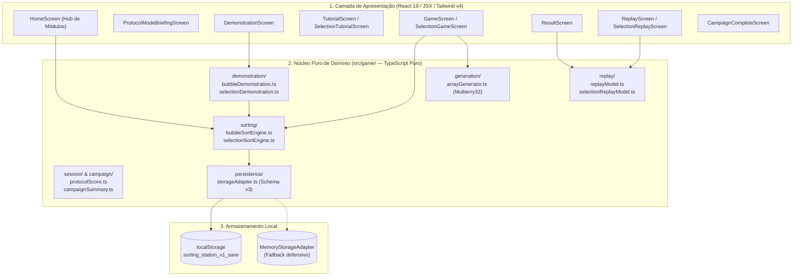

# Sorting Station – Sumário Operacional da Plataforma

> **Status da Documentação:** Ativo / Canônico  
> **Data da Última Revisão:** 15/09/2026 (Marco PLATFORM-R0)  
> **Governança:** [`AGENTS.md`](../../AGENTS.md) e [`ADR 0018`](../adr/0018-game-to-educational-platform-transition.md).  
> 
> *Este documento é o ponto de entrada operacional e mapa de navegação canônico da Wiki. Ele não substitui a leitura das páginas temáticas detalhadas correspondentes ao escopo da tarefa.*

---

## 1. O que é o Sorting Station hoje?

O **Sorting Station** é uma **plataforma educacional interativa e gamificada para aprendizagem, prática e visualização de algoritmos de ordenação**.

A aplicação opera como uma Single Page Application (SPA) client-side desenvolvida em React 19, TypeScript e Tailwind CSS v4, executada no ecossistema Vite 8 dentro da sandbox do Figma Make.

A identidade de **Central Logística Espacial/Industrial** permanece como metáfora visual de engajamento e camada de gamificação (cargas numeradas, esteiras mecânicas, operadores de triagem, badges de invariantes, pontuação do protocolo e desafios). O produto **não é mais arquitetado nem documentado primordialmente como um jogo com fases**, mas sim como uma plataforma de ensino estruturada em **Módulos de Algoritmo** e **Exercícios**.

---

## 2. Qual é o objetivo educacional?

O objetivo pedagógico central é **ensinar e consolidar a compreensão de algoritmos de ordenação por meio de manipulação cinestésica direta governada por Máquinas de Estados Finitas (FSMs) estritas**, superando a passividade de meras animações automáticas.

A plataforma articula continuamente a tríade cognitiva:
1. **Ação do Estudante:** Tomada de decisão lógica reflexiva nas botoeiras contextuais (`SWAP`/`KEEP` ou `INSPECT`/`COMMIT`);
2. **Representação Visual Concreta:** Cargas numeradas deslizando sobre esteiras com papéis semânticos explícitos (`BoxRole`);
3. **Ancoragem Formal em Pseudocódigo:** Destaque determinístico sincronizado linha a linha em tempo real.

O sistema enfatiza o feedback formativo, imediato e não punitivo: decisões incorretas paralisam a esteira e explicam a invariante violada sem reiniciar ou punir o estudante. O tempo de execução do usuário é estritamente descritivo e tem peso zero na avaliação.

---

## 3. Quais módulos curriculares existem?

A plataforma possui um currículo oficial congelado em **6 Módulos de Algoritmos de Ordenação**:

1. **Bubble Sort:** Ordenação por comparações e trocas locais entre elementos adjacentes;
2. **Selection Sort:** Ordenação por seleção sequencial do menor elemento via varredura com scanner e permuta única por passada;
3. **Insertion Sort:** Ordenação incremental por elevação de chave e deslocamentos regressivos (*shifts*) em partição ordenada à esquerda;
4. **Merge Sort:** Ordenação por divisão binária recursiva e intercalação ordenada com dois ponteiros;
5. **Quick Sort:** Ordenação por particionamento em torno de um pivô (Lomuto/Hoare) e recursão sobre partições independentes;
6. **Heap Sort:** Ordenação in-place por construção de árvore Max-Heap e repetidos afundamentos (*sift-down*) após extração da raiz.

---

## 4. Qual o status factual de cada módulo?

| Módulo Curricular | Status Factual | Implementação no Código | Documentação Canônica |
| :--- | :---: | :--- | :--- |
| **01. Bubble Sort** | `IMPLEMENTADO` | Engine pura (`bubbleSortEngine.ts`), FSM sequencial estrita, tutorial guiado (`[3, 1, 2]`), demonstração autônoma (`[5, 2, 4, 1]`), prática de 3 níveis procedurais, modo Early Exit, replay retrospectivo e pseudocódigo sincronizado de 9/14 linhas. Persistido em Schema v4 (`bubble.practice.*`). | [`modules/bubble-sort.md`](./modules/bubble-sort.md) |
| **02. Selection Sort** | `IMPLEMENTADO` | Engine pura (`selectionSortEngine.ts`), FSM bimodal `INSPECT`/`COMMIT`, constraints procedurais, briefing oficial, tutorial guiado (`[4, 1, 3]`), demonstração autônoma, prática de 3 níveis com animação de longa distância, replay e pseudocódigo sincronizado de 13 linhas. Persistido em Schema v4 (`selection.practice.*`). | [`modules/selection-sort.md`](./modules/selection-sort.md) |
| **03. Insertion Sort** | `IMPLEMENTADO E ATIVADO (P2.2-F)` | Engine pura (`insertionSortEngine.ts`), FSM de deslocamentos (*shifts*), constraints procedurais, briefing oficial, tutorial guiado (`[4, 2, 3]`), demonstração canônica autônoma (`[6, 3, 5, 2, 7]`), práticas interativas progressivas (`basic`, `intermediate`, `advanced`), `PracticeSetCompleteScreen`, `ResultScreen` com telemetria de *shifts*/*inserts*, replay retrospectivo puro (`insertionReplayModel.ts`), pseudocódigo sincronizado de 11 linhas (`InsertionSortPseudocodePanel.tsx`), persistência no Schema v4 orientada a exercícios e ativado publicamente no catálogo do Hub com status `available`. | [`modules/insertion-sort.md`](./modules/insertion-sort.md) |
| **04. Merge Sort** | `FUTURO` | Especificação completa no Module Standard; código algorítmico não iniciado (Marco P3.1). | [`modules/merge-sort.md`](./modules/merge-sort.md) |
| **05. Quick Sort** | `FUTURO` | Especificação completa no Module Standard; código algorítmico não iniciado (Marco P3.2). | [`modules/quick-sort.md`](./modules/quick-sort.md) |
| **06. Heap Sort** | `FUTURO` | Especificação completa no Module Standard; código algorítmico não iniciado (Marco P3.3). | [`modules/heap-sort.md`](./modules/heap-sort.md) |

---

## 5. Qual o padrão obrigatório de módulo (Module Standard)?

Todo módulo curricular deve ser documentado de forma exaustiva seguindo o **Module Standard de 20 seções obrigatórias** formalizado em [`modules/README.md`](./modules/README.md):

1. **Identificação:** `moduleId`, nome canônico, status factual e ordem curricular;
2. **Objetivos de Aprendizagem:** Competências conceituais sem alegações empíricas não comprovadas;
3. **Modelo Mental do Algoritmo:** Metáfora visual coerente e analogia física na Central Logística;
4. **Operações Fundamentais:** Comparações $C(n)$ e movimentações $M(n)$ discriminadas por tipo;
5. **Mecânica Interativa Própria:** Botoeira contextual e modelo de manipulação singular daquele algoritmo;
6. **Pseudocódigo Canônico:** Texto formal em português estruturado com numeração de linhas;
7. **Métricas Factuais Adequadas:** Telemetria inerente e fórmula de pontuação ($100 - 10\times\text{erros} - 5\times\text{dicas}$);
8. **Demonstração:** Observação autônoma da execução perfeita sobre vetor curado fixo;
9. **Tutorial Guiado:** Prática passo a passo formativa com instruções atômicas;
10. **Tipos de Exercícios:** Mapeamento na taxonomia transversal de 8 tipos (A a H);
11. **Casos Curados do Algoritmo:** Conjuntos fixos pedagógicos para evidenciar propriedades específicas;
12. **Geração Procedural e Constraints:** Predicados matemáticos aplicados sobre o gerador PRNG Mulberry32 global;
13. **Feedback Formativo:** Explicações imediatas exibidas em `InstructionPanel` para cada violação de invariante;
14. **Dicas Pedagógicas:** Scaffolding cognitivo contextual;
15. **Resultado e Reflexão:** Apresentação factual pós-exercício;
16. **Replay Retrospectivo:** Derivação funcional de quadros a partir de `history` com pseudocódigo sincronizado;
17. **Persistência e Progresso:** Schema v3 atual e mapeamento conceitual no Schema v4;
18. **Acessibilidade:** Conformidade WCAG, navegação por teclado, anéis de foco e papéis semânticos `BoxRole`;
19. **Riscos Pedagógicos:** Armadilhas cognitivas e equívocos conceituais comuns dos estudantes;
20. **Relação com o Laboratório Comparativo:** Papel do algoritmo no futuro laboratório multi-algoritmo.

### Taxonomia Transversal de 8 Tipos de Exercícios
- **A. Introdução / Conceito:** Briefing preparatório do módulo;
- **B. Demonstração:** Observação passiva da execução autônoma perfeita com pseudocódigo;
- **C. Tutorial Guiado:** Prática assistida com vetor curto curado;
- **D. Prática Básica:** Exercícios procedurais com vetores pequenos ($n=4$);
- **E. Prática Progressiva:** Exercícios procedurais crescentes ($n=5, 6$);
- **F. Casos do Algoritmo:** Entradas curadas demonstrando comportamentos críticos (já ordenado, inverso, duplicados);
- **G. Desafio:** Variações e otimizações algorítmicas (ex.: Early Exit);
- **H. Prática Livre (Sandbox):** Entrada configurável pelo usuário (futuro).

---

## 6. Qual a arquitetura de software?

A arquitetura do Sorting Station é dividida em camadas rigorosamente desacopladas:

- **Isolamento Total:** As engines algorítmicas em `src/game/` não importam React, hooks ou JSX;
- **Máquinas de Estados Imutáveis:** Cada passo gera um novo estado congelado (`Object.freeze`);
- **Geração Procedural Universal:** Um único gerador PRNG Mulberry32 determinístico (`arrayGenerator.ts`) atende a todos os algoritmos através de constraints específicas. Nenhum algoritmo possui gerador próprio;
- **Persistência Desacoplada:** Schema v4 implementado e ativo (`sorting_station_save`), orientado a módulos e conjuntos de exercícios (`exerciseSets`), com pipeline de migração v1->v2->v3->v4 e fallback de leitura da chave legada;
- **Suíte de Testes Automatizados:** **Vitest** com **376 testes unitários** em 27 arquivos com 100% de aprovação.

---

## 7. Qual é a próxima prioridade de desenvolvimento?

A próxima prioridade oficial de implementação de software é:

> **Marco P3.1 — Módulo Merge Sort (Engine Pura e Especificação Pedagógica)**  
> Implementação da engine pura de Merge Sort em `src/game/sorting/merge/` baseada na taxonomia curricular do Module Standard (divisão binária recursiva, representação visual de subarrays temporários e intercalação ordenada com dois ponteiros).

---

## 8. O que é trabalho futuro?

1. **Marco P3.1:** Módulo Merge Sort (divisão binária recursiva e intercalação com dois ponteiros);
2. **Marco P3.2:** Módulo Quick Sort (particionamento Lomuto/Hoare com pivô e recursão);
3. **Marco P3.3:** Módulo Heap Sort (Max-Heap, afundamento *sift-down* e extração);
4. **Marco P3.4:** **Laboratório Comparativo** ([`comparison-lab.md`](./comparison-lab.md)) — **Status: BLOQUEADO até que os 6 módulos estejam implementados**;
5. **Marco P3.5:** Avaliação Acadêmica e Metodologia Científica com estudantes universitários reais;
6. **Evolução da Persistência:** Schema v4 implementado e ativo no marco P2.2-F;
7. **Narrativa / Lore:** Personagens e diálogos reposicionados como backlog opcional de gamificação.

---

## 9. Onde encontrar cada informação na Wiki?

| Preciso saber sobre... | Documento Canônico de Referência |
| :--- | :--- |
| **Regras mandatórias e restrições do agente** | [`AGENTS.md`](../../AGENTS.md) |
| **Visão oficial do produto e princípios** | [`01-product-vision.md`](./01-product-vision.md) |
| **Arquitetura de software e roteamento de telas** | [`02-system-architecture.md`](./02-system-architecture.md) |
| **Front-end, componentes visuais e props** | [`03-frontend.md`](./03-frontend.md) |
| **Engines puras de ordenação e FSMs** | [`04-sorting-engine.md`](./04-sorting-engine.md) |
| **Design System, tokens e acessibilidade** | [`05-ux-design-system.md`](./05-ux-design-system.md) |
| **Ambiente Figma Make e scripts operacionais** | [`06-development-environment.md`](./06-development-environment.md) |
| **Persistência Schema v4 e migração v3->v4** | [`07-backend-and-persistence.md`](./07-backend-and-persistence.md) |
| **Suíte de testes Vitest (376 testes) e DoD** | [`08-testing-and-quality.md`](./08-testing-and-quality.md) |
| **Build, deploy e empacotamento** | [`09-build-deploy.md`](./09-build-deploy.md) |
| **Roadmap canônico da plataforma e legado histórico** | [`10-roadmap.md`](./10-roadmap.md) |
| **Governança de ADRs e índice de decisões 0001 a 0021** | [`11-architecture-decisions.md`](./11-architecture-decisions.md) |
| **Pedagogia, rigor ético e diretrizes para o artigo** | [`12-pedagogy-and-academic-traceability.md`](./12-pedagogy-and-academic-traceability.md) |
| **Padrão transversal de módulo e taxonomia de exercícios**| [`modules/README.md`](./modules/README.md) |
| **Módulo 01: Bubble Sort** | [`modules/bubble-sort.md`](./modules/bubble-sort.md) |
| **Módulo 02: Selection Sort** | [`modules/selection-sort.md`](./modules/selection-sort.md) |
| **Módulo 03: Insertion Sort** | [`modules/insertion-sort.md`](./modules/insertion-sort.md) |
| **Módulo 04: Merge Sort** | [`modules/merge-sort.md`](./modules/merge-sort.md) |
| **Módulo 05: Quick Sort** | [`modules/quick-sort.md`](./modules/quick-sort.md) |
| **Módulo 06: Heap Sort** | [`modules/heap-sort.md`](./modules/heap-sort.md) |
| **Especificação do Laboratório Comparativo** | [`comparison-lab.md`](./comparison-lab.md) |
| **Roteiro manual de testes e homologação QA** | [`qa-gameplay-checklist.md`](./qa-gameplay-checklist.md) |

---

## 10. Protocolo Obrigatório de Agentes (Preflight & Postflight)

Todo agente trabalhando no repositório Sorting Station deve cumprir integralmente o seguinte fluxo inegociável:

1. **Preflight:** Ler `AGENTS.md` $\rightarrow$ Ler `docs/wiki/SUMMARY.md` $\rightarrow$ Ler a página específica do tema $\rightarrow$ Ler ADRs relacionados $\rightarrow$ Confirmar no código o estado fático antes de qualquer alteração;
2. **Execução:** Não alterar código ou documentação sem aderência estrita às regras;
3. **Postflight:** Toda tarefa que altere comportamento, arquitetura, design system ou dependências DEVE atualizar a Wiki e o `SUMMARY.md` antes de ser considerada concluída.
