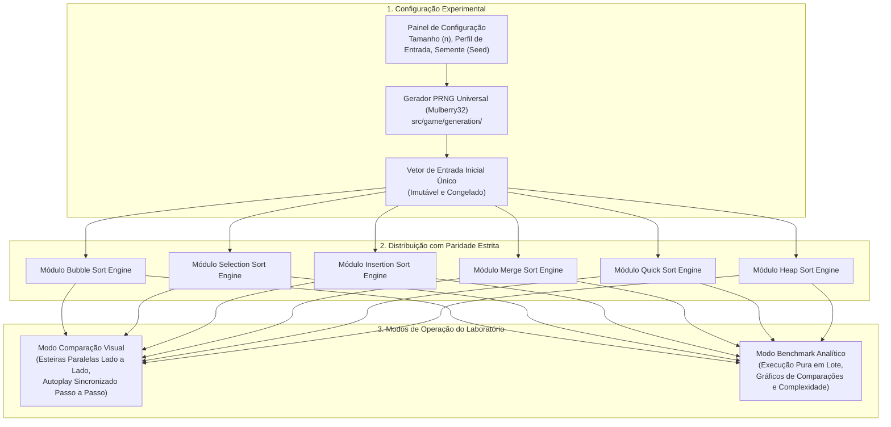

# Laboratório Comparativo de Algoritmos (Comparison Lab)

> **Documento canônico:** Especificação arquitetural, pedagógica e experimental do Laboratório Comparativo de Algoritmos da plataforma **Sorting Station**.  
> **Status de Implementação:** `BLOQUEADO ATÉ A IMPLEMENTAÇÃO INTEGRAL DOS 6 MÓDULOS CURRICULARES`  
> **Data:** 15/09/2026 (Marco PLATFORM-R0)  
> **Dependências:** [`AGENTS.md`](../../AGENTS.md), [`ADR 0018`](../adr/0018-game-to-educational-platform-transition.md), [`modules/README.md`](./modules/README.md), [`04-sorting-engine.md`](./04-sorting-engine.md), [`10-roadmap.md`](./10-roadmap.md).

---

## 1. Diretriz Mandatória de Bloqueio Arquitetural

> [!IMPORTANT]
> **Status Canônico: BLOQUEADO.**  
> O Laboratório Comparativo **NÃO DEVE** ter código implementado antes que os 6 módulos curriculares oficiais (**Bubble Sort**, **Selection Sort**, **Insertion Sort**, **Merge Sort**, **Quick Sort** e **Heap Sort**) estejam formalmente homologados com suas respectivas engines puras, máquinas de estados e testes unitários.  
> Qualquer tentativa de codificar o laboratório com suporte apenas parcial a 2 ou 3 algoritmos constitui violação da governança do projeto, pois distorceria a taxonomia comparativa e criaria acoplamentos prematuros de interface.

---

## 2. Visão Geral e Propósito Pedagógico

O **Laboratório Comparativo** é a experiência culminante da plataforma Sorting Station. Ele atende ao nível mais alto da Taxonomia de Bloom (Avaliar e Analisar), permitindo que estudantes e professores de Ciência da Computação:
1. Submetam múltiplos algoritmos de ordenação à **mesma carga de entrada exata** de maneira controlada e reprodutível;
2. Observem lado a lado a disparidade entre estratégias assintóticas quadráticas ($O(n^2)$) e log-lineares ($O(n \log n)$);
3. Compreendam a diferença fundamental entre métricas assintóticas universais (como comparações) e custos operacionais de movimentação específicos de cada família algorítmica.

---

## 3. Arquitetura Conceitual do Laboratório

---

## 4. Capacidade Operacional: 2 a 6 Algoritmos Simultâneos

O laboratório suportará a seleção dinâmica de **qualquer subconjunto de 2 até 6 algoritmos** para execução simultânea:
- **Duelos Clássicos Didáticos (2 Algoritmos):**
  - *Bubble Sort vs. Selection Sort:* Comparando permutas excessivas contra varredura com troca única.
  - *Insertion Sort vs. Selection Sort:* Confrontando o comportamento em dados quase ordenados contra pior caso.
  - *Merge Sort vs. Quick Sort:* Comparando estabilidade com custo de memória auxiliar contra velocidade in-place.
  - *Quick Sort vs. Heap Sort:* Analisando vulnerabilidade a pior caso quadrático contra garantia invariante $O(n \log n)$.
- **Baterias de Categoria (3 Algoritmos):**
  - *Copa dos Elementares:* Bubble vs. Selection vs. Insertion.
  - *Copa dos Avançados:* Merge vs. Quick vs. Heap.
- **Painel Geral Completo (6 Algoritmos):**
  - Execução simultânea de todos os módulos curriculares da plataforma.

---

## 5. Garantia Estrita de Paridade por Semente (Seed Parity)

Para assegurar validade científica e pedagógica rigorosa, **é terminantemente vedado** gerar arrays independentes para cada algoritmo comparado:
1. Uma **única semente** (numérica ou textual) é definida pelo usuário ou sorteada aleatoriamente;
2. O gerador determinístico universal `generateSortingArray` produz um vetor de entrada congelado `initialArray`;
3. Uma cópia profunda imutável desse mesmo vetor é distribuída como entrada inicial para a engine de cada algoritmo selecionado;
4. **Verificação de Integridade:** No encerramento da simulação, o sistema valida que o vetor final ordenado produzido por todos os algoritmos seja estritamente idêntico.

---

## 6. Taxonomia de Métricas: Comparáveis vs. Específicas

Uma armadilha pedagógica frequente em simuladores de ordenação é comparar "número de trocas" entre algoritmos com naturezas de memória distintas. O Sorting Station adota uma distinção formal estrita:

### 6.1. Métricas Universais Comparáveis
Métricas que possuem o mesmo significado semântico e matemático em todos os 6 algoritmos:
- **Comparações Formais de Chaves ($C(n)$):** O número exato de avaliações relacionais ($<$, $\le$, $>$, $\ge$) efetuadas entre elementos do vetor;
- **Comprimento da Entrada ($n$):** Número de elementos sob teste;
- **Conformidade do Resultado Final:** Confirmação de que o vetor resultante está monotonicamente ordenado e é uma permutação válida da entrada;
- **Complexidade Teórica Esperada:** Rótulo assintótico ($O(n^2)$ vs. $O(n \log n)$).

### 6.2. Métricas de Movimentação Específicas (Não Diretamente Comutáveis)
Cada algoritmo possui uma mecânica de escrita própria em memória. O laboratório apresentará essas métricas em colunas dedicadas, explicitando sua natureza:

| Algoritmo | Métrica Específica de Movimentação | Unidade | Natureza Física na Central Logística |
| :--- | :--- | :--- | :--- |
| **Bubble Sort** | Permutas Adjacentes (*Swaps*) | Troca local $[j, j+1]$ | Inversão física de duas caixas contíguas |
| **Selection Sort** | Permutas de Longa Distância | No máx. $n-1$ trocas | Guindaste transferindo carga mínima para doca $i$ |
| **Insertion Sort** | Deslocamentos em Cascata (*Shifts*) | Deslocamentos $+1$ | Empurrar cargas para a direita para abrir lacuna |
| **Merge Sort** | Escritas em Memória Auxiliar | Cópia $2n \log n$ | Transferência para esteira coletora temporária |
| **Quick Sort** | Permutas de Particionamento | Trocas bilaterais | Segregação de elementos entre baia menor e maior |
| **Heap Sort** | Permutas de Afundamento (*Sifts*) | Trocas verticais | Deslocamento de cargas na pirâmide hierárquica |

---

## 7. Tratamento de Tempo: Automação vs. Benchmark

> [!CAUTION]
> **Tempo de Usuário NÃO é Métrica Científica.**  
> O tempo que um estudante humano gasta clicando ou assistindo a animações depende de reflexos motores, velocidade de processamento visual e atrasos de renderização de interface. Portanto, **o tempo de clique humano tem peso estritamente ZERO em qualquer comparação algorítmica**.

O Laboratório tratará o tempo sob duas perspectivas formais:

### 7.1. Tempo no Modo Comparação Visual (Passo a Passo / Autoplay Controlado)
- O tempo é um **parâmetro de cadência ajustável pelo usuário** (ex.: $100\text{ms}$, $250\text{ms}$, $500\text{ms}$ por micro-passo);
- Os algoritmos avançam sincronizados em "pulsos de relógio didáticos" (*ticks*). O aluno pode pausar, retroceder ou avançar passo a passo para comparar qual algoritmo ainda está no início enquanto outro já consolidou suas posições.

### 7.2. Tempo no Modo Benchmark (Execução em Lote Assíncrono)
- O motor executa as engines puras sem animação visual de DOM/CSS;
- Para tamanhos médios/grandes ($n = 50, 100, 500, 1000$), mede-se o tempo real de CPU em milissegundos via `performance.now()`, acompanhado de avisos sobre a natureza monothread do JavaScript.

---

## 8. Os Dois Modos Operacionais do Laboratório

### 8.1. Modo Comparação Visual (Para Sala de Aula e Estudo Detalhado)
- **Interface:** Tela dividida verticalmente ou horizontalmente com esteiras paralelas em miniatura;
- **Capacidade Recomendada:** 2 a 4 algoritmos em paralelo para evitar sobrecarga cognitiva;
- **Controles Globais:**
  - `[ ▶ REPRODUZIR TUDO ]` / `[ ⏸ PAUSAR TUDO ]`;
  - Seletor de Velocidade Global (`0.5x`, `1x`, `2x`, `5x`);
  - `[ PASSO SEGUINTE ]` (avança exatamente 1 operação em todas as esteiras simultaneamente);
- **Painel de Telemetria Dinâmico:** Gráficos de barras em tempo real que crescem à medida que as comparações são computadas.

### 8.2. Modo Benchmark Analítico (Para Pesquisa e Avaliação Empírica)
- **Interface:** Painel analítico de alta densidade de dados;
- **Tamanhos Parametrizáveis:** $n = 10, 20, 50, 100, 250, 500$;
- **Perfis de Entrada Curados:**
  - *Totalmente Aleatório* (distribuição uniforme);
  - *Quase Ordenado* (90% ordenado com inversões locais esparsas);
  - *Estritamente Invertido* (pior caso para múltiplos algoritmos);
  - *Muitos Duplicados* (apenas 3 a 5 chaves distintas repetidas);
  - *Elemento Tartaruga* (menor elemento no final).
- **Saída:** Tabela consolidada de métricas, gráfico XY de Comparações vs. $n$ e botão de exportação de dados para formato JSON/CSV para trabalhos acadêmicos.

---

## 9. Critérios de Desbloqueio e Conclusão de DoD

O desenvolvimento do Laboratório Comparativo só poderá ser iniciado após o cumprimento rigoroso do seguinte checklist:
- [ ] Módulo Bubble Sort concluído e homologado
- [ ] Módulo Selection Sort concluído e homologado
- [ ] Módulo Insertion Sort concluído e homologado (P2.2)
- [ ] Módulo Merge Sort concluído e homologado (P3)
- [ ] Módulo Quick Sort concluído e homologado (P3)
- [ ] Módulo Heap Sort concluído e homologado (P3)
- [ ] Aprovação de ADR específico detalhando a arquitetura de sincronização de múltiplos web workers ou micro-loops.
