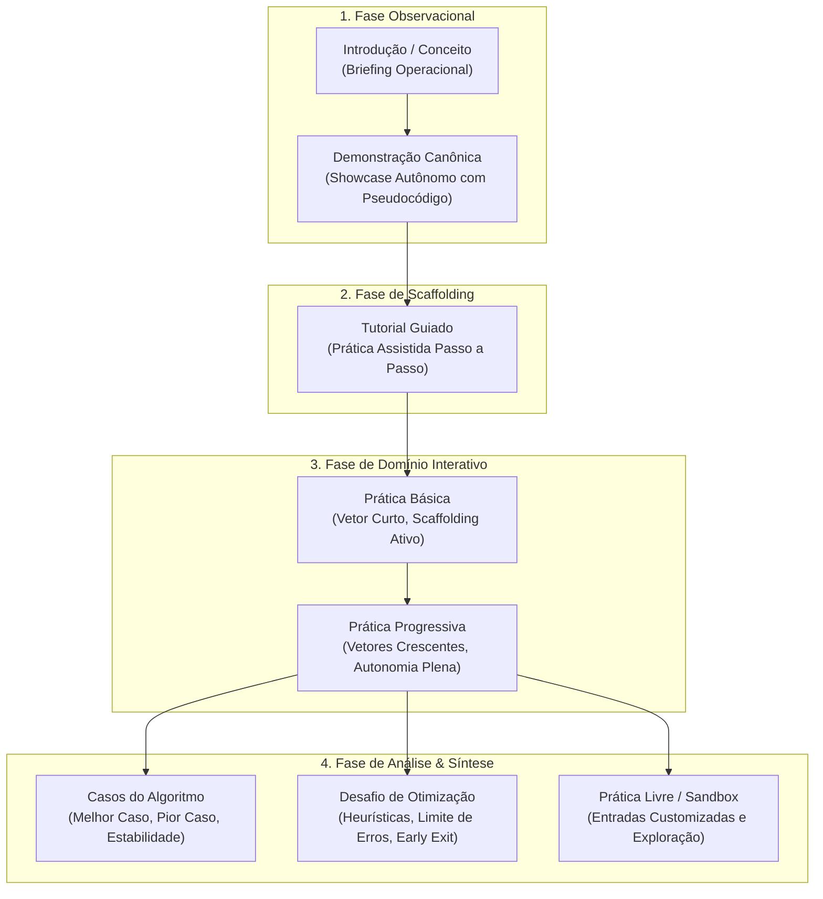

# Padrão Canônico de Módulos Curriculares (Module Standard)

> **Documento canônico:** Especificação formal do padrão transversal de módulo curricular, taxonomia de exercícios e catálogo dos 6 módulos oficiais de algoritmos de ordenação da plataforma **Sorting Station**.  
> **Status:** Ativo / Base de Verdade da Plataforma  
> **Data:** 15/09/2026 (Marco PLATFORM-R0)  
> **Dependências:** [`AGENTS.md`](../../../AGENTS.md), [`ADR 0018`](../../adr/0018-game-to-educational-platform-transition.md), [`01-product-vision.md`](../01-product-vision.md), [`02-system-architecture.md`](../02-system-architecture.md).

---

## 1. Visão Geral e Filosofia Curricular

No **Sorting Station**, a unidade curricular canônica de ensino, prática e software é o **Módulo de Algoritmo**.  
A plataforma substitui o modelo arcaico de "jogo linear de fases soltas" por uma estrutura modular rigorosa, fundamentada nas diretrizes curriculares de Ciência da Computação (ACM/IEEE CS Curricula) e em princípios de aprendizagem cinestésica e cognitiva.

Cada módulo é inteiramente autônomo e responsável por cobrir um algoritmo de ordenação de ponta a ponta, articulando observação passiva, instrução guiada, resolução prática de problemas, análise de invariantes, casos pedagógicos extremos e reflexão metacognitiva.

---

## 2. Catálogo Oficial dos 6 Módulos Curriculares Congelados

O currículo oficial do Sorting Station é formalmente delimitado e congelado nos seguintes 6 algoritmos:

| # | Módulo | Arquivo de Especificação | Complexidade Temporal (Médio / Pior) | Mecânica Central de Interação | Status Factual de Implementação |
| :-: | :--- | :--- | :---: | :--- | :---: |
| **01** | **Bubble Sort** | [`bubble-sort.md`](./bubble-sort.md) | $O(n^2) / O(n^2)$ | Janela deslizante de pares vizinhos $[j, j+1]$ com decisões explícitas TROCAR vs MANTER | `IMPLEMENTADO` (Adaptação conceitual fases $\rightarrow$ exercícios) |
| **02** | **Selection Sort** | [`selection-sort.md`](./selection-sort.md) | $O(n^2) / O(n^2)$ | Scanner linear de menor carga na região desordenada e transferência única no commit | `IMPLEMENTADO` (Adaptação conceitual fases $\rightarrow$ exercícios) |
| **03** | **Insertion Sort** | [`insertion-sort.md`](./insertion-sort.md) | $O(n^2) / O(n^2)$ | Elevação de chave (*lift*), deslocamento regressivo na partição ordenada e inserção na lacuna | `EM ANDAMENTO` (Marco P2.2: P2.2-A, B e C concluídos) |
| **04** | **Merge Sort** | [`merge-sort.md`](./merge-sort.md) | $O(n \log n) / O(n \log n)$ | Divisão em sub-esteiras paralelas e intercalação ordenada com dois ponteiros | `FUTURO` (Marco P3) |
| **05** | **Quick Sort** | [`quick-sort.md`](./quick-sort.md) | $O(n \log n) / O(n^2)$ | Eleição de carga pivô e particionamento bilateral em esteiras de menores e maiores | `FUTURO` (Marco P3) |
| **06** | **Heap Sort** | [`heap-sort.md`](./heap-sort.md) | $O(n \log n) / O(n \log n)$ | Transformação da esteira em max-heap, afundamento (*sift-down*) e extração da raiz | `FUTURO` (Marco P3) |

---

## 3. O Padrão Transversal Obrigatório de Módulo (Module Standard)

Para garantir integridade pedagógica e uniformidade visual e técnica em toda a plataforma, **todo documento de módulo em `docs/wiki/modules/` deve conter obrigatoriamente as 20 seções estruturais padronizadas**:

1. **Identificação do Módulo:** Nome canônico, ID, status factual, complexidade teórica assintótica ($O$, $\Omega$, $\Theta$), memória auxiliar, estabilidade formal e metadados temáticos da Central Logística.
2. **Objetivos de Aprendizagem:** Competências cognitivas esperadas segundo a Taxonomia de Bloom revisada (Lembrar, Entender, Aplicar, Analisar, Avaliar), abrangendo conceitos algorítmicos, computacionais e matemáticos pertinentes ao módulo, sem alegações empíricas não comprovadas.
3. **Modelo Mental e Metáfora Visual:** Analogia concreta na Central Logística, representação física da esteira e ancoragem cognitiva.
4. **Operações Fundamentais e Invariantes:** Definição matemática estrita da invariante de laço, fronteira ordenada (*sorted boundary*) e regras de parada.
5. **Mecânica Interativa Própria:** Modelo cinestésico e controles do estudante (botões, seleção de elementos, travamento de ações e translações visuais).
6. **Pseudocódigo Canônico:** Texto canônico estruturado em português com numeração de linhas, sem sintaxe proprietária de linguagens específicas.
7. **Métricas Factuais Adequadas ao Algoritmo:** Comparações $C(n)$, trocas físicas $M(n)$, deslocamentos (*shifts*) ou escritas auxiliares, passos e passadas, e aplicação da Pontuação do Protocolo.
8. **Modo Demonstração:** Especificação da execução canônica autônoma pré-prática, vetor curado fixo, autoplay e velocidade ajustável sem impacto em pontuação ou persistência.
9. **Tutorial Guiado:** Passo a passo formativo com vetor curto, bloqueio síncrono e feedback explicativo imediato.
10. **Tipos de Exercícios Suportados:** Mapeamento da taxonomia transversal de exercícios suportados pelo módulo (obrigatório, opcional, não aplicável).
11. **Casos Pedagógicos Curados Específicos:** Coleção fixa de vetores representativos de propriedades algorítmicas críticas (ordenado, inverso, quase ordenado, elementos problemáticos, estabilidade com duplicados).
12. **Geração Procedural e Constraints do Módulo:** Parâmetros do gerador universal `generateSortingArray` (PRNG Mulberry32), regras de rejeição matemática de vetores triviais e distribuição de valores.
13. **Feedback Formativo e Tratamento de Erros:** Filosofia não punitiva de correção imediata, mensagens explicativas contextuais e registro factual de `errors` na engine.
14. **Sistema de Dicas:** Scaffolding cognitivo contextual com revelação da regra lógica sem resolução automática desmedida, rastreado isoladamente em `hintsUsed`.
15. **Tela de Resultado e Reflexão:** Apresentação factual pós-exercício, síntese de desempenho via Pontuação do Protocolo, notas formativas e transições seguras.
16. **Replay e Inspeção Retrospectiva:** Reconstituição pura da partida jogada derivada de `history`, frame 0 inicial, autoplay, controle passo a passo e pseudocódigo sincronizado.
17. **Persistência e Progresso:** Mapeamento no storage local (Schema v3 atual e migração futura para Schema v4 orientado a exercícios).
18. **Acessibilidade e Inclusão:** Navegação por teclado, compatibilidade com `prefers-reduced-motion`, semântica `BoxRole`, alto contraste e independência de cor para transmissão de significado.
19. **Riscos Pedagógicos e Armadilhas Conceituais:** Concepções errôneas frequentes de estudantes e salvaguardas interativas implementadas para desarmá-las.
20. **Relação Futura com o Laboratório Comparativo:** Requisitos de paridade, métricas exportáveis e comportamento esperado no confronto empírico contra outros módulos.

---

## 4. Taxonomia Transversal de Tipos de Exercícios

Os módulos do Sorting Station organizam suas atividades didáticas sob uma taxonomia unificada de 8 tipos de exercícios:

### Classificação Transversal por Módulo:

| Tipo de Exercício | Bubble Sort | Selection Sort | Insertion Sort | Merge Sort | Quick Sort | Heap Sort |
| :--- | :---: | :---: | :---: | :---: | :---: | :---: |
| **1. Introdução / Conceito** | `OBRIGATÓRIO` | `OBRIGATÓRIO` | `OBRIGATÓRIO` | `OBRIGATÓRIO` | `OBRIGATÓRIO` | `OBRIGATÓRIO` |
| **2. Demonstração** | `OBRIGATÓRIO` | `OBRIGATÓRIO` | `OBRIGATÓRIO` | `OBRIGATÓRIO` | `OBRIGATÓRIO` | `OBRIGATÓRIO` |
| **3. Tutorial Guiado** | `OBRIGATÓRIO` | `OBRIGATÓRIO` | `OBRIGATÓRIO` | `OBRIGATÓRIO` | `OBRIGATÓRIO` | `OBRIGATÓRIO` |
| **4. Prática Básica** | `OBRIGATÓRIO` | `OBRIGATÓRIO` | `OBRIGATÓRIO` | `OBRIGATÓRIO` | `OBRIGATÓRIO` | `OBRIGATÓRIO` |
| **5. Prática Progressiva** | `OBRIGATÓRIO` | `OBRIGATÓRIO` | `OBRIGATÓRIO` | `OBRIGATÓRIO` | `OBRIGATÓRIO` | `OBRIGATÓRIO` |
| **6. Casos do Algoritmo** | `OBRIGATÓRIO` | `OBRIGATÓRIO` | `OBRIGATÓRIO` | `OBRIGATÓRIO` | `OBRIGATÓRIO` | `OBRIGATÓRIO` |
| **7. Desafio** | `OPCIONAL` (Early Exit) | `OPCIONAL` | `OPCIONAL` | `OPCIONAL` | `OPCIONAL` | `OPCIONAL` |
| **8. Prática Livre (Sandbox)** | `OPCIONAL` | `OPCIONAL` | `OPCIONAL` | `OPCIONAL` | `OPCIONAL` | `OPCIONAL` |

---

## 5. Mapeamento Conceitual de Fases Históricas para Exercícios

Para garantir 100% de retrocompatibilidade com o código atual (`src/App.tsx`, `GameScreen.tsx`, `SelectionGameScreen.tsx`) e a persistência Schema v3, **nenhum arquivo de código foi quebrado ou renomeado**. A relação entre os conceitos de código e a taxonomia da plataforma é formalizada abaixo:

| Identificador em Código Atual | Significado Arquitetural Canônico na Plataforma | Configuração Típica de Entrada | Propósito Pedagógico |
| :--- | :--- | :---: | :--- |
| `phase === 1` | **Prática Básica do Módulo** | $n = 4$ elementos | Consolidação do modelo mental inicial com feedback contínuo. |
| `phase === 2` | **Prática Intermediária do Módulo** | $n = 5$ elementos | Exercício de múltiplas passadas e assimilação da invariante. |
| `phase === 3` | **Prática Avançada do Módulo** | $n = 6$ elementos | Autonomia do estudante em lote extenso com avaliação de recorde. |
| `scenario.id === 1..3` | **Casos Específicos do Módulo (Desafio)** | Vetores fixos curados | Investigação de comportamento assimétrico e heurísticas de término. |

---

## 6. Governança de Desenvolvimento de Novos Módulos

Nenhum novo algoritmo de ordenação pode ser introduzido no código-fonte sem que seu respectivo arquivo em `docs/wiki/modules/` tenha sido previamente aprovado com as 20 seções preenchidas. O ciclo de vida mandatório de desenvolvimento de um módulo obedece ao fluxo:

$$\text{Especificação Wiki (20 Seções)} \longrightarrow \text{ADR Dedicado} \longrightarrow \text{Engine Pura \& FSM} \longrightarrow \text{Testes Unitários} \longrightarrow \text{UI \& Replay} \longrightarrow \text{Homologação}$$
