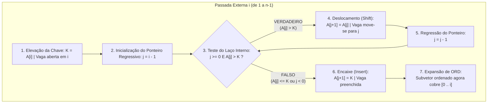

# Módulo 03 — Insertion Sort

> **Documento canônico do módulo curricular:** Especificação integral de design pedagógico, mecânico e computacional do Módulo de Insertion Sort da plataforma **Sorting Station**.  
> **Status de Implementação:** `EM ANDAMENTO` (Marco P2.2; P2.2-A, P2.2-B e P2.2-C concluídos — Constraints, Briefing, Tutorial Interativo e Driver Puro de Demonstração 100% Verdes).  
> **Data de Atualização:** 15/09/2026 (Marco P2.2-C / ADR 0019)  
> **Dependências:** [`AGENTS.md`](../../../AGENTS.md), [`ADR 0018`](../../adr/0018-game-to-educational-platform-transition.md), [`ADR 0019`](../../adr/0019-insertion-sort-pedagogical-layer-and-interactive-tutorial.md), [`modules/README.md`](./README.md), [`04-sorting-engine.md`](../04-sorting-engine.md), [`05-ux-design-system.md`](../05-ux-design-system.md), [`10-roadmap.md`](../10-roadmap.md), [`12-pedagogy-and-academic-traceability.md`](../12-pedagogy-and-academic-traceability.md).

---

## 1. Identificação do Módulo

- **Nome Canônico:** Insertion Sort (Ordenação por Inserção Incremental)
- **Identificador de Sistema (`moduleId`):** `insertion`
- **Rótulo Diegético na Interface:** `PROTOCOLO: INSERTION SORT // DESVIO E ENCAIXE DE CARGAS`
- **Subtítulo Diegético:** *Desvio e Encaixe de Cargas*
- **Status Factual:** `EM ANDAMENTO` (Engine pura, constraints, briefing, tutorial guiado e driver de demonstração implementados; P2.2-C concluído; próximo sub-marco: P2.2-D — Gameplay procedural e campanha)
- **Classificação Curricular:** Algoritmo Elementar de Inserção com Subvetor Ordenado Crescente
- **Complexidade Temporal:**
  - **Melhor Caso (Vetor Já Ordenado):** $\Omega(n)$ comparações, $0$ deslocamentos físicos
  - **Caso Médio:** $\Theta(n^2)$ comparações, $\Theta(n^2)$ deslocamentos de elementos
  - **Pior Caso (Vetor Invertido):** $\Theta(n^2)$ comparações ($\frac{n(n-1)}{2}$), $\frac{n(n-1)}{2}$ deslocamentos
- **Complexidade Espacial (Memória Auxiliar):** $O(1)$ (in-place; 1 registrador auxiliar para a chave suspensa)
- **Estabilidade Formal:** Estável (preserva a ordem relativa de elementos com chaves idênticas se a inserção parar estritamente ao encontrar elemento $\le \text{chave}$)
- **Tema Visual e Acentos:** Âmbar Industrial / Ouro Solar (`#f59e0b`), iluminação de trilho aéreo suspenso

---

## 2. Objetivos de Aprendizagem

Ao concluir o Módulo de Insertion Sort, o estudante deverá demonstrar competência nos seguintes conceitos algorítmicos, computacionais e matemáticos pertinentes ao módulo:

1. **Lembrar (Conhecimento):** Identificar a operação de extração do elemento-chave ($K = A[i]$), a existência de uma partição ordenada à esquerda ($[0 \dots i-1]$) e o laço de varredura regressiva ($j = i - 1$ descendo até $-1$).
2. **Entender (Compreensão):** Explicar a distinção fundamental entre uma **permuta física bilateral** (*swap*, típica de Bubble e Selection Sort) e um **deslocamento unilateral** (*shift*, característico de Insertion Sort), bem como a razão pela qual a partição `ORD` não representa posições definitivamente fixas (`OK`).
3. **Aplicar (Execução):** Conduzir a varredura regressiva na esteira, avaliando a cada passo a condição relacional $A[j] > \text{chave}$, comandando deslocamentos de cargas maiores para a direita e inserindo a chave no momento exato em que a invariante for restaurada.
4. **Analisar (Diferenciação):** Diferenciar o comportamento do algoritmo sob dados aleatórios versus dados quase ordenados, reconhecendo o caráter adaptativo do Insertion Sort ($O(n + d)$, onde $d$ é o número de inversões).
5. **Avaliar (Julgamento):** Comparar criticamente o custo computacional de deslocamento contíguo em arranjos físicos versus a facilidade de inserção de nós em listas encadeadas ou buffers circulares.

---

## 3. Modelo Mental e Metáfora Visual

### 3.1. A Metáfora Canônica: Desvio e Encaixe de Cargas
A metáfora do módulo é formalmente congelada no domínio da Central Logística:

- **O Trilho Aéreo de Desvio (*Bypass Suspenso*):** Paralelo e acima da esteira principal de roletes, existe um trilho pneumático/magnético energizado. No início de cada passada $i$, o guindaste mecânico eleva a carga $A[i]$ para esse trilho aéreo.
- **A Chave Suspensa (`CHAVE`):** A carga elevada permanece flutuando sobre a esteira, visível e destacada em âmbar, servindo como padrão de comparação móvel.
- **A Vaga na Esteira (`VAGA`):** A retirada da chave deixa uma lacuna vazia na esteira (slot tracejado com iluminação industrial pulsante). A vaga não é preenchida por um "fantasma", mas sim pelo elemento vizinho quando este for deslocado.
- **O Deslocamento Regressivo (*Shift*):** Cargas já arranjadas na partição ordenada à esquerda que forem mais pesadas que a chave suspensa deslizam uma posição para a direita, ocupando a vaga e transferindo o espaço vazio um passo para a esquerda.
- **O Encaixe na Doca (*Drop / Insertion*):** Ao encontrar uma carga mais leve ou igual à chave (ou ao atingir a cabeceira $j=-1$), o guindaste desce a chave suspensa, encaixando-a com firmeza na vaga correspondente.

---

## 4. Operações Fundamentais e Invariantes



### 4.1. Invariante de Laço do Laço Externo
No início de cada iteração $i$ ($1 \le i \le n - 1$):
- O subvetor $A[0 \dots i-1]$ contém os mesmos elementos originais que ocupavam essas posições, porém em **ordem não decrescente**.
- **Aviso Pedagógico Fundamental:** $A[0 \dots i-1]$ é um subvetor ordenado **localmente** (`ORD`). Ele **NÃO** contém necessariamente os menores elementos globais do vetor (diferente do Selection Sort). Futuras cargas desordenadas podem ser menores e forçar o deslocamento de elementos já ordenados.

### 4.2. Invariante do Laço Interno
Durante a varredura regressiva com a chave $K$ suspensa e a vaga em $\text{holeIndex} = j + 1$:
- Todos os elementos originalmente em $A[j+1 \dots i]$ foram deslocados uma posição para a direita e satisfazem $A[k] > K$ para todo $k \in [j+1 \dots i]$.
- A condição de parada ocorre exatamente quando:
  1. $j < 0$ (a chave é menor que todos os elementos da sub-esteira, devendo ser encaixada no índice 0); OU
  2. $A[j] \le K$ (encontrou-se um elemento menor ou igual, devendo a chave ser encaixada na posição imediatamente seguinte, $j+1$).

### 4.3. Regra de Estabilidade
Quando $A[j] = K$, a condição $A[j] > K$ avalia como **FALSA**. O laço é interrompido imediatamente e a chave é encaixada em $j+1$, garantindo que a chave duplicada permaneça **após** o elemento idêntico já presente na esteira, preservando estritamente a estabilidade.

---

## 5. Mecânica Interativa Própria

### 5.1. Comparação Crítica das Propostas Mecânicas

| Critério de Avaliação | Proposta A: Decisão Passo a Passo (`SHIFT` vs `INSERT`) | Proposta B: Seleção Direta da Vaga Alvo | Proposta C: Híbrido (Scanner Passivo + Confirmação) |
| :--- | :--- | :--- | :--- |
| **Fidelidade ao Algoritmo** | **Máxima:** Espelha 1:1 o laço `while (j >= 0 && A[j] > key)`. | **Baixa:** O aluno usa percepção visual humana global, ignorando a busca sequencial. | **Média:** O scanner avança sozinho e o aluno apenas confirma a parada final. |
| **Clareza para Iniciantes** | **Alta:** O estudante avalia a inequação booleana exata $A[j] > K$ a cada passo. | **Média:** O estudante tenta "adivinhar" o índice mentalmente contando posições. | **Média:** Falta agência ativa nas comparações intermediárias. |
| **Carga Cognitiva** | **Focal:** Foco restrito a 2 elementos ($A[j]$ e $K$). | **Elevada:** Requer varredura visual de todo o subvetor ordenado de uma só vez. | **Baixa:** Risco de passividade cognitiva do operador. |
| **Risco de Confusão com Bubble** | **Nulo:** A chave está suspensa; o movimento é de translação de 1 caixa para a vaga. | **Nulo:** Mas perde o conceito computacional de deslocamento. | **Baixo:** Porém perde a sensação física de empurrar caixas. |
| **Micro-Ações Excessivas** | **Controladas:** Para $n=4, 5, 6$, cada passada possui entre 1 e 5 decisões. | **Mínimas:** Apenas 1 clique por passada (superficial pedagogicamente). | **Mínimas:** Mas reduz a interatividade. |

### 5.2. Mecânica Canônica Recomendada: Proposta A Refinada (Decisão Guiada)
Fica aprovada a **Proposta A Refinada**, com as seguintes diretrizes ergonômicas:

1. **Início Automático da Passada (*Auto-Lift*):** No início da passada $i$, o sistema eleva a carga $A[i]$ para o trilho suspenso com uma animação fluida (400ms) e abre a vaga em $i$. **Veta-se exigir um clique manual burocrático apenas para "selecionar a chave"**, pois não há escolha alternativa (a chave é estritamente $A[i]$ pelo laço externo).
2. **Botoeira Contextual Bimodal:**
   - `[ ➔ DESLOCAR CARGA ]` (Tecla `Espaço`): Comanda o deslocamento de $A[j]$ para a vaga à direita ($A[j+1] \leftarrow A[j]$). Válido se $A[j] > \text{chave}$.
   - `[ ⇣ ENCAIXAR CHAVE ]` (Tecla `Enter`): Comanda o pouso da chave suspensa na vaga atual. Válido se $A[j] \le \text{chave}$ ou se $j < 0$.
3. **Tratamento da Cabeceira ($j < 0$):** Quando todos os elementos forem deslocados e o ponteiro atingir $j < 0$, o botão `DESLOCAR CARGA` é desabilitado visualmente e o botão `ENCAIXAR CHAVE` passa a ser a única ação permitida, acompanhado da mensagem explicativa no `InstructionPanel`.

---

## 6. Pseudocódigo Canônico (11 Instruções — `INSERTION_SORT_PSEUDOCODE`)

```text
1.  procedimento insertionSort(A)
2.    para i de 1 até n - 1 faça
3.      chave ← A[i]
4.      j ← i - 1
5.      enquanto j ≥ 0 e A[j] > chave faça
6.        A[j + 1] ← A[j]
7.        j ← j - 1
8.      fim enquanto
9.      A[j + 1] ← chave
10.   fim para
11. fim procedimento
```

### Mapeamento de IDs Semânticos para Replay e Demonstração:
- Linha 1: `PROCEDURE_START`
- Linha 2: `OUTER_LOOP_START`
- Linha 3: `LIFT_KEY` (Extração de $A[i]$ para a chave suspensa)
- Linha 4: `INIT_J` (Apontamento para o vizinho imediato à esquerda $i-1$)
- Linha 5: `WHILE_CONDITION` (Avaliação booleana $j \ge 0 \land A[j] > \text{chave}$)
- Linha 6: `SHIFT_RIGHT` (Deslocamento de $A[j]$ para a vaga $j+1$)
- Linha 7: `DECREMENT_J` (Avanço da inspeção para a esquerda $j \leftarrow j - 1$)
- Linha 8: `END_WHILE`
- Linha 9: `INSERT_KEY` (Descida da chave suspensa para a vaga $j+1$)
- Linha 10: `END_FOR`
- Linha 11: `PROCEDURE_END`

---

## 7. Métricas Factuais Adequadas ao Algoritmo

- **Comparações de Chaves ($C(n)$):** Contabiliza todas as avaliações relacionais entre $A[j]$ e a chave suspensa, inclusive a comparação de parada quando $A[j] \le \text{chave}$.
- **Deslocamentos de Carga (*Shifts*):** Contabiliza o número de movimentações de caixas sobre a esteira ($A[j+1] \leftarrow A[j]$). **Não são permutas (*swaps*)!**
- **Inserções de Chave (*Insertions*):** Exatamente $n - 1$ operações de pouso da chave na vaga final.
- **Decisões Incorretas (`errors`):**
  - Tentar `DESLOCAR` quando $A[j] \le \text{chave}$ (violação da condição do enquanto);
  - Tentar `ENCAIXAR` quando $A[j] > \text{chave}$ (inserção prematura antes de abrir a vaga correta).
- **Dicas Utilizadas (`hintsUsed`):** Solicitações de andaime cognitivo contextual.
- **Tempo de Operação (`elapsedTimeMs`):** Informativo descritivo com peso **estritamente zero**.
- **Pontuação do Protocolo:**
  $$\text{score} = \max(0, 100 - (\text{errors} \times 10) - (\text{hintsUsed} \times 5))$$

---

## 8. Modo Demonstração (Showcase Autônomo)

- **Propósito:** Proporcionar aprendizado observacional puro da mecânica de chave suspensa, deslocamentos em cadeia e encaixes.
- **Vetor Curado Fixo:** `[6, 3, 5, 2]` ($n=4$).
- **Passo a Passo Visual da Demonstração:**
  1. **Estado Inicial:** Vetor `[6, 3, 5, 2]`. Doca `[6]` marcada como `ORD`.
  2. **Passada 1 ($i=1$):**
     - Chave $3$ eleva-se ao trilho aéreo; vaga abre em $1$.
     - Scanner compara $A[0]=6$ com chave $3$: $6 > 3 \rightarrow$ VERDADEIRO.
     - Carga $6$ desliza para vaga $1$; vaga move-se para índice $0$.
     - Scanner atinge cabeceira ($j < 0$).
     - Chave $3$ desce para vaga $0$. Vetor: `[3, 6, 5, 2]`. Subvetor `ORD`: `[3, 6]`.
  3. **Passada 2 ($i=2$):**
     - Chave $5$ eleva-se; vaga abre em $2$.
     - Scanner compara $A[1]=6$ com chave $5$: $6 > 5 \rightarrow$ VERDADEIRO.
     - Carga $6$ desliza para vaga $2$; vaga move-se para índice $1$.
     - Scanner compara $A[0]=3$ com chave $5$: $3 \le 5 \rightarrow$ FALSO (parada do laço).
     - Chave $5$ desce para vaga $1$. Vetor: `[3, 5, 6, 2]`. Subvetor `ORD`: `[3, 5, 6]`.
  4. **Passada 3 ($i=3$):**
     - Chave $2$ eleva-se; vaga abre em $3$.
     - Deslocamentos sucessivos de $6 \rightarrow 3$, $5 \rightarrow 2$, $3 \rightarrow 1$.
     - Cabeceira atingida ($j < 0$).
     - Chave $2$ desce para vaga $0$. Vetor final: `[2, 3, 5, 6]`. Todas as caixas recebem selo `ORD`/`OK`.

---

## 9. Tutorial Guiado (Prática Assistida)

- **Vetor Curto de Treinamento:** `[4, 2, 3]` ($n=3$).
- **Roteiro Pedagógico em 7 Passos:**
  1. *Apresentação da Doca:* "A carga [4] já forma uma sub-esteira ordenada de 1 elemento. Observe a chave [2] elevando-se ao trilho aéreo."
  2. *Primeira Comparação:* "Comparando A[0] (4) com a chave (2). Como 4 > 2, a carga deve deslizar para a direita. Clique em [ ➔ DESLOCAR CARGA ]."
  3. *Encaixe na Cabeceira:* "Não há mais cargas à esquerda (início da esteira). A vaga 0 é perfeita para a chave. Clique em [ ⇣ ENCAIXAR CHAVE ]."
  4. *Expansão de ORD:* "Excelente! A esteira agora tem [2, 4] ordenados. Veja a chave [3] subindo ao trilho aéreo."
  5. *Comparação com Deslocamento:* "Comparando A[1] (4) com a chave (3). Como 4 > 3, clique em [ ➔ DESLOCAR CARGA ]."
  6. *Comparação com Parada:* "Atenção: A[0] (2) é menor ou igual à chave (3). O elemento 2 NÃO deve ser deslocado! Clique em [ ⇣ ENCAIXAR CHAVE ]."
  7. *Conclusão:* "Treinamento concluído! O vetor está ordenado: [2, 3, 4]."

---

## 10. Tipos de Exercícios Suportados (Taxonomia do Módulo)

| Tipo de Exercício | Suporte | ID Canônico | Artefato Implementado / Status |
| :--- | :---: | :---: | :--- |
| **A. Introdução / Conceito** | `OBRIGATÓRIO` | `insertion-canonical` | `ProtocolModeBriefingScreen.tsx` (`IMPLEMENTADO`, P2.2-C) |
| **B. Demonstração** | `OBRIGATÓRIO` | `insertion-demo` | `insertionDemonstration.ts` puro (`IMPLEMENTADO`, P2.2-C; visual em P2.2-E) |
| **C. Tutorial Guiado** | `OBRIGATÓRIO` | `insertion-tutorial` | `InsertionTutorialScreen.tsx` sobre vetor `[4, 2, 3]` (`IMPLEMENTADO`, P2.2-C) |
| **D. Prática Básica** | `OBRIGATÓRIO` | `insertion.practice.basic` | `InsertionGameScreen.tsx` com lote de 4 cargas (`IMPLEMENTADO`, P2.2-D) |
| **E. Prática Intermediária** | `OBRIGATÓRIO` | `insertion.practice.intermediate` | `InsertionGameScreen.tsx` com lote de 5 cargas (`IMPLEMENTADO`, P2.2-D) |
| **E. Prática Avançada** | `OBRIGATÓRIO` | `insertion.practice.advanced` | `InsertionGameScreen.tsx` com lote de 6 cargas (`IMPLEMENTADO`, P2.2-D) |
| **Encerramento do Conjunto** | `OBRIGATÓRIO` | `insertion.practice.set-complete` | `PracticeSetCompleteScreen.tsx` (`IMPLEMENTADO`, P2.2-D) |
| **F. Casos do Algoritmo** | `OBRIGATÓRIO` | `insertion.cases.*` | Bateria de 8 casos curados fixos (planejado para P2.2-E/F) |
| **G. Desafio** | `OPCIONAL` | `insertion.challenge` | Modo "Fluxo Contínuo / Inserção Online" (futuro) |
| **H. Prática Livre (Sandbox)**| `OPCIONAL` | `insertion.sandbox` | Montagem livre de vetor e inspeção aberta (futuro) |

---

## 11. Casos Pedagógicos Curados Específicos

1. **Melhor Caso Linear — Já Ordenado:** `[10, 20, 30, 40, 50]`  
   - *Propriedade:* Demonstrar que $C(n) = n - 1 = 4$ e $\text{shifts} = 0$. Todas as chaves encontram parada imediata em $j = i - 1$.
2. **Pior Caso Quadrático — Inverso:** `[50, 40, 30, 20, 10]`  
   - *Propriedade:* Demonstrar o custo máximo assintótico. $C(n) = \frac{n(n-1)}{2} = 10$, $\text{shifts} = 10$. Todas as chaves vão até a cabeceira $j=-1$.
3. **Quase Ordenado (Adaptabilidade):** `[10, 15, 25, 20, 30]`  
   - *Propriedade:* Apenas a carga 20 está fora do lugar. O Insertion realiza pouquíssimas operações ($O(n+d)$), superando amplamente o Selection Sort.
4. **Inserção com Múltiplos Shifts:** `[10, 30, 40, 50, 20]`  
   - *Propriedade:* Uma onda contínua de 3 deslocamentos sucessivos ($50, 40, 30$), demonstrando a abertura de lacuna no meio do vetor.
5. **Chave no Início da Esteira:** `[30, 40, 50, 10]`  
   - *Propriedade:* Força o esvaziamento completo até $j < 0$, ensinando a condição de cabeceira.
6. **Passada sem Nenhum Shift:** `[10, 30, 20, 40]`  
   - *Propriedade:* Na passada $i=3$ (chave 40), $A[2]=30 \le 40$, encaixando imediatamente sem mover nenhuma caixa.
7. **Duplicados e Estabilidade Formal:** `[30a, 10, 30b, 20]`  
   - *Propriedade:* Ao comparar a chave $30b$ com $30a$, $30a \le 30b$ para o laço, garantindo que $30b$ fique após $30a$.
8. **Vetor com Mínimo Absoluto na Última Posição:** `[20, 30, 40, 5]`  
   - *Propriedade:* Mostra como uma única carga desordenada pode "varrer" toda a região ordenada anteriormente consolidada.

---

## 12. Geração Procedural e Constraints do Módulo

Utiliza exclusivamente a infraestrutura global `generateSortingArray` (PRNG Mulberry32) em `src/game/generation/`:

- **Tamanhos Canônicos:** $n=4$ (Básica), $n=5$ (Intermediária), $n=6$ (Avançada). Intervalo $1 \dots 99$ sem duplicatas.
- **Predicados Matemáticos Puros (`insertionConstraints.ts`):**
  - `isNotSorted`: Rejeita vetores já ordenados nas práticas regulares (para garantir trabalho mecânico).
  - `isNotReverseSorted`: Rejeita pior caso absoluto trivial.
  - `hasAtLeastOneShift`: Garante que pelo menos uma passada exigirá ao menos um deslocamento.
  - `hasAtLeastOneDirectInsert`: Garante que pelo menos uma passada terá parada imediata sem deslocamentos ($A[i-1] \le A[i]$).

---

## 13. Feedback Formativo e Tratamento de Erros

- **Deslocamento Indevido (quando $A[j] \le \text{chave}$):**  
  - Mensagem: *"A carga sob análise A[j] (valor X) é menor ou igual à chave (valor K). Ela não deve ser deslocada! A vaga ideal para a chave foi encontrada."* (`errors += 1`, esteira paralisa sem alterar valores).
- **Encaixe Prematuro (quando $A[j] > \text{chave}$):**  
  - Mensagem: *"A carga A[j] (valor X) ainda é maior que a chave suspensa (valor K). Desloque-a para a direita antes de pousar a chave."* (`errors += 1`, estado preservado).
- **Tentativa de Deslocamento na Cabeceira ($j < 0$):**  
  - Mensagem: *"Início da esteira alcançado. Todas as cargas maiores já foram deslocadas. Encaixe a chave na vaga 0."*

---

## 14. Sistema de Dicas (Scaffolding Cognitivo)

- **Se $A[j] > \text{chave}$:**  
  *"A carga em inspeção A[j] (${A[j]}) é mais pesada que a chave (${key}). Clique em DESLOCAR CARGA para empurrá-la para a direita e abrir espaço."*
- **Se $A[j] \le \text{chave}$:**  
  *"A carga em inspeção A[j] (${A[j]}) é menor ou igual à chave (${key}). O laço de busca terminou! Clique em ENCAIXAR CHAVE."*
- **Se $j < 0$:**  
  *"Você alcançou o início da esteira. Não há elementos menores que a chave. Clique em ENCAIXAR CHAVE para colocá-la na posição 0."*
- *Rastreamento:* Cada dica solicitada incrementa `hintsUsed` na camada de sessão desacoplada, deduzindo 5 pontos na Pontuação do Protocolo.

---

## 15. Tela de Resultado e Reflexão

- **Métricas Exibidas:** Comparações $C(n)$, Deslocamentos de Carga (*shifts*), Inserções de Chave, Decisões Incorretas, Dicas, Tempo de Operação e Pontuação do Protocolo.
- **Reflexão Formativa:**  
  *"O Insertion Sort opera de maneira incremental e adaptativa. Ao contrário do Selection Sort, que sempre faz o mesmo número fixo de comparações independentemente da entrada, o Insertion Sort reduz drasticamente suas operações quando as cargas já estão próximas de sua ordem natural."*

---

## 16. Replay e Derivação de Quadros

- **Módulo Dedicado:** `insertionReplayModel.ts` consumindo `history: readonly InsertionStepRecord[]`.
- **Tipos de Quadros Imutáveis:**
  - `INITIAL`: Exibição do vetor inicial com subvetor $A[0]$ marcado como `ORD`.
  - `KEY_LIFT`: A chave eleva-se ao trilho aéreo e a vaga é aberta em $i$.
  - `COMPARISON`: Destaque relacional entre $A[j]$ e a chave suspensa.
  - `SHIFT`: Animação de deslocamento de $A[j]$ para $j+1$, com transferência da vaga para $j$.
  - `INSERTION`: Descida da chave para a vaga $j+1$ e expansão da fronteira `ORD`.
- **Pseudocódigo Sincronizado:** O painel `InsertionSortPseudocodePanel.tsx` destaca dinamicamente a linha exata da instrução correspondente ao quadro em exibição.

---

## 17. Persistência e Progresso

- **Schema v3 Atual:** Mapeado futuramente via chave isolada `protocols.insertion: ProtocolProgress` em `SaveData`, garantindo independência estrita em relação ao Bubble e Selection Sort.
- **Projeção para Schema v4:** Mapeamento conceitual para `moduleId: "insertion"` com `exerciseSetIds`: `["insertion.practice.basic", "insertion.practice.intermediate", "insertion.practice.advanced"]`.
- **Volatilidade de Sessão:** Demonstrações e quadros de Replay permanecem estritamente voláteis em memória RAM.

---

## 18. Acessibilidade e Inclusão

- **Independência de Cor:**
  - `ORD`: Identificado visualmente por tarja verde-esmeralda pontilhada, ícone `[ORD]` e `aria-label="Carga em região ordenada provisória"`.
  - `CHAVE`: Identificada por posição elevada no eixo Y, borda âmbar sólida com brilho, ícone `[CHAVE]` e `aria-label="Carga chave suspensa no trilho aéreo"`.
  - `SCAN`: Identificada por retículo ciano inferior e `aria-label="Carga em comparação regressiva"`.
  - `VAGA`: Identificada por padrão de hachuras industriais, borda tracejada, texto `[ VAGA DISPONÍVEL ]` e `aria-label="Vaga livre na esteira para encaixe"`.
- **Controles por Teclado:** Teclas `Espaço` (Deslocar) e `Enter` (Encaixar). Navegação completa por `Tab` com anéis `focus-visible`.

---

## 19. Riscos Pedagógicos e Armadilhas Conceituais

1. **Confundir Deslocamento (*Shift*) com Permuta (*Swap*):** Estudantes habituados a Bubble Sort supõem que a chave troca de lugar com cada elemento inspecionado.  
   *Mitigação:* A chave permanece fisicamente suspensa no trilho aéreo; apenas a carga da esteira desliza para o lado, evidenciando que é uma cópia/deslocamento unidirecional.
2. **Confundir Posição da Chave com a Posição da Vaga:** Achar que a vaga fica "presa" onde a chave foi retirada.  
   *Mitigação:* A vaga desloca-se dinamicamente para a esquerda a cada shift, tornando óbvia a posição onde a chave pousará.
3. **Interpretar `ORD` como Posição Definitiva (`OK`):** Supor que elementos da esquerda nunca mais se moverão.  
   *Mitigação:* O selo visual é explicitamente `ORD` (ordenado relativo); o selo esmeralda definitivo `OK` só aparece ao final da ordenação completa do vetor.
4. **Perder Visualmente a Chave Suspensa:** Foco excessivo na esteira fazendo esquecer o valor da chave.  
   *Mitigação:* A chave fica centralizada no campo de visão, alinhada com o banner da expressão matemática ($A[j] > \text{CHAVE}$).
5. **Incompreensão da Varredura Regressiva:** Dificuldade em entender por que $j$ diminui ($i-1 \rightarrow 0$) em vez de crescer.  
   *Mitigação:* O painel de telemetria exibe explicitamente $j \leftarrow j - 1$ e o scanner move-se visivelmente da direita para a esquerda.
6. **Excesso de Micro-Ações Cansativas:** Desgaste ao realizar muitos shifts repetitivos em vetores grandes.  
   *Mitigação:* Vetores procedurais estritamente calibrados em $n=4, 5, 6$, mantendo o foco na aprendizagem sem fadiga motora.
7. **Confundir Inserção Física com Adição de Elemento:** Imaginar que a esteira ganha uma nova caixa, aumentando $n$.  
   *Mitigação:* O total de caixas $n$ permanece estritamente constante; a chave retirada é a mesma que retorna à esteira.

---

## 20. Relação com o Laboratório Comparativo (Marco P3.4)

- **Status:** O laboratório permanece `BLOQUEADO` até que todos os 6 módulos estejam implementados.
- **Comportamento no Benchmark:** O Insertion Sort demonstrará empiricamente sua superioridade assintótica em conjuntos de dados quase ordenados, alcançando desempenho $O(n)$ e superando Bubble e Selection Sort em comparações e movimentações.
- **Isolamento de Métricas:** A métrica de *Shifts* será reportada em coluna própria, nunca somada ou equiparada a *Swaps* bilaterais.
