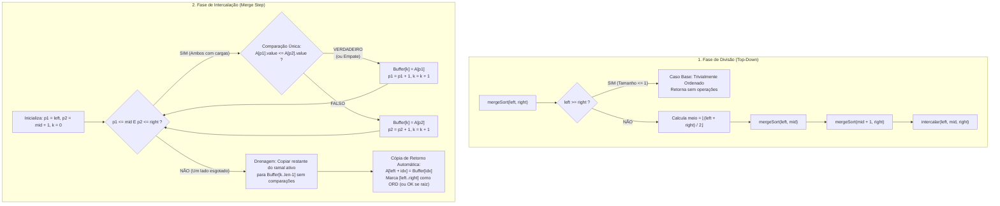

# Módulo 04 — Merge Sort

> **Documento canônico do módulo curricular:** Especificação integral de design pedagógico, mecânico e computacional do Módulo de Merge Sort da plataforma **Sorting Station**.  
> **Status de Implementação:** `ESTAÇÃO DE INTERCALAÇÃO E SELETOR IMPLEMENTADOS (P3.1-D)` (Engine pura, constraints procedurais com confronto real de duplicatas, tutorial guiado, demonstração canônica, briefing oficial, Estação Desktop-First `MergeGameScreen.tsx`, Seletor de Práticas `PracticeSelector` com 3 práticas canônicas $n=4, 5, 6$, `ResultScreen` segregando escritas no buffer e no principal, navegação completa e 68 testes unitários/comportamentais do módulo homologados no Vitest; Replay retrospectivo e persistência Schema v4 pública aguardam P3.1-E e P3.1-F; Merge permanece indisponível no Hub público).  
> **Data de Atualização:** 22/09/2026 (Marco P3.1-D / ADR 0023 Atualizado)  
> **Dependências:** [`AGENTS.md`](../../../AGENTS.md), [`ADR 0018`](../../adr/0018-game-to-educational-platform-transition.md), [`ADR 0021`](../../adr/0021-module-exercise-persistence-schema-v4.md), [`ADR 0022`](../../adr/0022-canonical-exercise-module-standardization.md), [`ADR 0023`](../../adr/0023-merge-sort-pedagogical-mechanical-design.md), [`modules/README.md`](./README.md), [`04-sorting-engine.md`](../04-sorting-engine.md), [`05-ux-design-system.md`](../05-ux-design-system.md), [`07-backend-and-persistence.md`](../07-backend-and-persistence.md), [`08-testing-and-quality.md`](../08-testing-and-quality.md), [`10-roadmap.md`](../10-roadmap.md), [`12-pedagogy-and-academic-traceability.md`](../12-pedagogy-and-academic-traceability.md).

---

## 1. Identificação do Módulo

- **Nome Canônico:** Merge Sort (Ordenação por Intercalação / Divisão e Conquista)
- **Identificador de Sistema (`moduleId`):** `merge`
- **Rótulo Diegético na Interface:** `PROTOCOLO: MERGE SORT // ESTEIRAS CONVERGENTES E INTERCALAÇÃO`
- **Subtítulo Diegético:** *Divisão de Fluxos e Intercalação Ordenada*
- **Status Factual:** `ESTAÇÃO DE INTERCALAÇÃO E SELETOR IMPLEMENTADOS (P3.1-D)` (Engine pura, constraints, tutorial, demonstração, briefing, Estação Desktop-First `MergeGameScreen.tsx`, integração curricular e 68 testes do módulo)
- **Classificação Curricular:** Algoritmo Avançado de Divisão e Conquista Assintoticamente Ótimo
- **Complexidade Temporal:**
  - **Melhor Caso:** $\Theta(n \log n)$ comparações ($\approx \lceil \frac{n}{2} \rceil \log_2 n$)
  - **Caso Médio:** $\Theta(n \log n)$ comparações
  - **Pior Caso:** $\Theta(n \log n)$ comparações ($n \log_2 n - n + 1$)
- **Complexidade Espacial (Espaço Auxiliar):** $O(n)$ células/posições (capacidade máxima da esteira coletora temporária para acomodar o intervalo ativo)
- **Estabilidade Formal:** Estável (preserva rigorosamente a ordem relativa de elementos de mesmo valor ao aplicar a regra de desempate canônica $\le$, priorizando sempre o subvetor da esquerda)
- **Tema Visual e Acentos:** Azul Cobalto / Ciano Elétrico (`#2563eb` e `#38bdf8`), sensores ópticos de inspeção e bifurcação de ramais

---

## 2. Objetivos de Aprendizagem

Ao concluir o Módulo de Merge Sort, o estudante deverá demonstrar competência nos seguintes conceitos algorítmicos e computacionais (estruturados sob a Taxonomia de Bloom revisada):

1. **Lembrar (Conhecimento):**
   - Identificar as duas etapas estruturais do algoritmo: **Divisão** (decomposição recursiva até subproblemas de tamanho unitário $n=1$) e **Intercalação** (reunião ordenada de dois subvetores adjacentes);
   - Citar a condição axiomática de parada da recursão ($left \ge right$ ou tamanho $\le 1$), reconhecendo que uma partição unitária está trivialmente ordenada por definição sem necessidade de comparações.
2. **Entender (Compreensão):**
   - Explicar por que a complexidade de tempo do Merge Sort é $\Theta(n \log n)$ em todos os cenários, fruto de uma árvore de recursão com altura $\lceil \log_2 n \rceil$ onde cada nível realiza no máximo $n-1$ comparações de intercalação;
   - Compreender que a divisão de vetores é uma operação **puramente estrutural** que não altera nem ordena os dados, e que toda a ordenação ocorre exclusivamente durante o processo de intercalação;
   - Diferenciar um subvetor intercalado e ordenado localmente (`ORD`) da ordenação global definitiva do vetor (`OK`), compreendendo que um trecho local ordenado pode precisar ser deslocado e rearranjado em intercalações de níveis superiores.
3. **Aplicar (Execução):**
   - Conduzir a estação de intercalação operando os dois ponteiros ($p_1$ no Ramal Esquerdo e $p_2$ no Ramal Direito), confrontando os elementos nas respectivas cabeças e despachando sempre o menor para a esteira coletora auxiliar;
   - Aplicar a regra canônica de desempate ($E[p_1] == D[p_2]$) selecionando o elemento do Ramal Esquerdo para salvaguardar a estabilidade do algoritmo;
   - Identificar o momento exato em que um dos ramais se esgota e comandar a transferência direta das cargas remanescentes do outro ramal sem efetuar comparações espúrias.
4. **Analisar (Diferenciação):**
   - Reconhecer a necessidade de memória auxiliar $O(n)$ no Merge Sort canônico, analisando por que a intercalação direta na esteira de origem sem buffer auxiliar demandaria deslocamentos contíguos custosos ($O(n^2)$);
   - Comparar a invariância de desempenho do Merge Sort ($\Theta(n \log n)$ fixo) com o caráter adaptativo do Insertion Sort ($O(n)$ no melhor caso e $O(n^2)$ no pior) e a volatilidade do Quick Sort ($O(n \log n)$ no médio e $O(n^2)$ no pior caso de pivô).
5. **Avaliar (Julgamento):**
   - Avaliar o trade-off entre custo de memória auxiliar ($O(n)$ posições) versus previsibilidade estrita de desempenho assintótico, justificando cenários onde o Merge Sort é preferível a algoritmos in-place.

---

## 3. Modelo Mental e Metáfora Visual

### 3.1. A Metáfora Canônica: Pátio de Triagem com Esteiras Convergentes
O módulo é ambientado no setor de confluência logística da Central Espacial:

```
[ NÍVEL SUPERIOR: Árvore de Decomposição Estrutural / Contexto Global ]
  (Bloco Ativo em Destaque: Intervalo [left .. right], corte em mid)

         ┌───────────────────────────────┐
         │ Ramal Esquerdo (Subvetor E)   │  p1 ──► [ Carga E[p1] ] ...
         │ Janela sobre A[left .. mid]   │             │
         └──────────────┬────────────────┘             ▼ [Sensores Ópticos]
                        │                          [ E[p1] <= D[p2] ? ]
         ┌──────────────┴────────────────┐             ▲
         │ Ramal Direito (Subvetor D)    │  p2 ──► [ Carga D[p2] ] ...
         │ Janela sobre A[mid+1..right]  │             │
         └───────────────────────────────┘
                        │
                        ▼  (Despacho Ordenado)
   ═════════════════════════════════════════════════════════════════
   ESTEIRA COLETORA AUXILIAR (Buffer Temporário B[0 .. len-1])
   [ Carga 1 ] [ Carga 2 ] [ Carga 3 ] [ Vaga ] [ Vaga ]
   ═════════════════════════════════════════════════════════════════
                        │
                        ▼  (Cópia de Retorno / Consolidação Automática)
   [ RECOLOCAÇÃO NA ESTEIRA PRINCIPAL: Intervalo A[left..right] marcado como ORD ]
```

- **Ramais como Janelas Diretas do Vetor Principal:** Os ramais superior/esquerdo ($E$) e inferior/direito ($D$) não representam cópias físicas prévias nem geram consumo oculto de memória; constituem janelas lógicas sobre os intervalos $A[left \dots mid]$ e $A[mid + 1 \dots right]$.
- **A Estação de Intercalação (*Convergence Station*):** Confluência pneumática onde os dois ramais encontram a esteira coletora. As cargas de cada ramal formam uma fila onde apenas o elemento da frente (apontado por $p_1$ ou $p_2$) está sob o campo de visão dos sensores ópticos.
- **Sensores Ópticos de Inspeção:** Dois feixes de luz (ciano para a esquerda, índigo para a direita) iluminam simultaneamente as duas cargas sob confronto. O painel central exibe a condição a comparar ($E[p_1] \le D[p_2]$), sem revelar antecipadamente o resultado booleano ou a resposta correta durante a prática.
- **A Esteira Coletora Auxiliar (*Merge Buffer Track*):** Esteira temporária posicionada logo abaixo da confluência. Ela recebe as cargas despachadas na ordem exata decidida pelo operador. Sua presença visual permanente ancora fisicamente o consumo de espaço auxiliar $O(n)$.
- **Drenagem da Cauda Remanescente:** Quando um dos ramais se esgota, o sensor correspondente acusa `RAMAL ESGOTADO`. O sistema destaca que os elementos restantes do outro ramal já são maiores que tudo o que desceu e já estão ordenados entre si, habilitando o botão de liberação direta da cauda.
- **Cópia de Retorno Automática e Badges (`ORD` vs `OK`):** Ao encher o buffer, os elementos são transferidos de volta para as posições $[left \dots right]$ da esteira principal. O trecho recebe a borda ciano e o badge **`ORD` (Subvetor Localmente Ordenado)**. Somente no término da última intercalação raiz $[0 \dots n-1]$ as cargas recebem o badge verde **`OK` (Ordenação Global Definitiva)**.

---

## 4. Operações Fundamentais, Invariantes e Recorrência de Escritas



### 4.1. Convenção Canônica de Limites e Partição Ímpar
- Intervalos $[left, right]$ fechados e inclusivos ($0 \le left \le right \le n - 1$).
- Ponto médio truncado:
  $$mid = \left\lfloor \frac{left + right}{2} \right\rfloor = left + \left\lfloor \frac{right - left}{2} \right\rfloor$$
- Ramo esquerdo: $[left \dots mid]$, com comprimento $len_E = mid - left + 1 = \lceil len / 2 \rceil$.
- Ramo direito: $[mid + 1 \dots right]$, com comprimento $len_D = right - mid = \lfloor len / 2 \rfloor$.
- **Exemplo de Partição Ímpar ($n=5$ em $[0 \dots 4]$):**
  $mid = \lfloor (0+4)/2 \rfloor = 2 \implies \text{Esquerda: } [0 \dots 2] \text{ (3 elementos)}; \text{ Direita: } [3 \dots 4] \text{ (2 elementos)}$.

### 4.2. Invariante da Intercalação
Ao intercalar duas metades adjacentes $A[left \dots mid]$ e $A[mid + 1 \dots right]$:
- A cada iteração $k$ ($0 \le k < len$):
  1. O buffer coletor $B[0 \dots k-1]$ contém exatamente os $k$ menores elementos de $A[left \dots right]$ em ordem não decrescente de `value`: $B[0].value \le B[1].value \le \dots \le B[k-1].value$;
  2. Todos os elementos remanescentes em $A[p_1 \dots mid]$ e em $A[p_2 \dots right]$ possuem `value` maior ou igual a qualquer elemento já alocado em $B[0 \dots k-1]$.

### 4.3. Identidade Estável e Regra de Desempate
Cada carga possui identidade persistente:
```typescript
export interface MergeElement {
  readonly id: string;            // Identificador único imutável
  readonly value: number;         // Valor numérico de ordenação
  readonly originalIndex: number; // Índice inicial no vetor bruto (0..n-1)
  readonly label?: string;        // Rótulo visual opcional (ex.: "4a", "4b")
}
```
- A comparação algorítmica utiliza **exclusivamente** `element.value`.
- **Regra de Desempate:** Se $E[p_1].value == D[p_2].value$, a decisão correta é **obrigatoriamente despachar o elemento do Ramal Esquerdo ($p_1$)**.
- Como $p_1$ possuía índice original menor que $p_2$, priorizar a esquerda preserva a ordem relativa original, garantindo estabilidade formal.

### 4.4. Buffer Auxiliar vs Memória Educacional de Snapshots
Fica expressamente diferenciado na arquitetura:
1. **Espaço Auxiliar do Algoritmo:** Estritamente **$O(n)$ posições/células**, correspondendo à capacidade máxima da esteira coletora temporária alocada a cada intercalação para acomodar até $n$ cargas antes do retorno à esteira principal.
2. **Memória de Infraestrutura Educacional:** $O(n \log n)$ snapshots gerados pelo histórico imutável (`MergeStepRecord[]`), armazenados na memória de sessão da plataforma para viabilizar replay retrospectivo sem recálculo, auditoria factual e scaffolding formativo.

### 4.5. Recorrência Exata de Escritas
A métrica de **Escritas** ($W(n)$) computa a movimentação de dados:
1. $1$ escrita no buffer por elemento ao descer da frente de um ramal ou ao ser drenado da cauda remanescente;
2. $1$ escrita no vetor principal por elemento ao retornar do buffer para $A[left \dots right]$.
- Em cada intercalação de intervalo $L$, ocorrem exatamente $L$ escritas no buffer e $L$ escritas no vetor principal ($2L$ escritas).
- **Recorrência:**
  $$W(0) = 0, \quad W(1) = 0$$
  $$W(n) = W\left(\left\lceil \frac{n}{2} \right\rceil\right) + W\left(\left\lfloor \frac{n}{2} \right\rfloor\right) + 2n, \quad \text{para } n \ge 2$$
- **Valores Padronizados:**
  - **$n = 4$:** $W(4) = W(2) + W(2) + 2(4) = 4 + 4 + 8 = \mathbf{16 \text{ escritas}}$ (8 no buffer, 8 no vetor principal);
  - **$n = 5$:** $W(5) = W(3) + W(2) + 2(5) = 10 + 4 + 10 = \mathbf{24 \text{ escritas}}$ (12 no buffer, 12 no vetor principal);
  - **$n = 6$:** $W(6) = W(3) + W(3) + 2(6) = 10 + 10 + 12 = \mathbf{32 \text{ escritas}}$ (16 no buffer, 16 no vetor principal).
- *Distinção Obrigatória:* A contagem de escritas mede operações computacionais ($O(n \log n)$) e **não** mede espaço auxiliar ($O(n)$ células).

---

## 5. Mecânica Interativa e Divisão de Agência

### 5.1. Justificativa Didática da Escolha de Interação
A variante Top-Down com travessia pós-ordem à esquerda foi selecionada por alinhar-se perfeitamente aos objetivos pedagógicos da plataforma: ela expõe visualmente a decomposição de problemas em subproblemas idênticos, reforça o raciocínio recursivo estruturado e conecta-se diretamente à metáfora física das esteiras industriais que se bifurcam hierarquicamente e confluem em estações de triagem. A abordagem Bottom-Up (iterativa com blocos em potências de 2), embora evite pilha recursiva em linguagens de baixo nível, oculta a intuição visual de ramificação e torna a árvore de divisão menos evidente para iniciantes.

### 5.2. O que o Aluno Decide vs O que o Sistema Automatiza nas Práticas

| Etapa | Responsabilidade do Aluno | Automação do Sistema | Justificativa Pedagógica |
| :--- | :--- | :--- | :--- |
| **Divisão Estrutural** | Nenhuma (observação do fluxo). | Anima a abertura dos ramais e calcula limites $mid$. | Elimina cliques vazios e foca o esforço na resolução algorítmica. |
| **Confronto de Frentes** | Compara os valores nas cabeças e aciona `DESPACHAR ESQUERDA` ou `DESPACHAR DIREITA`. | Mantém sensores nas frentes e bloqueia cargas traseiras. | Garante que cada comparação computacional resulte de uma decisão consciente. |
| **Desempate Estável** | Aplica a regra de estabilidade escolhendo a esquerda sob empate. | Feedback imediato caso tente violar a ordem relativa. | Ensina ativamente por que o Merge Sort é estável. |
| **Esgotamento de Ramal** | Comanda `DESPACHAR RESTANTE` ao notar que um ramal esvaziou. | Desativa o ramal vazio e habilita o botão de drenagem direta. | Fixa o conceito de que a cauda remanescente já está ordenada e custa $0$ comparações. |
| **Cópia de Retorno** | Nenhuma (observação da consolidação). | Transfere o buffer para a esteira principal e marca `ORD` (ou `OK` na raiz). | Mantém ritmo fluido sem burocracia mecânica. |

*Nota para Tutorial e Demonstração:* Permitem-se pausas explicativas antes da divisão e da cópia de retorno para scaffolding conceitual, sem contabilizá-las como decisões algorítmicas avaliadas.

---

## 6. Pseudocódigo Canônico (30 Linhas — `MERGE_SORT_PSEUDOCODE`)

```text
 1. procedimento mergeSort(A, inicio, fim)
 2.   se inicio < fim então
 3.     meio ← ⌊(inicio + fim) / 2⌋
 4.     mergeSort(A, inicio, meio)
 5.     mergeSort(A, meio + 1, fim)
 6.     intercalar(A, inicio, meio, fim)
 7.   fim se
 8. fim procedimento
 9. 
10. procedimento intercalar(A, inicio, meio, fim)
11.   Buffer ← alocar buffer de tamanho (fim - inicio + 1)
12.   p1 ← inicio, p2 ← meio + 1, k ← 0
13.   enquanto p1 ≤ meio e p2 ≤ fim faça
14.     se A[p1].value ≤ A[p2].value então
15.       Buffer[k] ← A[p1]; p1 ← p1 + 1
16.     senão
17.       Buffer[k] ← A[p2]; p2 ← p2 + 1
18.     fim se
19.     k ← k + 1
20.   fim enquanto
21.   enquanto p1 ≤ meio faça
22.     Buffer[k] ← A[p1]; p1 ← p1 + 1; k ← k + 1
23.   fim enquanto
24.   enquanto p2 ≤ fim faça
25.     Buffer[k] ← A[p2]; p2 ← p2 + 1; k ← k + 1
26.   fim enquanto
27.   para idx de 0 até (fim - inicio) faça
28.     A[inicio + idx] ← Buffer[idx]
29.   fim para
30. fim procedimento
```

### Mapeamento com a FSM da Engine:
- `DIVIDE_AUTOMATIC`: Linhas 2–5 (`se inicio < fim`, cálculo de `meio` e chamadas recursivas);
- `MERGE_INIT`: Linhas 11–12 (alocação do buffer temporário e inicialização dos ponteiros $p_1, p_2, k=0$);
- `COMPARE_HEADS`: Linhas 13–14 (`enquanto...`, teste relacional `A[p1].value ≤ A[p2].value`);
- `DISPATCH_LEFT`: Linha 15 (`Buffer[k] ← A[p1]; p1 ← p1 + 1; k ← k + 1`);
- `DISPATCH_RIGHT`: Linha 17 (`Buffer[k] ← A[p2]; p2 ← p2 + 1; k ← k + 1`);
- `DRAIN_READY`: Linhas 21–26 (drenagem dos remanescentes com $k \leftarrow k + 1$);
- `COPY_BACK_AUTOMATIC`: Linhas 27–29 (cópia de retorno de todos os elementos para a esteira principal).

---

## 7. Métricas Factuais Adequadas ao Algoritmo

1. **Comparações de Dados ($C(n)$):**
   - Contabiliza **exclusivamente** os confrontos relacionais entre duas cargas sob os sensores ópticos ($A[p_1].value \le A[p_2].value$).
   - Uma comparação entre o mesmo par de frentes ativas é registrada **uma única vez**.
   - Testes de limites de laço ($p_1 \le meio$), verificações de caso base e drenagem da cauda remanescente **não** somam comparações.
2. **Escritas ($W(n)$):**
   - Registra as transferências físicas (1 no buffer + 1 no vetor principal por elemento).
   - Decomposta na UI como: *Escritas no Buffer* e *Escritas no Vetor Principal*.
3. **Decisões Incorretas (`errors`):**
   - Tentativa de despachar a carga de maior valor ou escolher o ramal direito sob empate (violação de estabilidade).
   - Incrementa `errors` (+1), exibe feedback explicativo e **não** avança o estado da engine nem soma novas comparações algorítmicas.
4. **Ações Impossíveis:**
   - Ações inválidas para o estado corrente (ex.: despachar ramal esgotado). Bloqueadas pela UI e ignoradas pela engine com **zero penalidade**.
5. **Dicas Utilizadas (`hintsUsed`):** Revelação assistida da inequação (-5 pontos).
6. **Tempo Decorrido (`elapsedTimeMs`):** Estritamente descritivo, com zero impacto na pontuação.
7. **Pontuação do Protocolo:**
   $$\text{score} = \max\Big(0,\, 100 - (\text{errors} \times 10) - (\text{hintsUsed} \times 5)\Big)$$

---

## 8. Modo Demonstração

- **Propósito:** Apresentação autônoma da Divisão e Conquista antes da prática, ilustrando a separação física, o desempate estável e a intercalação ritmada.
- **Vetor Canônico Curado:** `[7, 2, 5, 3]` ($n=4$).
- **Justificativa da Escolha:**
  - Árvore balanceada com 2 níveis de profundidade ($2^2 = 4$), ideal para visualização em tela única;
  - Decompõe em `[7, 2]` e `[5, 3]`;
  - Intercalações de nível 1 geram `[2, 7]` e `[3, 5]` com 1 comparação e 4 escritas cada;
  - Intercalação final confronta:
    1. $2 \le 3 \rightarrow$ desce 2;
    2. $7 > 3 \rightarrow$ desce 3;
    3. $7 > 5 \rightarrow$ desce 5;
    4. Ramal direito esgotado $\rightarrow$ drena 7 sem comparação adicional.
  - Consolida em `[2, 3, 5, 7]` com 3 comparações e 8 escritas.
  - Total geral: 5 comparações e 16 escritas (8 no buffer, 8 no vetor principal).

---

## 9. Tutorial Guiado

- **Propósito:** Scaffolding assistido passo a passo ensinando a mecânica da confluência e a regra de estabilidade antes de submeter o aluno ao algoritmo completo.
- **Vetor de Scaffolding Curado:** `[4a, 1, 3, 4b]` ($n=4$).
- **Diferenciação Curricular Importante:**
  - O algoritmo completo executa as divisões estruturais e as intercalações locais dos ramos esquerdos e direitos, gerando as sub-esteiras `E = [1, 4a]` e `D = [3, 4b]`.
  - O trecho interativo focal do tutorial concentra-se na **intercalação raiz** (`intercalar(0, 1, 3)`), onde o estudante vivencia em 4 passos didáticos:
    1. Comparação ordinária ($1 \le 3 \rightarrow$ comanda esquerda);
    2. Alternância de ramal ($4a > 3 \rightarrow$ comanda direita);
    3. **Empate Crítico ($4a == 4b$):** Bloqueio explicativo da direita para fixar a regra de estabilidade: *"Valores iguais! Priorize o Ramal Esquerdo para manter a ordem relativa original"*;
    4. Esgotamento lateral $\rightarrow$ Libera `[ DESPACHAR RESTANTE ]` para descer $4b$.

---

## 10. Tipos de Exercícios Suportados

| Tipo de Exercício | Status no Módulo | Configuração Curricular e Objetivo Didático |
| :--- | :---: | :--- |
| **1. Introdução / Conceito** | `OBRIGATÓRIO` | Briefing interativo sobre Divisão e Conquista e complexidade $\Theta(n \log n)$. |
| **2. Demonstração** | `OBRIGATÓRIO` | Demonstração canônica sobre `[7, 2, 5, 3]` com pseudocódigo sincronizado. |
| **3. Tutorial Guiado** | `OBRIGATÓRIO` | Passo a passo assistido sobre `[4a, 1, 3, 4b]` com ênfase na estabilidade da intercalação raiz. |
| **4. Prática Básica** | `OBRIGATÓRIO` | **Lote com 4 cargas ($n=4$):** Árvore balanceada com 2 níveis de recursão. Foco na alternância de frentes e consolidação inicial de `ORD`. |
| **5. Prática Intermediária** | `OBRIGATÓRIO` | **Lote com 5 cargas ($n=5$):** Introdução à partição assimétrica ($\lceil 5/2 \rceil = 3$ e $\lfloor 5/2 \rfloor = 2$). Foco em subvetores desiguais e drenagem assimétrica. |
| **6. Prática Avançada** | `OBRIGATÓRIO` | **Lote com 6 cargas ($n=6$) com duplicatas:** Árvore de 3 níveis, desempate sob chaves duplicadas identificadas ($X_a, X_b$) e garantia de estabilidade sob dados densos. |
| **7. Desafio de Otimização** | `OPCIONAL` | Modo "Tolerância Zero": completar a intercalação com 0 erros de estabilidade. |
| **8. Prática Livre (Sandbox)**| `OPCIONAL` | Entrada customizada pelo usuário ($4 \le n \le 8$) com inspeção da árvore. |

---

## 11. Casos Pedagógicos Curados Específicos

1. **Pior Caso de Comparações na Intercalação (`[1, 3, 5]` e `[2, 4, 6]`):** Elementos alternam perfeitamente ($1 \rightarrow 2 \rightarrow 3 \rightarrow 4 \rightarrow 5$), exigindo $len - 1 = 5$ comparações para mesclar 6 itens.
2. **Melhor Caso de Comparações na Intercalação (`[1, 2, 3]` e `[7, 8, 9]`):** Ramo esquerdo esgota-se com 3 comparações, e o ramo direito inteiro é drenado sem comparações ($len/2$ comparações).
3. **Estabilidade com Chaves Duplicadas (`[3a, 8]` e `[3b, 6]`):** Prova que a condição $\le$ preserva $3a$ antes de $3b$ na esteira coletora.
4. **Vetor Inversamente Ordenado (`[6, 5, 4, 3, 2, 1]`):** Evidencia que o Merge Sort processa o vetor invertido no mesmo tempo assintótico $\Theta(n \log n)$ com o mesmo número previsível de níveis.
5. **Vetor de Tamanho Ímpar ($n=5$ — `[5, 2, 4, 1, 3]`):** Demonstra a divisão assimétrica em sub-esteiras de 3 e 2 elementos.

---

## 12. Geração Procedural e Constraints do Módulo

O módulo utilizará estritamente o gerador procedural compartilhado da plataforma:
```typescript
generateSortingArray(size: number, seed: number): number[]
```
Fundamentado no algoritmo PRNG determinístico **Mulberry32** ([`ADR 0002`](../../adr/0002-procedural-generation-mulberry32.md)), garantindo reprodutibilidade matemática absoluta sem recorrer a geradores proprietários ou `Math.random()`.

### Restrições Matemáticas Procedurais (`MERGE_CONSTRAINTS`):
- Valores inteiros no domínio $[1 \dots 99]$;
- Rejeição de vetores já ordenados (regeneração automática com `seed + 1`);
- Garantia de que a intercalação raiz possua ao menos uma alternância entre ramais (impedindo que a metade esquerda seja trivialmente menor em bloco);
- Injeção controlada de exatamente um par de chaves duplicadas na Prática Avançada ($n=6$) para verificação de estabilidade.

---

## 13. Feedback Formativo e Tratamento de Erros

1. **Tentativa de Despachar a Carga Maior:**
   - Ação bloqueada; `errors` incrementado (+1); ponteiros e buffer inalterados;
   - Feedback: *"Atenção na Confluência: A carga selecionada é maior que a do outro ramal. O Merge Sort exige sempre colher a menor carga para manter o buffer ordenado."*
2. **Tentativa de Despachar a Direita sob Empate:**
   - Ação bloqueada; `errors` incrementado (+1);
   - Feedback: *"Violação de Estabilidade: Ambas as cargas possuem o mesmo valor. O Merge Sort exige priorizar o Ramal Esquerdo para preservar a ordem relativa original dos itens."*
3. **Ações Impossíveis:**
   - Tentativa de clique em ramal vazio ou acionamento via teclado de botão indisponível: ação ignorada com zero penalidade.

---

## 14. Sistema de Dicas

Acesso sob demanda via `[ SOLICITAR DICA ]` (-5 pontos):
- **Nível 1 (Frentes Ativas):** Ilumina as duas cargas sob os sensores ópticos.
- **Nível 2 (Orientação Relacional):** Indica qual ramal contém a menor carga sem revelar antecipadamente o botão.
- **Nível 3 (Aviso de Esgotamento):** Instruções quando um lado atinge o fim da fila: *"O Ramal Esquerdo terminou. Acione DESPACHAR RESTANTE."*

---

## 15. Tela de Resultado e Reflexão

Ao concluir uma prática, a tela [`ResultScreen.tsx`](../../src/screens/ResultScreen.tsx) apresenta:
- Comparações de dados efetuadas;
- Escritas totais, decompostas em *Escritas no Buffer* e *Escritas no Vetor Principal*;
- Erros conceituais cometidos;
- Tempo decorrido (descritivo);
- Pontuação do Protocolo alcançada;
- Painel de reflexão comparando o custo de tempo $\Theta(n \log n)$ com a necessidade de espaço auxiliar $O(n)$ células.

---

## 16. Replay, Inspeção Retrospectiva e Memória do Histórico

- **Derivação Pura de Quadros Visuais (`MergeVisualStepFrame`):**
  - A função pura `deriveMergeFramesFromHistory(initialValues, history)` deriva a esteira de quadros visuais para Replay e Auditoria sem reexecutar a ordenação.
  - Cada quadro contém: `stepIndex`, `stepNumber`, `type`, `phase`, `activeInterval` ($[left..right]$, corte $mid$, profundidade e flag de raiz), ponteiros $(p_1, p_2, k)$, `values` snapshot, `buffer` snapshot, `explanation` diegética factual e contadores cumulativos (`cumulativeComparisons`, `cumulativeWritesInBuffer`, `cumulativeWritesInMain`, `cumulativeTotalWrites`).
  - Acesso temporal em $O(1)$ a qualquer momento histórico via `reconstructMergeStepAt(initialValues, history, stepIndex)`.
- **Análise Rigorosa da Memória do Histórico:**
  - *Espaço Auxiliar do Algoritmo:* Estritamente **$O(n)$ células físicas** na esteira coletora temporária.
  - *Retenção de Snapshots na Sessão:* O histórico grava $m \in O(n \log n)$ eventos imutáveis (`MergeStepRecord[]`), cada qual retendo uma cópia rasa do array `valuesSnapshot` de comprimento $n$.
  - *Custo Total de Referências:* $O(m \cdot n) = O(n^2 \log n)$ referências de objetos no heap de execução durante a sessão.
  - *Imutabilidade e Compartilhamento:* As instâncias de `MergeElement` são compartilhadas por referência entre os snapshots (zero duplicação profunda de dados). Para os tamanhos curriculares da plataforma ($n \in [4, 6]$), o histórico totaliza apenas ~50 a 180 referências de ponteiros, dispensando desnormalizações complexas ou overhead de reprocessamento.
- **Auditoria Factual:** `reconstructMergeStateFromHistory` reconstrói os valores finais e totalizadores diretamente da entrada inicial e da lista de eventos gravados.
- Rótulos diegéticos estáveis ($X_a, X_b$) permanecem fixos em cada elemento desde a geração até a conclusão, permitindo verificação explícita da invariante de estabilidade no Replay.

---

## 17. Persistência e Progresso

Schema v4 canônico ([`ADR 0021`](../../adr/0021-module-exercise-persistence-schema-v4.md)):
- `merge.practice.basic`: Prática Básica ($n=4$);
- `merge.practice.intermediate`: Prática Intermediária ($n=5$);
- `merge.practice.advanced`: Prática Avançada ($n=6$).
- Desbloqueio progressivo derivado deterministicamente; persistência em escrita atômica única com `completedTutorial`.

---

## 18. Acessibilidade e Inclusão

- **Navegação por Teclado Dedicada:** Atalhos específicos para evitar conflito com a ativação nativa do botão focado via `Enter`/`Espaço`:
  - `1` (ou `ArrowLeft`): `DESPACHAR ESQUERDA`;
  - `2` (ou `ArrowRight`): `DESPACHAR DIREITA`;
  - `3` (ou `D`): `DESPACHAR RESTANTE`.
- Foco por teclado (`Tab`) ativa normalmente o botão selecionado via `Enter` ou `Espaço`.
- **Independência de Cor:** Identificadores textuais explícitos (`ESQUERDA`, `DIREITA`, `ORD`, `OK`).
- **Suporte a `prefers-reduced-motion`:** Transições instantâneas sem interpolação contínua.
- **Single Scroll Owner:** Sem barras de rolagem aninhadas.

---

## 19. Riscos Pedagógicos e Armadilhas Conceituais

1. **Achar que a Divisão Ordena:** Esclarecido pela manutenção da desordem e das cores originais nos ramais.
2. **Confundir `ORD` com `OK`:** Trechos locais recebem `ORD` (azul); o status `OK` (verde) é conferido exclusivamente no término da intercalação raiz $[0 \dots n-1]$.
3. **Confundir Escritas com Espaço Auxiliar:** As escritas somam $O(n \log n)$ operações de movimentação, enquanto o espaço auxiliar é estritamente $O(n)$ células.
4. **Violar a Estabilidade:** Bloqueado pela engine com feedback instrutivo.

---

## 20. Relação Futura com o Laboratório Comparativo

- O Merge Sort fornecerá telemetria alinhada: Comparações de Dados $C(n)$ e Escritas $W(n)$.
- No Laboratório Comparativo, confrontará diretamente o crescimento quadrático de Bubble e Selection Sort ($n(n-1)/2$) com o platô log-linear do Merge Sort para $n \ge 16$, além de evidenciar o custo de memória auxiliar $+N$ slots.
